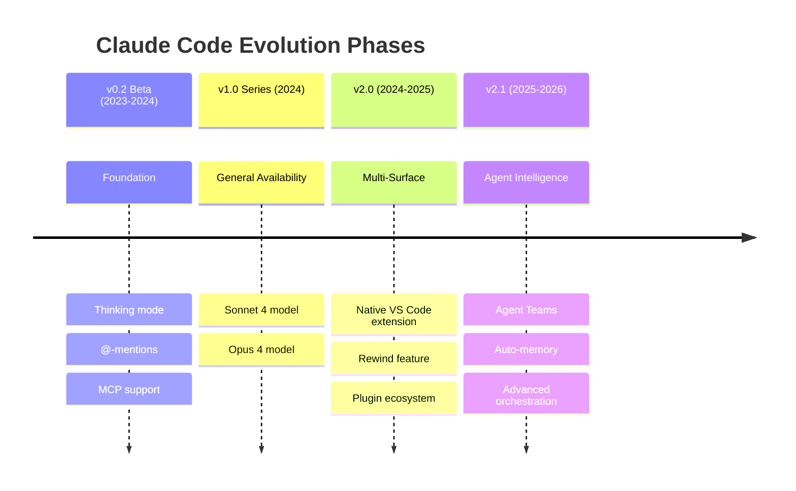
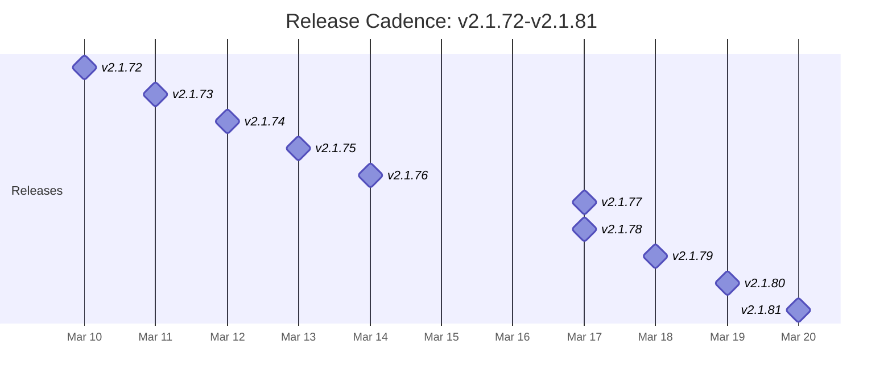
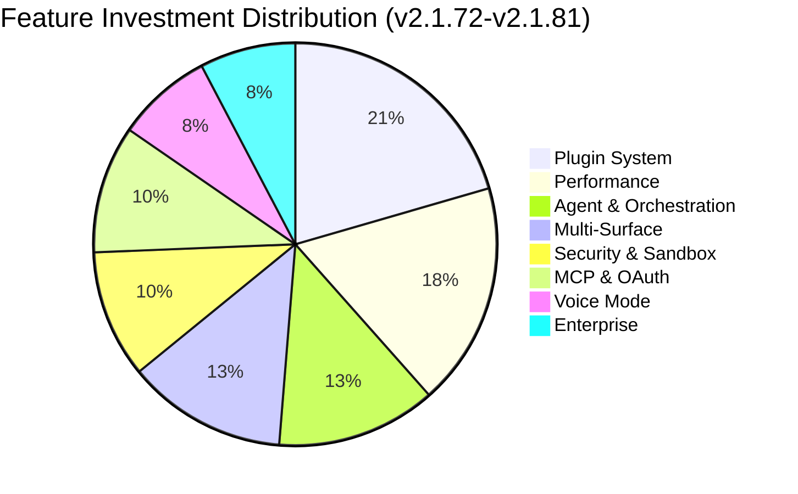
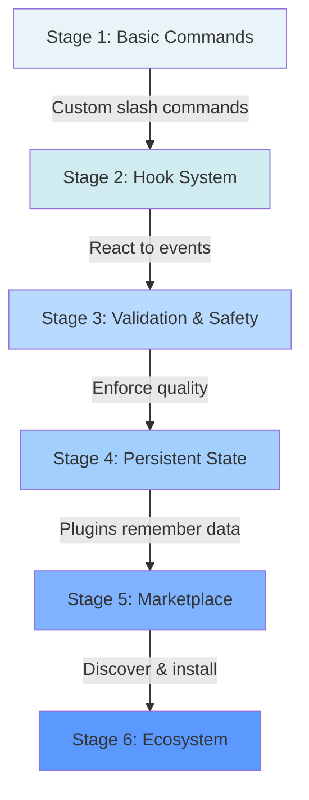
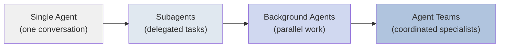
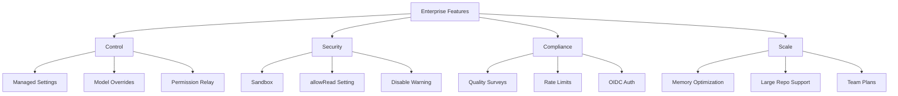
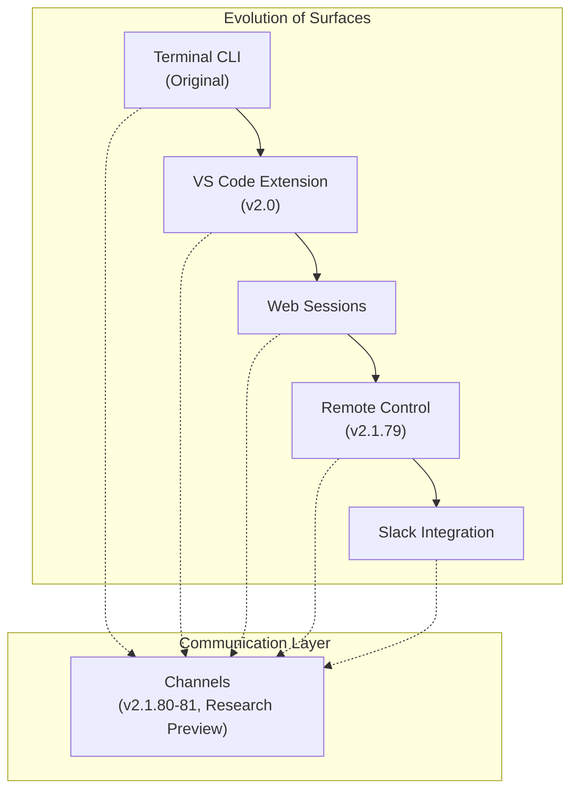

# The CHANGELOG as a Product Roadmap

How to read the Claude Code changelog like a product strategist. This guide analyzes the public changelog to reveal product evolution, development patterns, and where the project is heading -- giving contributors and professionals a clear picture of the bigger story behind each release.

> **Why this matters:** Claude Code is a closed-source product. The changelog is one of the few public artifacts that reveals the engineering team's priorities, investments, and direction. Learning to read it systematically transforms a flat list of bullet points into a strategic roadmap.

---

## How to Read a Closed-Source Changelog

### What a Changelog Actually Reveals

When a product is closed-source, you cannot browse the commit history, read internal design documents, or watch the team's planning conversations. The changelog becomes your primary window into the product's soul. Here is what each element tells you:

| Changelog Element | What It Reveals |
|---|---|
| **Feature entries** | Where the team is investing engineering time |
| **Bug fix patterns** | Which areas are under active development (more bugs = more work happening) |
| **Version numbering** | How the team thinks about stability vs. innovation |
| **Release frequency** | The team's deployment confidence and CI/CD maturity |
| **Ordering of entries** | What the team considers most important (top items first) |
| **Naming conventions** | The product vocabulary and mental model |
| **Security callouts** | The organization's security posture and transparency |

### Reading Between the Lines

A changelog entry like "Memory reduction ~80MB on startup for large repos" tells you several things at once:

1. **Users reported memory problems** -- this fix did not appear from nowhere
2. **Large repos are a key use case** -- the team optimizes for professional-scale projects
3. **The team measures memory precisely** -- they have benchmarking infrastructure
4. **Startup performance is a priority** -- it appears in multiple releases

When you see the same category (like memory optimization) appearing across consecutive releases, it signals a sustained engineering initiative, not a one-off fix.

### The Prefix Convention

Claude Code's changelog uses consistent prefixes that categorize entries:

- **Security:** -- Explicit security-related changes, always given priority visibility
- **[VSCode]** -- Features specific to the VS Code extension surface
- No prefix -- Core CLI features and general improvements

This tagging system tells you the team thinks about the product in terms of distinct surfaces (CLI, VS Code, web) and treats security as a cross-cutting concern worthy of special attention.

---

## Major Evolution Phases

The Claude Code project has passed through four distinct phases, each with a clear theme:

### Phase 1: Foundation (v0.2 Beta, 2023--2024)

The beta phase established the core interaction model. Three foundational capabilities defined this era:

- **Thinking mode** -- the ability for the AI to reason step-by-step before acting, which later became a core differentiator for complex coding tasks
- **@-mentions** -- a natural language mechanism for referencing files, URLs, and other resources within prompts
- **MCP (Model Context Protocol) support** -- the standardized protocol for connecting Claude to external tools and data sources

These three features together created the Claude Code identity: an AI that thinks, references context, and connects to your existing toolchain.

### Phase 2: General Availability (v1.0, 2024)

The v1.0 release marked the transition from experimental beta to production-ready tool. The key milestone was shipping with the Sonnet 4 and Opus 4 model families, establishing Claude Code as a multi-model product where users choose between speed (Sonnet) and depth (Opus).

### Phase 3: Multi-Surface Expansion (v2.0, 2024--2025)

This phase transformed Claude Code from a terminal-only tool into a multi-surface product:

- **Native VS Code extension** -- meeting developers where they already work
- **Rewind feature** -- allowing users to undo and replay AI actions, addressing trust and control concerns
- **Plugin ecosystem** -- opening the product to third-party extensibility

The shift from "CLI tool" to "platform" happened here. The plugin ecosystem in particular signaled that the team was thinking about Claude Code as a foundation that others build on, not just a standalone product.

### Phase 4: Agent Intelligence (v2.1, 2025--2026)

The current phase focuses on making Claude Code smarter about managing complex work:

- **Agent Teams** -- multiple specialized agents working together on different aspects of a task
- **Auto-memory** -- the system learns from your project and remembers context across sessions
- **Advanced orchestration** -- coordinating tool calls, background work, and multi-step operations

This is the "AI that works like a team" phase, where individual tool use evolves into coordinated multi-agent workflows.

---

## Release Cadence Analysis

### Versioning Pattern

Claude Code follows semantic versioning (major.minor.patch), but with a distinctive pattern:

- **Major versions** (v1.0, v2.0) mark architectural shifts and are infrequent
- **Minor versions** (v2.1) represent feature epochs and last months
- **Patch versions** (v2.1.72 through v2.1.81) carry the actual week-to-week changes

The practical effect is that the patch number functions more like a build number than a traditional "bugfix-only" patch. Each patch release contains a mix of new features, improvements, and fixes.

### Frequency Analysis

**10 releases in 10 days** (March 10--20, 2026) is an extremely aggressive cadence. Key observations:

- **Daily releases are normal** -- the team ships nearly every business day
- **Multiple releases per day can happen** -- v2.1.77 and v2.1.78 both shipped on March 17
- **Weekend gaps exist** -- no releases on March 15--16 (Saturday--Sunday), suggesting the team avoids weekend deploys
- **The broader v2.1 pattern** averages roughly 2-week intervals between significant capability jumps, but patch releases ship continuously within those intervals

### What This Cadence Tells You

This release velocity is only possible with:

1. **Strong automated testing** -- you cannot ship daily without CI catching regressions
2. **Feature flags or gradual rollout** -- not every feature ships to all users simultaneously
3. **Automated changelog generation** -- the public repository shows GitHub Actions committing CHANGELOG updates, confirming automation in the release pipeline
4. **High deployment confidence** -- the team trusts their release process enough to ship features and fixes in the same release

For contributors, this means: your plugin or contribution will not wait months for a release. The pipeline moves fast.

---

## Feature Investment Areas

Analyzing which capability areas receive the most changelog entries reveals where the engineering team spends its time. Here is the investment breakdown across the v2.1.72--v2.1.81 window:

### Investment Area 1: Plugin System

The plugin system receives the most attention, with new capabilities in nearly every release:

| Version | Plugin Feature |
|---|---|
| v2.1.72 | Simplified effort levels |
| v2.1.73 | Deprecated commands consolidated |
| v2.1.76 | Elicitation hooks |
| v2.1.77 | Plugin validation improvements |
| v2.1.78 | Persistent state (`${CLAUDE_PLUGIN_DATA}`) |
| v2.1.80 | Marketplace inline source |
| v2.1.81 | Plugin freshness checks |

The trajectory is clear: plugins are evolving from simple command extensions into stateful, validated, marketplace-distributed components. The addition of persistent state in v2.1.78 is particularly significant -- it means plugins can now remember things between sessions, enabling much more sophisticated functionality.

### Investment Area 2: Performance

Performance improvements appear in almost every release, suggesting a dedicated performance engineering effort:

| Version | Performance Improvement |
|---|---|
| v2.1.72 | Bundle size reduction ~510KB |
| v2.1.72 | Prompt cache fix (up to 12x cost reduction) |
| v2.1.73 | CPU/memory optimizations |
| v2.1.75 | Token estimation fix preventing premature compaction |
| v2.1.77 | 45% faster --resume, 100-150MB less peak memory |
| v2.1.77 | ~60ms faster startup on macOS |
| v2.1.79 | Memory improvement ~18MB |
| v2.1.80 | Memory reduction ~80MB on startup for large repos |

Notice the pattern: the team measures precisely (not "faster" but "45% faster"; not "less memory" but "~80MB less"). This precision suggests systematic benchmarking as part of the development process.

### Investment Area 3: Agent Orchestration

Agent capabilities are evolving from single-agent tool use to multi-agent coordination:

- **Agent Teams** -- multiple agents working on different parts of a problem
- **Background agents** -- agents that continue working while you do other things
- **Subagent improvements** -- better delegation and result aggregation
- **Session tabs with AI-generated titles** (v2.1.79) -- managing multiple agent conversations

### Investment Area 4: Multi-Surface

Claude Code is expanding beyond the terminal:

- **VS Code extension** -- native integration, not just a terminal panel
- **Remote Control** (v2.1.79) -- controlling Claude Code from VS Code
- **Web sessions** -- browser-based access
- **Slack integration** -- Claude Code in team communication
- **Channels** (v2.1.80-81) -- a new surface for research preview

---

## The Plugin System Evolution

The plugin system's evolution is one of the clearest stories in the changelog. It progresses through distinct maturity stages:

### Stage 1: Basic Commands

Plugins started as simple markdown files that define custom slash commands. A plugin was essentially a prompt template.

### Stage 2: Hook System

Hooks allowed plugins to react to events in the Claude Code lifecycle -- before a tool runs, after a message, when a session starts. This made plugins active participants rather than passive templates.

The v2.1.76 release added **Elicitation and ElicitationResult hooks**, allowing plugins to ask the user questions during execution. v2.1.78 added **StopFailure** as a new hook event type, letting plugins react when something goes wrong.

### Stage 3: Validation and Safety

v2.1.77 introduced plugin validation improvements, ensuring that plugins meet quality and safety standards before they run. This is a prerequisite for any marketplace -- you need to trust that third-party plugins will not break your system.

### Stage 4: Persistent State

v2.1.78 introduced `${CLAUDE_PLUGIN_DATA}`, giving plugins a dedicated directory to store data between sessions. Before this, plugins were stateless -- they could not remember anything between invocations. With persistent state, plugins can:

- Cache API responses
- Store user preferences
- Maintain conversation history
- Track metrics over time

### Stage 5: Marketplace

v2.1.80 added marketplace inline source display, meaning users can now see a plugin's source code directly in the marketplace before installing it. This builds trust and transparency.

v2.1.81 added plugin freshness checks, ensuring installed plugins stay up to date with their marketplace versions.

### Where It Is Heading

The trajectory points toward a full ecosystem: validated plugins with persistent state, distributed through a marketplace with transparency features, automatically kept up to date. The next logical steps would be plugin ratings or reviews, dependency management between plugins, and possibly a plugin revenue model.

---

## Agent Capabilities Evolution

### From Single Agent to Agent Teams

The evolution of agent capabilities follows a clear progression:

**Single Agent** -- The original model. One Claude Code instance, one conversation, sequential tool use.

**Subagents** -- The first multiplier. Claude could spawn child agents to handle specific subtasks (like reading a file or running a test), then aggregate their results.

**Background Agents** -- A concurrency improvement. Agents could continue working while the user does other things, with results available when ready.

**Agent Teams** (v2.1) -- The current frontier. Multiple specialized agents with defined roles work together on different aspects of a problem. Think of it like a development team: one agent handles architecture, another writes tests, a third handles documentation.

### Orchestration Improvements in Recent Releases

Several recent changes improve how agents coordinate:

- **Session tabs with AI-generated titles** (v2.1.79) -- managing multiple agent conversations becomes practical when each one has a meaningful name instead of a timestamp
- **Line-by-line response streaming** (v2.1.78) -- agents can see partial results from tools as they stream, enabling faster reactions
- **PostCompact hook** (v2.1.76) -- when context is compacted (summarized to save tokens), plugins can react and preserve critical state
- **Opus 4.6 output limits: 64k default, 128k upper bound** (v2.1.77) -- agents can produce longer, more detailed responses when needed
- **1M context window for Opus 4.6** (v2.1.75) -- agents can hold vastly more information in a single conversation, reducing the need for context switching

---

## Performance and Stability Patterns

### The Performance Story in Numbers

Tracking performance improvements across releases reveals a sustained engineering effort:

| Metric | Improvement | Version |
|---|---|---|
| Bundle size | -510KB | v2.1.72 |
| API cost | Up to 12x reduction (prompt cache fix) | v2.1.72 |
| Resume speed | 45% faster | v2.1.77 |
| Peak memory | -100 to -150MB | v2.1.77 |
| Startup time (macOS) | -60ms | v2.1.77 |
| Memory (general) | -18MB | v2.1.79 |
| Memory (large repo startup) | -80MB | v2.1.80 |

### Why Performance Matters Here

Claude Code is an interactive tool. Every millisecond of startup time and every megabyte of memory consumption is felt directly by the user. Unlike a web service where latency is hidden behind a loading spinner, a CLI tool's performance is immediately perceptible.

The team's approach follows a pattern:

1. **Measure precisely** -- they report exact numbers, not vague "improved"
2. **Target specific scenarios** -- "large repos" and "resume" are called out as distinct performance targets
3. **Reduce across multiple dimensions** -- memory, CPU, startup time, bundle size, and API cost are all tracked
4. **Ship incrementally** -- each release shaves off another chunk rather than waiting for one big optimization

### Stability Indicators

Bug fixes consistently outnumber features at approximately a **3:1 ratio** in each release. This is a healthy sign for a rapidly shipping product -- it means the team is not just adding features but actively stabilizing what they ship.

Common stability categories in the changelog:

- **Voice mode fixes** -- voice interaction has its own stability track
- **OAuth fixes** -- authentication edge cases get regular attention
- **Node.js compatibility** -- fixing crashes on specific Node.js versions (like the Node.js 18 crash fix in v2.1.81)
- **Token estimation** -- preventing premature compaction (v2.1.75) to avoid losing context unexpectedly

---

## Enterprise Features

### The Enterprise Feature Set

Claude Code's enterprise features cluster around four themes:

### Control

**Managed settings** allow organization administrators to configure Claude Code centrally. Instead of each developer choosing their own model or enabling experimental features, the admin sets policies that apply organization-wide.

**modelOverrides** (v2.1.73) lets enterprises specify which models are available, potentially restricting access to approved models only.

**--channels permission relay** (v2.1.81) enables passing permissions through communication channels, important for enterprise workflows where authorization chains matter.

### Security

**Sandbox** isolation ensures Claude Code cannot access files or systems outside its designated boundaries. The **allowRead** setting (v2.1.77) provides fine-grained control over which files the sandbox can read.

The **sandbox disable warning** (v2.1.78) is a transparency feature -- if someone disables the sandbox (which removes security boundaries), the system explicitly warns about it. This "security:" prefix pattern in the changelog signals that the team treats security changes as first-class announcements.

### Compliance and Observability

**Session quality surveys** (v2.1.76) allow enterprises to collect structured feedback about Claude Code sessions, feeding into quality assurance processes.

**Rate limits** (v2.1.80) exposed via the `rate_limits` field for statusline scripts let enterprises monitor and control API consumption.

**OIDC authentication** enables integration with enterprise identity providers (Okta, Azure AD, etc.), a requirement for any enterprise tool.

### Scale

Memory optimizations directly benefit enterprise users who work with large monorepos. The ~80MB startup memory reduction in v2.1.80 specifically targets "large repos," which is enterprise language for monorepos with millions of lines of code.

---

## Multi-Surface Expansion

### The Surface Story

Claude Code started as a terminal application. It has since expanded to five distinct surfaces:

### Terminal (the origin)

The CLI remains the power-user surface. Features like `--bare` flag (v2.1.81) for scripted `-p` calls show continued investment in making the terminal experience composable and scriptable.

### VS Code Extension

The native VS Code extension (v2.0) moved Claude Code from a separate terminal window into the editor itself. Features tagged with `[VSCode]` in the changelog indicate dedicated development attention for this surface. The `/remote-control` command (v2.1.79) allows VS Code to drive a Claude Code session, creating a tighter integration than running Claude Code in a VS Code terminal.

### Web Sessions

Browser-based access removes the installation barrier entirely. No CLI setup, no extension install -- just open a URL and start working.

### Remote Control

Introduced in v2.1.79 for VS Code, Remote Control lets one surface drive another. This is architecturally significant because it means surfaces are not isolated -- they can coordinate.

### Slack Integration

Bringing Claude Code into Slack meets teams where they already communicate. Instead of context-switching to a terminal or editor, team members can interact with Claude Code in the same place they discuss work.

### Channels (Research Preview)

The `--channels` flag (v2.1.80-81) represents a new communication primitive. While still in research preview, channels suggest a future where Claude Code instances can communicate with each other or with external systems through a standardized messaging layer.

---

## Patterns for Predicting Future Direction

### Pattern 1: Follow the Bug Fixes

Where bugs cluster, features are coming. If voice mode has three bug fixes in one release, it means voice mode is under active development and new voice features are likely in the next few releases.

### Pattern 2: Research Preview to GA Pipeline

Features tagged "research preview" (like `--channels`) follow a predictable pipeline:

1. **Research preview** -- available behind a flag, expect breaking changes
2. **Beta** -- more stable, still evolving
3. **GA (General Availability)** -- production-ready, backward-compatible

When you see a research preview appear, expect it to mature over 2--4 release cycles.

### Pattern 3: The Hook-Then-Feature Pattern

New hooks (event types in the plugin system) often foreshadow new features. The **ElicitationResult** hook (v2.1.76) appeared before elicitation became a common pattern. The **StopFailure** hook (v2.1.78) suggests the team is building more sophisticated error recovery that plugins will participate in.

### Pattern 4: Memory Before Features

Performance improvements (especially memory reduction) often precede new capability additions. The team clears headroom before adding new features that consume resources. The sustained memory optimization work in v2.1.77--v2.1.80 likely precedes a major new capability that requires more memory.

### Pattern 5: Platform Before Product

When you see infrastructure features (persistent state, validation, marketplace), product features built on that infrastructure are coming. The plugin persistent state (v2.1.78) enables a new class of stateful plugins that we should expect to see in the marketplace soon.

### What to Watch For Next

Based on current patterns, these areas are likely to see significant development:

1. **Channels graduating from research preview** -- the communication layer between Claude Code instances
2. **Plugin marketplace maturation** -- ratings, reviews, dependency management
3. **Agent Teams becoming generally available** -- moving from experimental to production
4. **Voice mode stabilization** -- the volume of bug fixes suggests it is approaching a major milestone
5. **Additional enterprise controls** -- audit logging, compliance reporting, SSO improvements

---

## The Bug Fix to Feature Ratio

One of the most revealing metrics in any changelog is the ratio of bug fixes to new features. In Claude Code's v2.1.72--v2.1.81 window, bug fixes outnumber features approximately **3:1**.

This ratio tells a nuanced story:

- **It is not a sign of instability.** A 3:1 ratio in a rapidly shipping product with daily releases is healthy. It means the team fixes things faster than they break them.
- **It reflects the breadth of surfaces.** With terminal, VS Code, web, voice, and Slack surfaces, each new feature has more places where edge cases can appear.
- **It shows investment in polish.** Teams that only ship features and ignore bugs are building on sand. The consistent attention to fixes shows engineering discipline.

For contributors, this ratio means: **bug fix PRs are welcome and valued.** The team clearly prioritizes fixing existing behavior, not just adding new capabilities.

---

## References

- [Claude Code CHANGELOG](https://github.com/anthropics/claude-code/blob/main/CHANGELOG.md) -- The primary source for release notes and product evolution
- [Claude Code Documentation](https://code.claude.com/docs/en/overview) -- Official documentation for all features
- [Plugin System Documentation](https://docs.claude.com/en/docs/claude-code/plugins) -- Guide to building and distributing plugins
- [Claude Code GitHub Repository](https://github.com/anthropics/claude-code) -- Public repository with plugins and release artifacts
- [Model Context Protocol (MCP)](https://modelcontextprotocol.io/) -- The protocol standard that Claude Code implements for tool integration
- [Semantic Versioning](https://semver.org/) -- The versioning scheme used by Claude Code
