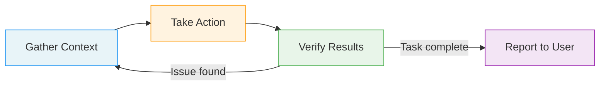
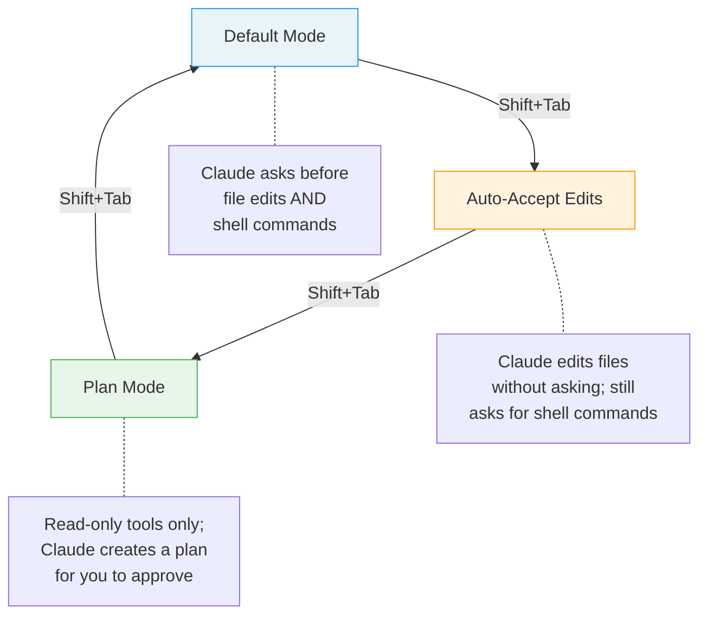
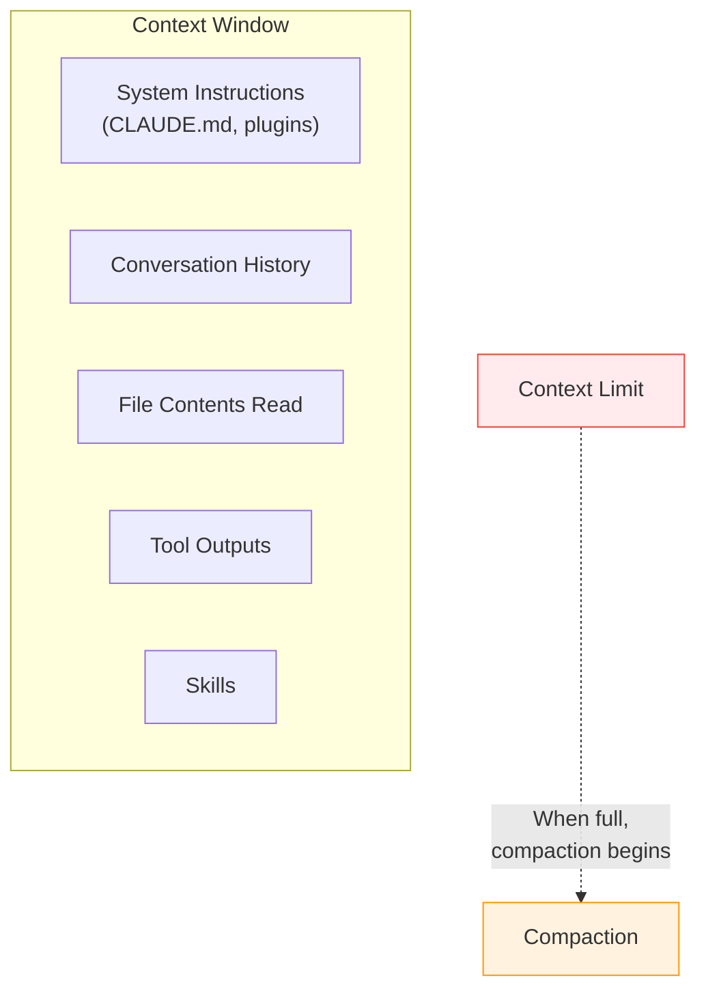
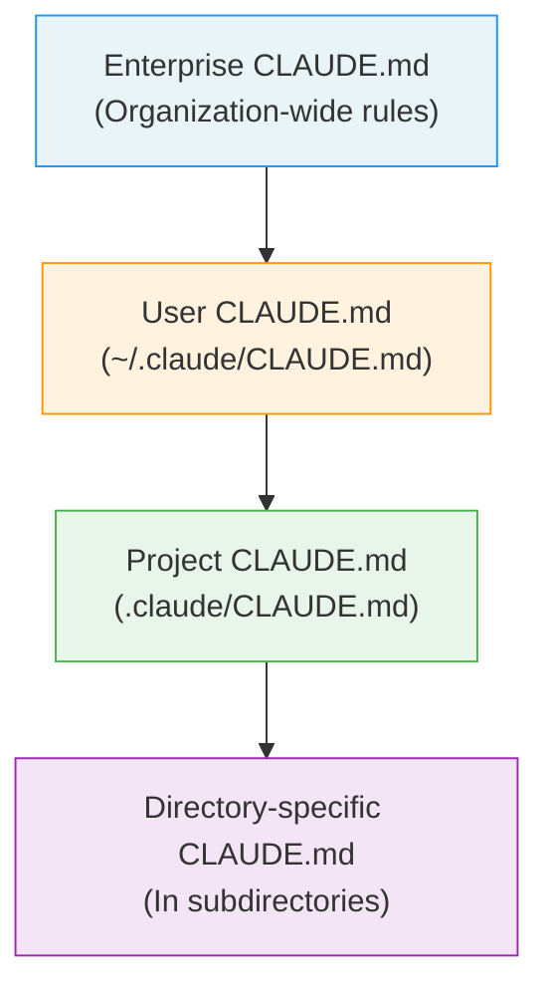
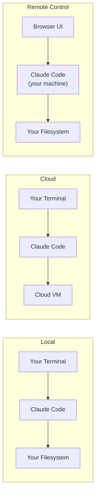

# Claude Code as a User: CLI Features and Workflows

Claude Code is an agentic coding assistant that runs in your terminal. It reads your codebase, edits files, runs commands, and manages git -- all through natural-language conversation. Before you can build plugins for it or file meaningful bug reports, you need to understand how it works from the user's perspective.

This guide walks through every major feature of Claude Code: how the agentic loop operates, what CLI flags are available, how to manage sessions and context, and how to work with the tool effectively.

---

## The Agentic Loop

The agentic loop is the core execution model of Claude Code. Every time you give Claude a task, it works through three phases that blend together in a continuous cycle.



### Phase 1: Gather Context

Claude starts by understanding the problem. It reads files, searches for patterns, checks project structure, and examines relevant code. For a simple question ("What does this function do?"), this might be the only phase needed.

### Phase 2: Take Action

Once Claude understands the situation, it acts. It might edit files, run shell commands, create new files, or execute tests. Claude chooses the appropriate tools based on what the task requires.

### Phase 3: Verify Results

After acting, Claude checks its work. It might run tests, read the modified files to confirm correctness, or execute the program to see if the change works. If something is wrong, it loops back to gather more context and try again.

### You Are Part of the Loop

You can interrupt Claude at any point during execution. If you see it heading in the wrong direction, type a correction and Claude will adjust course. This makes the loop collaborative rather than autonomous.

### The Two Components

The agentic loop is powered by two components working together:

- **Models that reason**: Claude analyzes context, plans approaches, and makes decisions about what to do next.
- **Tools that act**: The harness provides tools that let Claude interact with your codebase and environment.

### Tool Categories

Claude Code provides tools across five categories:

| Category | What It Does | Examples |
|----------|-------------|----------|
| **File operations** | Read, edit, create, and rename files | Reading source code, writing new modules, renaming components |
| **Search** | Find files by pattern, search content with regex | Locating all test files, finding where a function is called |
| **Execution** | Run shell commands, start servers, run tests, use git | Running `npm test`, checking `git status`, starting a dev server |
| **Web** | Search the web, fetch documentation | Looking up API docs, finding error explanations |
| **Code intelligence** | Type errors, jump to definitions | Checking TypeScript errors, finding interface definitions (requires LSP plugins) |

---

## CLI Commands and Flags

Claude Code is invoked through the `claude` command. How you invoke it determines the mode of interaction.

### Core Commands

| Command | Description |
|---------|-------------|
| `claude` | Start an interactive session in the current directory |
| `claude "query"` | Start an interactive session with an initial prompt |
| `claude -p "query"` | Print mode -- run a query and exit without interaction |
| `cat file \| claude -p "query"` | Pipe content into Claude for processing |
| `claude -c` | Continue the most recent conversation |
| `claude -r "session" "query"` | Resume a specific session by ID or display name |
| `claude update` | Update Claude Code to the latest version |
| `claude auth login` | Sign in to your account |
| `claude agents` | List configured subagents |
| `claude mcp` | Configure MCP (Model Context Protocol) servers |
| `claude remote-control` | Start a Remote Control server |

### Interactive Mode vs. Print Mode

The two most common ways to use Claude Code are interactive mode and print mode:

- **Interactive mode** (`claude` or `claude "query"`): Opens a persistent session where you and Claude go back and forth. Claude asks for permission before making changes. You can steer, interrupt, and build on previous context.
- **Print mode** (`claude -p "query"`): Claude processes your query and prints the result to stdout, then exits. This is designed for scripting, CI/CD pipelines, and one-shot tasks. There is no back-and-forth.

**Example -- interactive mode:**
```bash
claude "Review the authentication module for security issues"
```
Claude opens a session, reads relevant files, and presents findings. You can ask follow-up questions.

**Example -- print mode for scripting:**
```bash
# Generate a commit message from staged changes
git diff --staged | claude -p "Write a concise commit message for these changes"
```

### Key CLI Flags

These flags modify how Claude Code starts and behaves.

#### Session Management Flags

| Flag | Description |
|------|-------------|
| `--continue` / `-c` | Continue the most recent conversation |
| `--resume` / `-r` | Resume a session by ID or name |
| `--fork-session` | Create a new session ID when resuming (branches the conversation) |
| `--name` / `-n` | Set a display name for the session, making it easier to resume later |
| `--from-pr` | Resume sessions linked to a specific GitHub PR |

**Example -- naming and resuming sessions:**
```bash
# Start a named session
claude -n "auth-refactor" "Let's refactor the auth module"

# Later, resume it
claude -r "auth-refactor" "What was our plan for the token refresh logic?"

# Fork a session to explore an alternative approach
claude -r "auth-refactor" --fork-session "What if we used JWT instead?"
```

#### Model and Effort Flags

| Flag | Description |
|------|-------------|
| `--model` | Set the model to use (e.g., `sonnet`, `opus`, or a full model name) |
| `--effort` | Set the reasoning effort level: `low`, `medium`, `high`, or `max` (max is Opus only) |

**Example:**
```bash
# Use Opus for a complex architectural review
claude --model opus --effort max "Analyze the entire codebase architecture"

# Use Sonnet with low effort for a quick question
claude --model sonnet --effort low -p "What version of React is in package.json?"
```

#### Plugin and Tool Flags

| Flag | Description |
|------|-------------|
| `--plugin-dir` | Load plugins from a directory (can be repeated for multiple directories) |
| `--allowedTools` | Specify tools that execute without permission prompts |
| `--tools` | Restrict which tools Claude can use |
| `--chrome` | Enable Chrome browser integration |

#### System Prompt Flags

| Flag | Description |
|------|-------------|
| `--system-prompt` | Replace the entire system prompt with custom text |
| `--append-system-prompt` | Append text to the default system prompt |

These are useful for customizing Claude's behavior in automated workflows.

#### Working Directory Flags

| Flag | Description |
|------|-------------|
| `--add-dir` | Add additional working directories beyond the current one |
| `--worktree` / `-w` | Start in an isolated git worktree |
| `--agent` | Specify a named agent for the session |

#### Output Flags

| Flag | Description |
|------|-------------|
| `--bare` | For scripted `-p` calls -- skips hooks, LSP, plugin sync, and skill walks |
| `--remote` | Create a web session on claude.ai |
| `--remote-control` / `--rc` | Start an interactive session with Remote Control enabled |
| `--channels` | Research preview -- enable MCP server push notifications |

**The `--bare` flag** is particularly important for CI/CD pipelines. It strips away all the interactive features that would slow down or break a scripted call, giving you raw output.

**The `--worktree` flag** creates an isolated git worktree so Claude can make changes without affecting your working directory. This is useful when you want Claude to explore an approach without risk.

---

## Interactive Features: Slash Commands

During an interactive session, slash commands let you control Claude's behavior without using natural language. Type `/` to see the full list.

### Key Slash Commands

| Command | Purpose |
|---------|---------|
| `/help` | Show available commands and usage tips |
| `/config` | View and edit configuration |
| `/model` | Switch the active model mid-session |
| `/compact` | Manually trigger context compaction (see Context Management below) |
| `/context` | Show what is consuming your context window |
| `/voice` | Toggle voice input mode |
| `/effort` | Change reasoning effort level |
| `/plan` | Enter plan mode for read-only exploration |
| `/agents` | List and manage subagents |
| `/mcp` | View and manage MCP server connections |
| `/plugin` | View loaded plugins |
| `/allowed-tools` | Manage which tools skip permission prompts |
| `/hooks` | View configured hooks |
| `/vim` | Toggle vim keybindings |
| `/terminal-setup` | Configure terminal integration |
| `/color` | Change the accent color |
| `/rename` | Rename the current session |
| `/copy` | Copy the last response to clipboard |
| `/export` | Export the conversation |
| `/resume` | Resume a different session |
| `/branch` | Branch the current session (formerly `/fork`) |
| `/feedback` | Send feedback to the Claude Code team |
| `/bug` | Report a bug |
| `/btw` | Send a background thought without interrupting Claude |

### Compact with Focus

The `/compact` command is especially useful when your context window is getting full. You can provide a focus keyword to tell Claude what to preserve:

```
/compact focus on the API changes
```

This tells Claude to summarize the conversation but keep details about API changes intact.

---

## File References with @ Mentions

You can reference files and directories directly in your prompts using the `@` symbol. This tells Claude exactly where to look, saving time and context.

### Syntax

| Pattern | What It References |
|---------|--------------------|
| `@./src/api/routes.ts` | A specific file |
| `@./src/` | An entire directory |
| `@./src/**/*.test.ts` | All files matching a glob pattern |

### Examples

```
# Reference a specific file
"Look at @./src/api/routes.ts and add input validation"

# Reference a directory
"Review all files in @./src/auth/ for security issues"

# Reference files matching a pattern
"Run all tests in @./src/**/*.test.ts and fix any failures"
```

Using `@` references is more reliable than describing file locations in natural language. It ensures Claude reads the exact files you intend.

---

## Permission Modes

Claude Code has three permission modes that control how much autonomy Claude has. You cycle through them by pressing **Shift+Tab**.



### Default Mode

Claude asks for your approval before editing any file or running any shell command. This is the safest mode and gives you full control.

### Auto-Accept Edits Mode

Claude can edit files without asking, but still requests approval before running shell commands. This speeds up workflows where you trust Claude's edits but want to review commands (which might have side effects like installing packages or modifying system state).

### Plan Mode

Claude can only use read-only tools. It explores the codebase and produces a plan for you to review and approve before any changes are made. This is ideal for complex tasks where you want to understand the approach before committing to it.

**When to use each mode:**
- **Default**: When working on unfamiliar code, or for tasks where mistakes are costly
- **Auto-accept edits**: When iterating quickly on code you understand well
- **Plan mode**: When tackling complex, multi-step problems where you want a roadmap first

---

## Session Management

Understanding how sessions work is fundamental to using Claude Code effectively.

### Sessions Are Independent

Each session starts with a fresh context window. There is no automatic memory between sessions. If you start a new session, Claude does not know what you discussed in a previous one.

To carry context forward, you have three options:
1. **Continue/resume** a previous session (`-c` or `-r`)
2. **Auto memory** -- Claude can save learnings that persist across sessions
3. **CLAUDE.md** -- Write persistent project instructions that load into every session

### The Context Window

The context window is the total amount of information Claude can hold at once. It includes:

- The conversation (your messages and Claude's responses)
- File contents that Claude has read
- Tool outputs (search results, command output, etc.)
- Loaded skills and plugins
- System instructions (including CLAUDE.md contents)



### Compaction

When the context window fills up, Claude Code automatically compacts the conversation to make room. Compaction works in two stages:

1. **First**: Older tool outputs are cleared (file contents, command results)
2. **Then**: The conversation itself is summarized

You can trigger compaction manually with `/compact`. Adding a focus keyword (`/compact focus on the database migration`) tells Claude what details to preserve in the summary.

### Checking Context Usage

Use `/context` to see a breakdown of what is consuming your context window. This helps you understand when you are approaching the limit and what is taking up the most space.

---

## CLAUDE.md and Auto Memory

### CLAUDE.md Files

CLAUDE.md files provide persistent project instructions that are loaded into every session. They follow a hierarchy:



- **Enterprise CLAUDE.md**: Organization-wide rules set by administrators
- **User CLAUDE.md** (`~/.claude/CLAUDE.md`): Your personal preferences that apply to all projects
- **Project CLAUDE.md** (`.claude/CLAUDE.md` at the repo root): Project-specific conventions, coding standards, and instructions
- **Directory-specific CLAUDE.md**: Instructions that apply only when working in a specific subdirectory

Lower levels in the hierarchy can add to but not override higher levels. This means your project instructions sit on top of your personal preferences, which sit on top of enterprise rules.

**Example project CLAUDE.md:**
```markdown
# Project Conventions

- Use TypeScript strict mode for all new files
- Follow the existing naming pattern: camelCase for functions, PascalCase for classes
- All API routes must have input validation using Zod schemas
- Run `npm test` before considering any task complete
- Prefer functional components with hooks over class components
```

### Auto Memory

When Claude learns something about your project during a session (a convention, a preference, a technical detail), it can save that learning to memory. These memories persist across sessions and are automatically included in future context.

Auto memory is different from CLAUDE.md in that it is written by Claude based on what it observes, rather than being written by you. Both serve the same purpose: giving Claude consistent context across sessions.

---

## Context Management

Effective context management separates productive Claude Code sessions from frustrating ones. Understanding what consumes context and how to manage it is essential.

### What Consumes Context

Everything Claude reads, writes, or receives as tool output goes into the context window:

| Source | Context Cost | Notes |
|--------|-------------|-------|
| Your messages | Low | Short prompts are cheap |
| Claude's responses | Medium | Longer explanations use more |
| File reads | High | Large files consume significant context |
| Command output | High | Verbose commands (e.g., full test output) are expensive |
| MCP tool calls | Variable | Each MCP server interaction has token costs |
| Search results | Medium | Depends on number of matches returned |

### Managing Context Effectively

1. **Be specific with file references**: Use `@` mentions to point Claude at exact files instead of asking it to search broadly.
2. **Use `/compact` proactively**: Do not wait for automatic compaction. If you are done with one phase of work, compact with a focus on what comes next.
3. **Start new sessions for new tasks**: If you are switching to a completely different task, start a fresh session rather than continuing in the same one.
4. **Check with `/context`**: Periodically check what is using your context window.
5. **Keep command output short**: If a command produces verbose output, consider piping through `head` or `tail` before letting Claude see it.

### MCP Token Costs

Model Context Protocol (MCP) servers extend Claude's capabilities but add token costs. Each MCP tool call requires sending the tool schema and receiving the response, both of which consume context. If you have many MCP servers configured, the tool definitions alone can take up meaningful space.

---

## Checkpoints and Undo

Claude Code creates a checkpoint before every file edit. This gives you a safety net that is entirely separate from git.

### How Checkpoints Work

- Every file modification creates a local snapshot of the file's previous state
- Checkpoints are stored locally on your machine
- They are independent of your git history
- They only cover file changes (not shell command side effects)

### Undoing Changes

Press **Esc twice** to rewind to the previous checkpoint. This reverts the last file change Claude made.

This is useful when Claude makes an edit that looks wrong. Rather than asking Claude to undo it (which uses context and might not produce the exact original), pressing Esc twice instantly restores the file.

**Important limitations:**
- Checkpoints only cover file changes. If Claude ran a shell command that modified state (installed a package, dropped a database table), pressing Esc will not undo that.
- Checkpoints are local. They do not affect git history.

---

## Environments

Claude Code can run in three different environments, each suited to different use cases.

### Local (Default)

Claude Code runs directly on your machine. It has access to your filesystem, your shell environment, and your git repositories. This is the standard setup for most development work.

### Cloud

Claude Code runs on Anthropic-managed virtual machines. Your code is synced to a cloud VM where Claude performs its work. This is useful for teams that want consistent environments or need more compute power.

### Remote Control

Claude Code runs on your machine but is controlled from a web browser. You start the Remote Control server locally with `claude remote-control`, then interact with Claude through a browser interface. This is useful for demonstrations, pair programming, or when you prefer a web-based UI.



### Subscription Plans

Claude Code is available under three subscription tiers:

| Plan | Price | Key Features |
|------|-------|-------------|
| **Pro** | $20/month | Limited Opus access, standard token allocation |
| **Max5** | $100/month | 5x token allocation, full Opus access |
| **Max20** | $200/month | 20x token allocation, large context windows |

Higher tiers primarily give you more tokens per month and better access to the Opus model, which provides deeper reasoning for complex tasks.

---

## Working Effectively with Claude Code

Knowing the features is only half the story. How you interact with Claude Code determines how useful it is.

### Be Specific Upfront

Vague prompts lead to wasted context and wrong approaches. Reference specific files, mention constraints, and state your goal clearly.

**Less effective:**
```
Fix the login bug
```

**More effective:**
```
The login form in @./src/components/LoginForm.tsx throws a 401 error
when the user's email contains a plus sign. Fix the email validation
to handle plus-addressed emails like user+tag@example.com.
```

### Give Claude Something to Verify Against

Claude works best when it has a way to check its own work. Provide test cases, expected output, or specific success criteria.

**Example:**
```
Add pagination to the /api/users endpoint. The endpoint should accept
`page` and `limit` query parameters. Verify by running `npm test`
and make sure all existing tests still pass.
```

### Explore Before Implementing

For complex problems, use plan mode (`/plan` or Shift+Tab to cycle to it). Let Claude explore the codebase and propose an approach before making changes. This prevents costly wrong turns.

**Example workflow:**
1. Switch to plan mode
2. Ask Claude to analyze the problem
3. Review the proposed plan
4. Switch back to default mode
5. Tell Claude to execute the plan

### Delegate, Don't Dictate

Claude Code works best when you give it context and direction rather than step-by-step instructions. Tell Claude what you want to achieve and why, then let it figure out the how.

**Less effective:**
```
Open src/utils.ts, go to line 42, change the function name from
processData to transformData, then find all files that import it
and update the import statements.
```

**More effective:**
```
Rename the processData function in @./src/utils.ts to transformData
and update all call sites across the codebase.
```

### Interrupt and Steer

You do not have to wait for Claude to finish before providing input. If you see Claude going in the wrong direction -- reading the wrong files, pursuing the wrong approach -- type a correction. Claude will stop and adjust.

This is one of the most powerful features of the interactive loop. It keeps you in control without requiring you to specify everything upfront.

---

## References

- [Claude Code Overview](https://docs.anthropic.com/en/docs/claude-code/overview) -- Official documentation for Claude Code
- [Claude Code CLI Usage](https://docs.anthropic.com/en/docs/claude-code/cli-usage) -- CLI commands and flags reference
- [Claude Code Interactive Features](https://docs.anthropic.com/en/docs/claude-code/interactive-features) -- Slash commands, permissions, and interactive controls
- [CLAUDE.md Documentation](https://docs.anthropic.com/en/docs/claude-code/claude-md) -- How to configure project instructions
- [Claude Code Context Management](https://docs.anthropic.com/en/docs/claude-code/context-management) -- Managing context windows and compaction
- [Claude Code MCP Integration](https://docs.anthropic.com/en/docs/claude-code/mcp) -- Model Context Protocol server configuration
- [Claude Code Subscription Plans](https://www.anthropic.com/pricing) -- Pricing and plan comparison
