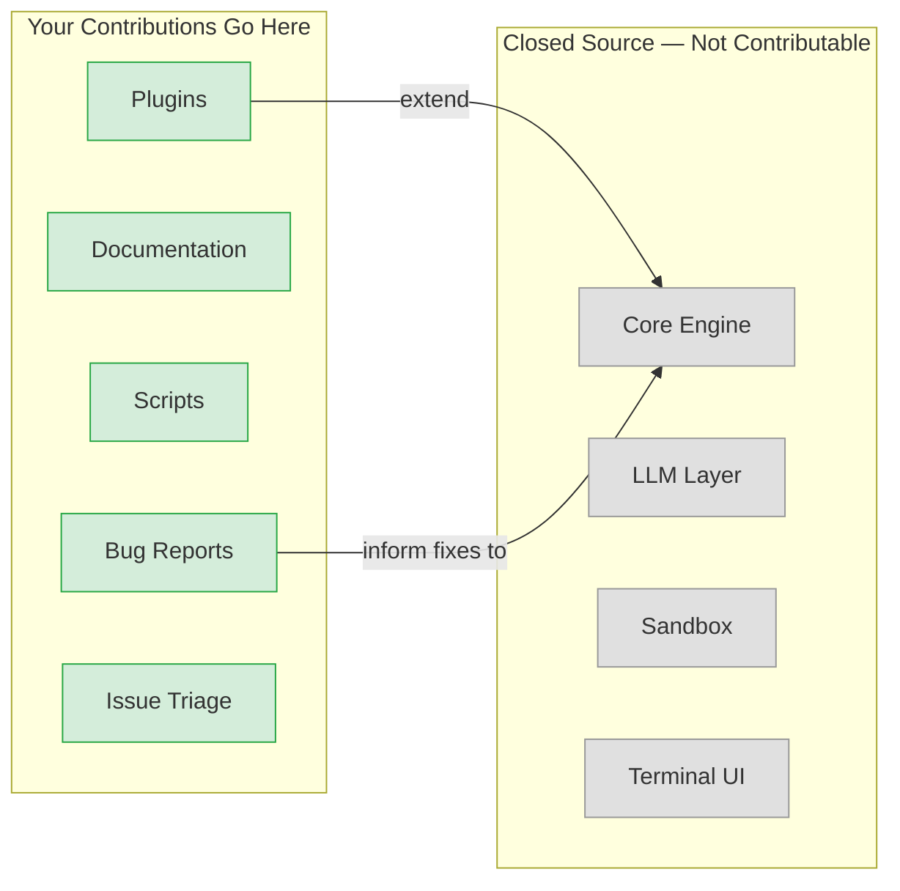
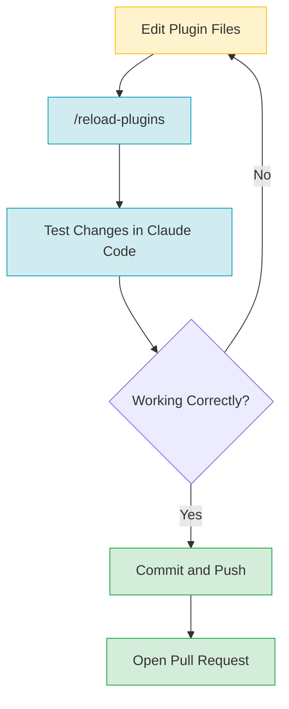
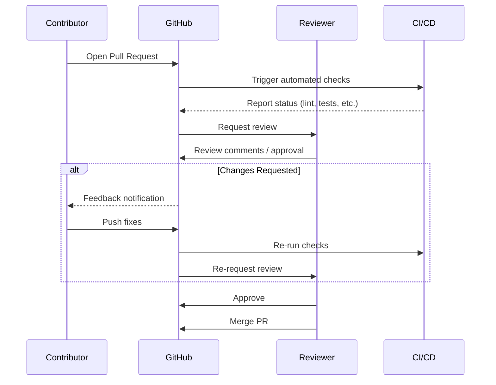
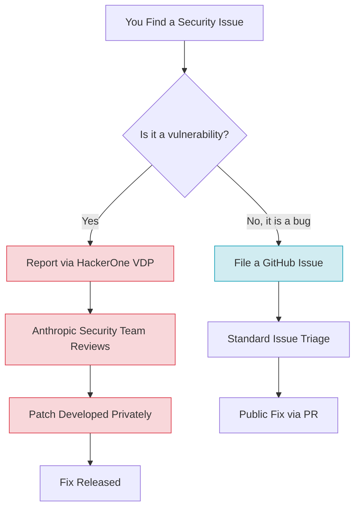

# Contributing to Claude Code

Contributing to open-source projects can feel intimidating, especially when the project belongs to a major AI company. This guide demystifies the process of contributing to the Claude Code public repository. You will learn what parts of the project are open for contribution, how to set up your development environment, where to find beginner-friendly tasks, and how to submit high-quality pull requests that get merged.

Whether you want to build a plugin, fix a bug, improve documentation, or help triage issues, this guide walks you through every step from zero to your first merged contribution.

---

## Understanding the Repository Structure

### The Public/Closed-Source Boundary

The first thing to understand -- and this trips up many newcomers -- is that **the Claude Code repository on GitHub is not the full application**. The core Claude Code engine (the terminal UI, the LLM integration, the sandbox system, the streaming layer) is closed-source. It is distributed as a compiled binary through package managers like Homebrew, NPM, and WinGet.

The public repository at `github.com/anthropics/claude-code` serves a different purpose: it is the **extensibility layer** and **community hub**. You will notice there is no `package.json`, `Cargo.toml`, or `pyproject.toml` at the root -- because there is no application to build from source.

What the public repository *does* contain:

| Directory | Purpose | Contribution Potential |
|-----------|---------|----------------------|
| `plugins/` | 13 official plugins that extend Claude Code | **High** -- new plugins, improvements to existing ones |
| `scripts/` | Issue lifecycle automation scripts | **Medium** -- improvements to repo tooling |
| `.devcontainer/` | Dev container setup for contributors | **Low** -- mostly maintained by core team |
| `.github/workflows/` | CI/CD automation pipelines | **Medium** -- workflow improvements |
| `README.md`, `CHANGELOG.md` | Project documentation | **High** -- always room to improve docs |
| `SECURITY.md` | Security disclosure policy | **Low** -- maintained by security team |

### What You Can (and Cannot) Contribute

This distinction matters because it sets expectations:

**You CAN contribute:**
- New plugins or improvements to existing plugins
- Bug reports for the Claude Code application itself
- Documentation improvements
- Issue triage and community support
- Scripts and automation improvements
- Dev container configuration improvements

**You CANNOT contribute (via this repo):**
- Changes to the core Claude Code engine
- Modifications to the LLM integration layer
- Changes to the sandbox or permissions system
- Core terminal UI changes



---

## Ways to Contribute

There are many ways to contribute, and not all of them involve writing code. Below is a comprehensive breakdown of each contribution type, ordered roughly from easiest to most involved.

### Bug Reports

Filing a well-structured bug report is one of the most valuable contributions you can make. The Claude Code team uses GitHub Issues to track bugs, and clear reports help them fix problems faster.

**How to report a bug:**

1. **Use the `/bug` command** inside Claude Code itself -- this automatically captures system information, version details, and context
2. **File a GitHub Issue** at `github.com/anthropics/claude-code/issues` if you prefer the web interface
3. Include these elements in every bug report:
   - Steps to reproduce the issue
   - Expected behavior vs. actual behavior
   - Your Claude Code version (`claude --version`)
   - Your operating system and terminal
   - Relevant error messages or screenshots

**What makes a great bug report:**
- A minimal reproduction case (the smallest set of steps that trigger the bug)
- Clear separation of facts vs. interpretation
- A check of existing issues to avoid duplicates (the repo has automated duplicate detection via `scripts/auto-close-duplicates.ts`)

### Issue Triage

Issue triage means helping organize, label, and respond to existing GitHub Issues. This is an excellent way to contribute without writing any code while simultaneously learning how the project works.

**What issue triage looks like:**
- Confirming whether you can reproduce a reported bug
- Adding missing information (OS details, version numbers) when you can
- Pointing out duplicate issues
- Suggesting labels or priority levels
- Responding to questions from other community members

The repository has a sophisticated issue lifecycle system (built by contributor chrislloyd across 5 PRs) that automates much of this work via scripts in the `scripts/` directory:

| Script | Purpose |
|--------|---------|
| `sweep.ts` | Periodic cleanup of stale issues |
| `lifecycle-comment.ts` | Automated comments on issue state changes |
| `issue-lifecycle.ts` | State machine for issue progression |
| `auto-close-duplicates.ts` | Automatic detection and closing of duplicate issues |
| `edit-issue-labels.sh` | Batch label management |

### Documentation

Documentation contributions are always welcome and are one of the best entry points for new contributors. Areas that often need attention:

- Plugin README files -- making usage instructions clearer
- Code comments in scripts -- explaining *why* something is done, not just *what*
- Adding examples to plugin documentation
- Fixing typos, broken links, or outdated information
- Writing tutorials or guides for common use cases

### Building Plugins

Building a new plugin is the most impactful way to contribute to the Claude Code ecosystem. Plugins extend Claude Code with new slash commands, specialized agents, reusable skills, and event-driven hooks.

Every plugin follows a standard directory structure:

```
plugin-name/
├── .claude-plugin/
│   └── plugin.json          # Plugin metadata (name, version, description)
├── commands/                # Slash commands (e.g., /my-command)
├── agents/                  # Specialized AI agents
├── skills/                  # Reusable agent skills
├── hooks/                   # Event handlers (triggered on specific actions)
├── .mcp.json                # External tool configuration via MCP servers
└── README.md                # Plugin documentation
```

Not every directory is required -- a simple plugin might only have `commands/` and a `README.md`. The only mandatory elements are the `.claude-plugin/plugin.json` metadata file and a `README.md`.

**Examples of existing official plugins:**

| Plugin | Purpose |
|--------|---------|
| `code-review` | Automated code review assistance |
| `commit-commands` | Enhanced git commit workflows |
| `pr-review-toolkit` | Pull request review tools |
| `security-guidance` | Security best practices and scanning |
| `frontend-design` | Frontend design assistance |
| `plugin-dev` | Tools for developing plugins themselves |
| `hookify` | Create hooks from natural language |
| `ralph-wiggum` | Fun personality plugin |
| `agent-sdk-dev` | Agent SDK development tools |
| `feature-dev` | Feature development workflows |
| `learning-output-style` | Customized learning output formatting |

### Community Plugins

Beyond the 13 official plugins in the repository, you can build and distribute plugins independently. Community plugins do not need to be merged into the official repo -- you can host them in your own GitHub repository and share them with others.

However, if your plugin solves a broadly useful problem and meets the quality standards described later in this guide, consider submitting it as an official plugin via a pull request.

---

## Setting Up Your Development Environment

### Prerequisites

Before you begin, make sure you have the following installed:

- **Git** -- for cloning and version control
- **Claude Code** -- the CLI itself (install via `npm install -g @anthropic-ai/claude-code` or Homebrew)
- **Node.js** (recommended) -- many scripts are written in TypeScript
- **A code editor** -- VS Code, Cursor, or any editor you prefer
- **A GitHub account** -- for forking, issues, and pull requests

### Cloning the Repository

```bash
# Clone the official repository
git clone https://github.com/anthropics/claude-code.git

# Navigate into the repo
cd claude-code
```

If you plan to submit a pull request, fork the repository first on GitHub and clone your fork instead:

```bash
# Clone your fork
git clone https://github.com/YOUR-USERNAME/claude-code.git

# Add the upstream remote so you can stay in sync
cd claude-code
git remote add upstream https://github.com/anthropics/claude-code.git
```

### Using the Dev Container

The repository includes a `.devcontainer/` directory with a pre-configured development environment. If you use VS Code with the Dev Containers extension (or GitHub Codespaces), you can open the project in a container that has all dependencies pre-installed.

The dev container setup includes:
- `Dockerfile` -- defines the container image with required tools
- `devcontainer.json` -- VS Code/Codespaces configuration
- `init-firewall.sh` -- network security initialization for the dev environment

This is the easiest way to get a consistent development environment without manually installing dependencies.

### Testing Plugins Locally

The key command for plugin development is `--plugin-dir`, which tells Claude Code to load a plugin from a local directory:

```bash
# Test a plugin from the official plugins directory
claude --plugin-dir ./plugins/code-review

# Test your own plugin under development
claude --plugin-dir ./my-new-plugin
```

When you make changes to a plugin while Claude Code is running, you do not need to restart. Instead, use the `/reload-plugins` slash command to hot-reload your changes:

```
> /reload-plugins
```

This makes the development cycle fast: edit your plugin files, run `/reload-plugins`, and immediately test your changes.



---

## Finding Good First Contributions

Starting with the right task makes all the difference. Here is a practical strategy for finding your first contribution.

### Strategy 1: Documentation Improvements

Read through the existing plugin README files in `plugins/`. Look for:
- Missing usage examples
- Unclear instructions
- Typos or grammatical errors
- Outdated information

These are low-risk, high-value contributions that help you learn the codebase while providing immediate value.

### Strategy 2: Improve an Existing Plugin

Pick one of the 13 official plugins and use it. As you use it, note any rough edges:
- Could the error messages be clearer?
- Is there a missing feature that would be natural to add?
- Does the plugin handle edge cases well?

Small, focused improvements to existing plugins are welcomed by reviewers.

### Strategy 3: Build a Simple Plugin

Start with a plugin that does one thing well. For example:
- A custom slash command that formats output in a specific way
- A hook that validates something before a commit
- A skill that provides context about a specific technology

Refer to the `plugin-dev` plugin itself -- it is literally a plugin designed to help you build plugins.

### Strategy 4: Check GitHub Issues

Browse the Issues tab on the GitHub repository. Look for issues labeled with tags like `good-first-issue`, `help-wanted`, or `documentation`. Keep in mind that the automated issue lifecycle system (managed by the scripts in `scripts/`) regularly triages and labels issues.

---

## The PR Process and Quality Standards

Understanding how pull requests are reviewed and what quality bar the team expects will save you from frustrating revision cycles.

### Observed PR Patterns

Based on analysis of 20 merged pull requests, here are the patterns that consistently lead to successful merges:

**1. Keep PRs focused on a single concern.**
Each pull request should address one thing: one bug fix, one new feature, one documentation update. Do not bundle unrelated changes together. This makes review faster and reduces the chance of one problematic change blocking an otherwise good contribution.

**2. Use conventional commit messages.**
The project follows the conventional commits standard:

| Prefix | When to Use | Example |
|--------|-------------|---------|
| `feat:` | New feature or capability | `feat: add code complexity scoring to code-review plugin` |
| `fix:` | Bug fix | `fix: handle empty file list in sweep script` |
| `chore:` | Maintenance, refactoring, tooling | `chore: migrate CI from Jenkins to GitHub Actions` |
| `docs:` | Documentation only changes | `docs: add usage examples to hookify README` |

**3. Structure your PR description clearly.**
Successful PRs include three sections in their description:
- **Problem** -- what issue or gap this PR addresses
- **Fix/Solution** -- what you changed and why
- **Test Plan** -- how you verified the changes work

**4. Include `--dry-run` support for scripts.**
If your contribution involves scripts (especially in the `scripts/` directory), include a `--dry-run` flag that lets reviewers and users test the script without side effects. This is a consistent pattern in the existing scripts.

**5. Expect thorough review.**
PRs are not rubber-stamped. The team has dedicated reviewers for different areas:

| Reviewer | Focus Area |
|----------|-----------|
| ddworken | Security-related changes |
| bogini | Issue lifecycle and automation |
| ashwin-ant | Refactors and architecture |
| sid374 | Plugin development |

Security-sensitive PRs receive dual review -- for example, a security-related change will be reviewed by ddworken plus at least one other reviewer.

### The Review Flow



### Key Contributors and Their Patterns

Understanding who contributes what helps you see the project's development culture:

| Contributor | Focus | Notable Contributions |
|-------------|-------|----------------------|
| chrislloyd | Issue lifecycle system | 5 PRs building the automated issue management pipeline |
| OctavianGuzu | Security hardening | 5 PRs improving security posture across the project |
| hackyon-anthropic | CI/CD migration | 4 PRs modernizing the build and deployment pipeline |
| km-anthropic | Code review plugin | Created the code-review plugin |
| fvolcic | Bug fixes | Targeted fixes across the codebase |

This tells you something important: **contributions do not need to be large to be valuable**. Focused, well-executed work in a specific area is the norm, not the exception.

---

## Security Considerations When Contributing

Security is taken seriously in the Claude Code project, and for good reason -- Claude Code executes commands on users' machines and interacts with their codebases. Any vulnerability could have serious consequences.

### What You Need to Know

**1. Security reviews are mandatory for certain changes.**
Any PR that touches security-sensitive areas (permissions, network access, command execution, data handling) will receive dedicated security review from ddworken or another security reviewer. This is not optional and you should expect it.

**2. The dev container includes a firewall.**
The `.devcontainer/init-firewall.sh` script initializes network restrictions in the development environment. This is intentional -- it limits what the dev container can access, reducing the risk of accidental data exposure during development.

**3. Never commit secrets or credentials.**
This might seem obvious, but it bears repeating:
- Do not include API keys, tokens, or passwords in your code
- Do not include `.env` files in your commits
- Do not hardcode paths that contain usernames or system-specific information
- Use environment variables for any configuration that varies between environments

**4. Vulnerability disclosure has a dedicated channel.**
If you discover a security vulnerability in Claude Code, do NOT file a public GitHub Issue. Instead, report it through the HackerOne Vulnerability Disclosure Program at `https://hackerone.com/anthropic-vdp`. This ensures the vulnerability can be patched before it is publicly known.

**5. Plugin security matters.**
When building plugins, remember that they run with the same permissions as Claude Code itself. Your plugin should:
- Request only the permissions it needs
- Validate all user input
- Handle errors gracefully without exposing sensitive information
- Document any external network calls or data access



---

## Community Channels and Resources

Contributing is not just about code -- it is about being part of a community. Here is where to find help, discuss ideas, and connect with other contributors.

### Communication Channels

| Channel | Purpose | Link |
|---------|---------|------|
| **Discord** | Real-time discussion with other Claude Code users and developers | [anthropic.com/discord](https://anthropic.com/discord) |
| **GitHub Issues** | Bug reports, feature requests, and discussions | [github.com/anthropics/claude-code/issues](https://github.com/anthropics/claude-code/issues) |
| **GitHub Pull Requests** | Code review and contribution discussion | [github.com/anthropics/claude-code/pulls](https://github.com/anthropics/claude-code/pulls) |
| **HackerOne** | Security vulnerability disclosure | [hackerone.com/anthropic-vdp](https://hackerone.com/anthropic-vdp) |

### Documentation Resources

| Resource | What It Covers |
|----------|---------------|
| [Claude Code Overview](https://code.claude.com/docs/en/overview) | Official documentation for using Claude Code |
| [Plugin System Docs](https://docs.claude.com/en/docs/claude-code/plugins) | Detailed guide to the plugin architecture |
| [Plugins README](https://github.com/anthropics/claude-code/blob/main/plugins/README.md) | Contributing guidelines specific to plugins |
| [SECURITY.md](https://github.com/anthropics/claude-code/blob/main/SECURITY.md) | Security policy and disclosure process |

### Getting Help

If you get stuck while contributing:

1. **Search existing issues** -- someone else may have encountered the same problem
2. **Ask on Discord** -- the community is active and generally helpful
3. **Read the existing plugins** -- the 13 official plugins are excellent reference implementations
4. **Use Claude Code itself** -- Claude Code can help you understand and develop plugins (consider using the `plugin-dev` plugin)

---

## Quick-Start Checklist

If you want to get from zero to your first contribution as quickly as possible, follow this checklist:

1. **Install Claude Code** and use it for a few days to understand the product
2. **Clone the repository** (`git clone https://github.com/anthropics/claude-code.git`)
3. **Read through 2-3 plugin READMEs** to understand the plugin structure
4. **Pick a small task** -- a documentation fix, a typo correction, or a minor plugin improvement
5. **Fork the repo** and create a feature branch
6. **Make your change** and test it locally with `claude --plugin-dir ./your-plugin`
7. **Write a clear commit message** using conventional commits (`feat:`, `fix:`, `docs:`, `chore:`)
8. **Open a pull request** with a clear Problem/Fix/Test Plan description
9. **Respond to review feedback** promptly and constructively
10. **Celebrate** when your PR is merged

---

## References

- [Claude Code GitHub Repository](https://github.com/anthropics/claude-code)
- [Claude Code Official Documentation](https://code.claude.com/docs/en/overview)
- [Plugin System Documentation](https://docs.claude.com/en/docs/claude-code/plugins)
- [Claude Developers Discord](https://anthropic.com/discord)
- [HackerOne Vulnerability Disclosure Program](https://hackerone.com/anthropic-vdp)
- [Conventional Commits Specification](https://www.conventionalcommits.org/)
