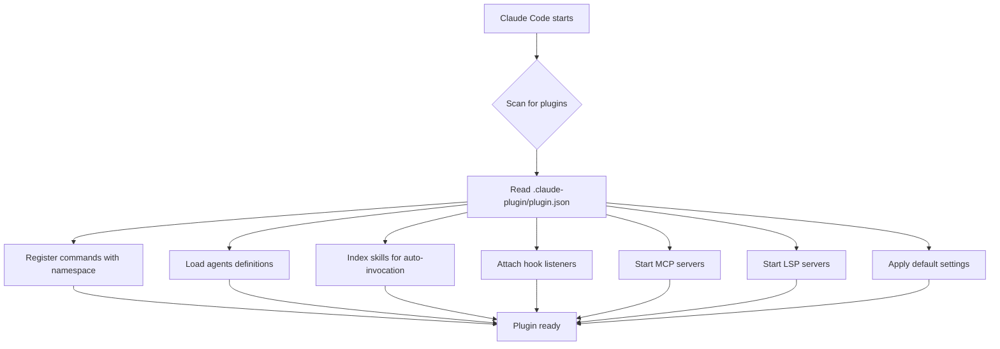
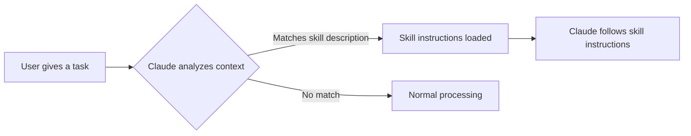
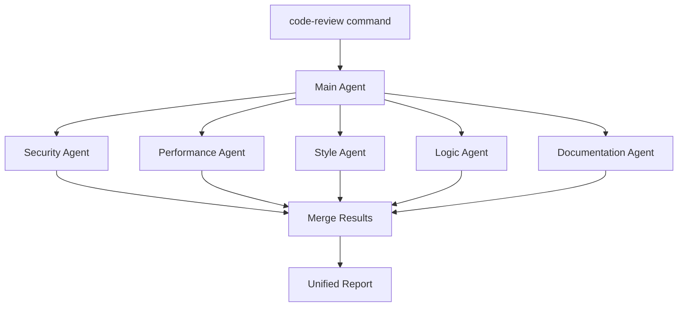
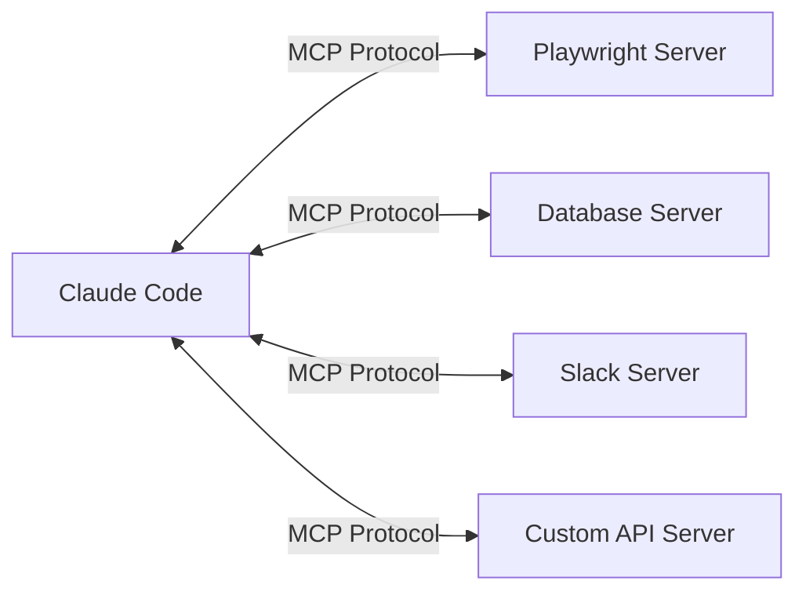
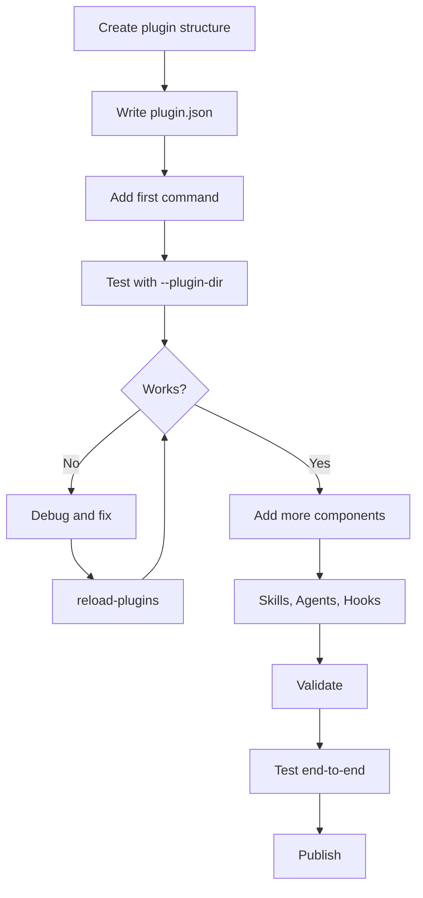
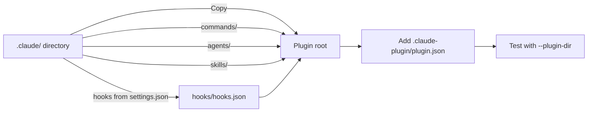
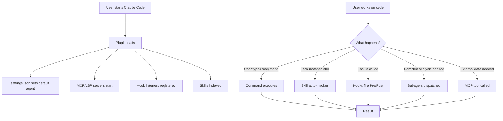

# Plugin Development Deep Dive

Building plugins for Claude Code lets you package reusable workflows, specialized agents, automated hooks, and external tool integrations into a single distributable unit. This guide walks through every aspect of plugin development — from the directory structure and manifest configuration to testing, debugging, and publishing your plugin to a marketplace.

Whether you are automating code reviews, enforcing security policies, or wiring up external services, plugins give you a structured, versioned, shareable way to extend Claude Code far beyond what standalone configuration files can do.

---

## Why Plugins Exist

Before plugins, all customization lived inside a project's `.claude/` directory: slash commands, agents, skills, and hook definitions mixed together with the rest of the codebase. That approach works for personal workflows, but it has clear limitations:

- **No versioning** — changes to your automation are not tracked separately from application code.
- **No sharing** — another developer cannot install your workflow with a single command.
- **No namespacing** — two teams using a `/review` command will collide.

Plugins solve all three problems. A plugin is a self-contained directory with a manifest, and Claude Code loads it as a first-class extension. Commands are namespaced (`/plugin-name:command`), versions follow semver, and distribution happens through marketplaces backed by Git repositories.

### Standalone vs Plugin at a Glance

| Aspect | Standalone (`.claude/`) | Plugin |
|---|---|---|
| Command invocation | `/hello` | `/plugin-name:hello` |
| Scope | Personal, project-local | Shareable, versioned |
| Best for | Quick experiments | Reusable cross-project workflows |
| Distribution | Copy files manually | Marketplace install |
| Namespacing | None — collisions possible | Automatic via plugin name |

---

## Plugin Architecture

A plugin is a directory that follows a specific layout. Claude Code discovers it through the `.claude-plugin/` folder, reads the manifest, and then loads every other component — commands, agents, skills, hooks, MCP servers, LSP servers, and settings — from well-known paths relative to the plugin root.

### Directory Structure

```
plugin-name/
├── .claude-plugin/
│   └── plugin.json          # Plugin metadata (the ONLY file inside .claude-plugin/)
├── commands/                # Slash commands
├── agents/                  # Specialized subagents
├── skills/                  # Agent Skills with SKILL.md files
├── hooks/                   # Event handlers (hooks.json)
├── .mcp.json                # MCP server configurations
├── .lsp.json                # LSP server configurations
├── settings.json            # Default settings
└── README.md
```

> **Critical rule:** Only `plugin.json` goes inside `.claude-plugin/`. Never place `commands/`, `agents/`, `skills/`, or `hooks/` inside that folder. They belong at the plugin root.

### How Claude Code Loads a Plugin



When Claude Code launches (or when you run `/reload-plugins`), it walks the plugin directory, reads the manifest, and wires up every component. Each component type has its own discovery mechanism:

- **Commands** are found by scanning the `commands/` directory for markdown files.
- **Agents** are found by scanning the `agents/` directory.
- **Skills** are found by looking for `SKILL.md` files inside subdirectories of `skills/`.
- **Hooks** are read from `hooks/hooks.json`.
- **MCP servers** are read from `.mcp.json` at the plugin root.
- **LSP servers** are read from `.lsp.json` at the plugin root.
- **Settings** are read from `settings.json` at the plugin root.

---

## The Plugin Manifest (`plugin.json`)

The manifest is the identity card of your plugin. It lives at `.claude-plugin/plugin.json` and tells Claude Code who the plugin is, what version it is, and where to find more information.

### Minimal Example

```json
{
  "name": "my-plugin",
  "description": "A greeting plugin",
  "version": "1.0.0"
}
```

### All Fields

| Field | Required | Type | Description |
|---|---|---|---|
| `name` | Yes | `string` | Unique identifier. Also used as the namespace for commands (e.g., `/my-plugin:hello`). Use lowercase, hyphens only. |
| `description` | Yes | `string` | Short human-readable summary shown in plugin listings and help output. |
| `version` | Yes | `string` | Semantic version (`major.minor.patch`). Claude Code uses this for marketplace updates. |
| `author` | No | `object` | An object with a `name` field (e.g., `{ "name": "Your Name" }`). Shown in marketplace listings. |
| `homepage` | No | `string` | URL to the plugin's documentation or landing page. |
| `repository` | No | `string` | URL to the source code repository. |
| `license` | No | `string` | SPDX license identifier (e.g., `"MIT"`, `"Apache-2.0"`). |

### Full Example

```json
{
  "name": "code-review",
  "description": "Automated code review with parallel subagents",
  "version": "2.1.0",
  "author": { "name": "Acme Engineering" },
  "homepage": "https://acme.dev/plugins/code-review",
  "repository": "https://github.com/acme/claude-code-review",
  "license": "MIT"
}
```

### Naming Conventions

The `name` field serves double duty: it is the unique identifier in marketplaces *and* the namespace prefix for every command the plugin exposes. Choose it carefully:

- Keep it short — users type it every time they invoke a command.
- Use hyphens, not underscores or camelCase (`code-review`, not `codeReview`).
- Make it descriptive — `security-guidance` is better than `sg`.

---

## Commands (Slash Commands)

Commands are the most visible part of a plugin. They give users explicit, on-demand workflows triggered by typing a slash command in the Claude Code prompt.

### Creating a Command

Each command is a markdown file inside the `commands/` directory. The filename (minus the `.md` extension) becomes the command name, namespaced under the plugin.

```
commands/
├── review.md          # Invoked as /plugin-name:review
├── fix.md             # Invoked as /plugin-name:fix
└── report/
    └── summary.md     # Invoked as /plugin-name:report:summary
```

Subdirectories create nested command namespaces using the colon separator.

### Command File Format

A command file is plain markdown. The content becomes the prompt that Claude Code executes when the user invokes the command.

```markdown
Review the current Git diff for:
1. Logic errors
2. Security vulnerabilities
3. Performance issues

Provide a summary with severity ratings.
```

### Arguments

Users can pass arguments after the command name. Inside the command file, use the `$ARGUMENTS` placeholder to capture whatever the user typed:

```markdown
Explain the following concept in simple terms:

$ARGUMENTS
```

When the user types `/my-plugin:explain dependency injection`, the `$ARGUMENTS` placeholder is replaced with `dependency injection`.

### Real-World Example: The `commit-commands` Plugin

The official `commit-commands` plugin ships three commands:

| Command | What It Does |
|---|---|
| `/commit-commands:commit` | Stages and commits with a well-crafted message |
| `/commit-commands:commit-push-pr` | Commits, pushes, and opens a pull request |
| `/commit-commands:clean_gone` | Deletes local branches whose remote tracking branch is gone |

Each is a markdown file in `commands/` describing the workflow Claude should follow.

---

## Agent Skills

Skills are instructions that Claude Code can automatically invoke based on the current task context — no slash command required. They are the "always-on" counterpart to the "on-demand" nature of commands.

### How Skills Work



Claude reads the `description` field in every loaded skill's frontmatter. If the current task matches a skill's description, Claude automatically pulls in that skill's instructions — without the user explicitly asking.

### Creating a Skill

Skills live in `skills/`. Each skill is a **subdirectory** containing a `SKILL.md` file.

```
skills/
├── code-review/
│   └── SKILL.md
├── security-check/
│   └── SKILL.md
└── accessibility-audit/
    └── SKILL.md
```

### The `SKILL.md` Format

Every `SKILL.md` starts with YAML frontmatter between `---` delimiters, followed by the skill instructions in markdown.

```markdown
---
name: code-review
description: Reviews code for best practices and common bugs. Use when reviewing code, checking pull requests, or auditing changes.
---

## Code Review Instructions

When reviewing code, follow these steps:

1. **Read the diff** — Use the Bash tool to run `git diff` or read the relevant files.
2. **Check for logic errors** — Look for off-by-one errors, null checks, and race conditions.
3. **Evaluate naming** — Are variables and functions named clearly?
4. **Assess test coverage** — Are edge cases tested?

Provide findings in a structured table with columns: File, Line, Severity, Finding.
```

### Frontmatter Options

| Field | Required | Type | Description |
|---|---|---|---|
| `name` | Yes | `string` | The skill identifier. |
| `description` | Yes | `string` | Tells Claude *when* to use this skill. Write it like a search query — "Use when reviewing code, checking PRs, auditing changes." |
| `disable-model-invocation` | No | `boolean` | When `true`, Claude will never auto-invoke this skill. It can only be triggered manually. Defaults to `false`. |

### The `$ARGUMENTS` Placeholder in Skills

Just like commands, skills support `$ARGUMENTS`. When a skill is invoked (manually or automatically), any user input is substituted into this placeholder.

### Auto-Invocation vs Manual-Only

By default, skills are **model-invoked**: Claude decides when they are relevant. This is powerful but sometimes you want a skill that only activates when explicitly called. Set `disable-model-invocation: true` in the frontmatter for that behavior.

**When to use auto-invocation:**
- Enforcing coding standards on every edit
- Security scanning whenever new code is written
- Accessibility checks whenever frontend components are created

**When to use manual-only:**
- One-off generation tasks (e.g., "generate a migration")
- Destructive operations (e.g., "reset the database")

### Real-World Example: The `frontend-design` Plugin

The official `frontend-design` plugin ships a skill that auto-invokes whenever Claude detects frontend work (HTML, CSS, React components). The skill instructions guide Claude to follow specific design system rules, use particular component libraries, and maintain visual consistency — all without the user having to remember to ask.

---

## Subagents

Subagents are specialized AI personalities that run in isolated context windows. They let you divide complex tasks among focused experts, each with their own system prompt, tool access, and even model selection.

### Why Subagents Matter

The main Claude Code conversation accumulates context over time. A long conversation means more tokens consumed and a higher chance of the model losing focus. Subagents solve this by:

1. **Isolating context** — Each subagent gets a fresh context window with only its system prompt and relevant data.
2. **Restricting tools** — A security auditor subagent does not need file-writing tools. Limiting tools reduces risk and focuses the agent.
3. **Enabling parallelism** — Multiple subagents can run simultaneously on different aspects of a task.
4. **Choosing the right model** — A simple formatting task can use a faster, cheaper model while a complex analysis task uses the most capable one.

### Creating a Subagent

Subagents live in `agents/`. Each agent is a markdown file with YAML frontmatter.

```
agents/
├── security-auditor.md
├── performance-reviewer.md
└── documentation-writer.md
```

### Agent Definition Format

```markdown
---
name: security-auditor
description: Analyzes code for security vulnerabilities and unsafe patterns
tools: Read, Grep, Bash
model: sonnet
---

You are a security-focused code auditor. Your job is to find vulnerabilities in code.

## What to Look For

- SQL injection
- Cross-site scripting (XSS)
- Insecure deserialization
- Hardcoded secrets
- Missing input validation
- Improper error handling that leaks information

## Output Format

For each finding, report:
- **File and line number**
- **Vulnerability type** (from OWASP Top 10 if applicable)
- **Severity** (Critical / High / Medium / Low)
- **Recommendation** for remediation
```

### Frontmatter Fields

| Field | Required | Type | Description |
|---|---|---|---|
| `name` | Yes | `string` | Identifier used to reference the agent. |
| `description` | Yes | `string` | Describes what the agent does — Claude uses this to decide when to dispatch to it. |
| `tools` | No | `string` | Comma-separated list of tools the agent is allowed to use (e.g., `Read, Grep, Bash`). Restricting tools improves safety and focus. |
| `model` | No | `string` | Which model the agent runs on. Options include `sonnet`, `opus`, `haiku`, etc. Useful for cost/performance trade-offs. |

### Parallel Subagent Execution

One of the most powerful patterns is launching multiple subagents in parallel. The official `code-review` plugin demonstrates this: it spawns **five Sonnet subagents** simultaneously, each reviewing a different aspect of the codebase (logic, performance, security, style, and documentation). The results are collected and merged into a unified report.



### Activating an Agent as Default

If you want your plugin's agent to be the default personality for the entire Claude Code session, use `settings.json`:

```json
{
  "agent": "security-auditor"
}
```

This replaces the main Claude Code persona with your agent's system prompt and tool restrictions for the duration of the session.

---

## Hooks

Hooks let your plugin react to lifecycle events inside Claude Code. Instead of waiting for the user to invoke a command, hooks fire automatically when specific things happen — a file is written, a tool is called, a prompt is submitted.

### Lifecycle Events

| Event | When It Fires | Typical Use |
|---|---|---|
| `SessionStart` | Claude Code session begins | Set up environment, check prerequisites |
| `UserPromptSubmit` | User submits a prompt (before processing) | Validate input, inject context |
| `PreToolUse` | Before a tool executes | Block dangerous operations, add guardrails |
| `PostToolUse` | After a tool executes | Lint files, run tests, validate output |
| `Notification` | Claude Code sends a notification | Custom alerting, logging |
| `Stop` | Main agent finishes | Cleanup, final validation |
| `SubagentStop` | A subagent finishes | Collect results, trigger next phase |

### Hook Configuration (`hooks/hooks.json`)

All hooks for a plugin are defined in a single `hooks/hooks.json` file.

```json
{
  "hooks": {
    "PostToolUse": [
      {
        "matcher": "Write|Edit",
        "hooks": [
          {
            "type": "command",
            "command": "jq -r '.tool_input.file_path' | xargs npm run lint:fix"
          }
        ]
      }
    ]
  }
}
```

### Hook Types: Command vs Prompt

There are two fundamentally different ways a hook can respond to an event:

**Command hooks** run a shell command. They are fast, deterministic, and do not consume AI tokens.

```json
{
  "type": "command",
  "command": "npm run lint:fix -- $FILE_PATH"
}
```

**Prompt hooks** send a prompt to the LLM for evaluation. They are more flexible but slower and token-consuming.

```json
{
  "type": "prompt",
  "prompt": "Check if the file that was just written follows our coding standards. If not, fix it."
}
```

**When to use each:**

| Command Hooks | Prompt Hooks |
|---|---|
| Linting and formatting | Subjective code quality checks |
| Running test suites | Deciding whether to proceed with an operation |
| File validation (JSON schema, etc.) | Generating follow-up actions based on context |
| Logging and metrics | Complex conditional logic |

### Matchers

The `matcher` field filters which tool invocations trigger a hook. It accepts a pipe-separated list of tool names:

- `"Write"` — only fires when the Write tool is used
- `"Write|Edit"` — fires for Write or Edit
- `"Bash"` — fires whenever a Bash command runs

Without a matcher, the hook fires for *every* tool use in that lifecycle event.

### Real-World Example: The `security-guidance` Plugin

The official `security-guidance` plugin uses a `PreToolUse` hook that monitors **nine different security patterns**. Before any tool executes, the hook checks whether the operation might introduce a vulnerability (hardcoded credentials, unsafe deserialization, SQL string concatenation, etc.) and warns the user.

### Real-World Example: The `ralph-wiggum` Plugin

The `ralph-wiggum` plugin uses a `Stop` hook to create iterative AI loops. When the main agent finishes, the hook evaluates the output and decides whether another iteration is needed — effectively creating a self-improving feedback loop.

---

## MCP Servers

MCP (Model Context Protocol) is a universal adapter that connects Claude Code to external systems. Each MCP server exposes a set of tools that Claude can call, just like its built-in tools (Read, Write, Bash, etc.).

### What MCP Enables



MCP servers can provide access to:
- **Browser automation** (Playwright)
- **Databases** (query and mutate)
- **Third-party APIs** (Slack, Jira, GitHub, Notion)
- **Custom internal services**

### Configuration (`.mcp.json`)

MCP servers are configured in `.mcp.json` at the plugin root.

```json
{
  "mcpServers": {
    "playwright": {
      "command": "npx",
      "args": ["@playwright/mcp@latest"]
    },
    "my-database": {
      "command": "node",
      "args": ["./mcp-servers/database-server.js"],
      "env": {
        "DATABASE_URL": "postgresql://localhost:5432/mydb"
      }
    }
  }
}
```

Each key is the server name, and the value specifies:

| Field | Description |
|---|---|
| `command` | The executable to run (e.g., `npx`, `node`, `python`) |
| `args` | Arguments passed to the command |
| `env` | Environment variables available to the server process |

### Adding MCP Servers via CLI

You can also add MCP servers directly from the command line:

```bash
claude mcp add playwright npx @playwright/mcp@latest
```

This modifies the `.mcp.json` file for you.

### Token Considerations

Every MCP server adds its tool definitions to Claude's context window. More servers means more tokens consumed before any actual work begins. Be selective — only include servers your plugin genuinely needs.

---

## LSP Servers

LSP (Language Server Protocol) servers provide code intelligence: diagnostics, completions, hover information, and go-to-definition. Plugins can ship LSP server configurations so that Claude Code has language-aware analysis for specific programming languages.

### Configuration (`.lsp.json`)

```json
{
  "go": {
    "command": "gopls",
    "args": ["serve"],
    "extensionToLanguage": {
      ".go": "go"
    }
  },
  "typescript": {
    "command": "typescript-language-server",
    "args": ["--stdio"],
    "extensionToLanguage": {
      ".ts": "typescript",
      ".tsx": "typescriptreact"
    }
  }
}
```

Each key is a language identifier. The value specifies:

| Field | Description |
|---|---|
| `command` | The LSP server executable |
| `args` | Arguments to start the server |
| `extensionToLanguage` | Maps file extensions to language IDs the server understands |

### When to Use LSP in a Plugin

Most developers already have LSP servers configured in their editors. A plugin should ship LSP configuration when:

- The plugin targets a specific language ecosystem and needs richer analysis than file reading provides.
- The target audience may not have the relevant LSP server installed and the plugin can bundle it.
- The plugin's hooks or skills depend on diagnostic information from the LSP.

---

## Settings

Plugins can ship default settings in a `settings.json` file at the plugin root. Currently, the only supported key is `agent`, which activates a plugin agent as the main thread personality.

### Configuration (`settings.json`)

```json
{
  "agent": "security-reviewer"
}
```

When this setting is active, the specified agent's system prompt and tool restrictions replace the default Claude Code persona for the entire session. This is useful for plugins that want to completely reshape the Claude Code experience — for example, a "security-first development" plugin where every interaction is filtered through a security lens.

### Important Notes

- The `agent` value must match the `name` field in one of the plugin's agent definitions (in `agents/`).
- Only one agent can be active at a time. If multiple plugins set this, the last one loaded wins.
- Users can override this by selecting a different agent during their session.

---

## Testing and Debugging Plugins

### Loading a Plugin During Development

Use the `--plugin-dir` flag to load your plugin from a local directory:

```bash
claude --plugin-dir ./my-plugin
```

You can load multiple plugins simultaneously:

```bash
claude --plugin-dir ./my-plugin --plugin-dir ./another-plugin
```

### Hot Reloading

After making changes to your plugin files, you do not need to restart Claude Code. Run the `/reload-plugins` command inside the session to pick up changes immediately.

### Validation

Claude Code includes a built-in validation command that checks your plugin structure for errors:

```bash
claude plugin validate
```

This checks:
- Manifest format and required fields
- Command file syntax
- Agent frontmatter validity
- Skill SKILL.md format
- Hook configuration schema
- MCP and LSP JSON validity

### Debugging Tips

1. **Start with validation** — Run `claude plugin validate` before anything else. It catches structural errors immediately.

2. **Test commands first** — Commands are the simplest component. Get a basic command working before adding agents, skills, or hooks.

3. **Check hook matchers** — A common mistake is a typo in the matcher string. `"Write|Edit"` works; `"write|edit"` may not (tool names are case-sensitive).

4. **Watch token usage with MCP** — If your plugin adds MCP servers, monitor token consumption. Every server's tool definitions are loaded into context.

5. **Isolate subagent issues** — If a subagent is not behaving as expected, test its system prompt and tool restrictions independently by creating a temporary command that invokes just that agent.

6. **Use `/reload-plugins` liberally** — After every change, reload. It is instant and avoids stale-state bugs.

### Development Workflow



---

## Distribution

### Official Marketplace

Submit your plugin to the official Claude Code marketplace:

- **Web submission:** `claude.ai/settings/plugins/submit` or `platform.claude.com/plugins/submit`
- Your plugin goes through a review process before appearing in the public marketplace.

### Team Marketplaces

For internal or private plugins, create a team marketplace backed by a Git repository:

```bash
/plugin marketplace add user-or-org/repo-name
```

### Marketplace Repository Format

A marketplace repository contains a `.claude-plugin/marketplace.json` file that indexes the available plugins:

```
marketplace-repo/
├── .claude-plugin/
│   └── marketplace.json
├── plugin-a/
│   ├── .claude-plugin/
│   │   └── plugin.json
│   └── ...
└── plugin-b/
    ├── .claude-plugin/
    │   └── plugin.json
    └── ...
```

This lets organizations maintain curated collections of plugins that team members can install from a single source.

### Versioning Strategy

Follow semantic versioning strictly:

- **Patch** (1.0.0 -> 1.0.1): Bug fixes, typo corrections in prompts
- **Minor** (1.0.0 -> 1.1.0): New commands, skills, or agents added (backward compatible)
- **Major** (1.0.0 -> 2.0.0): Breaking changes — renamed commands, removed features, restructured hooks

---

## Real-World Examples from Official Plugins

The 13 official Claude Code plugins demonstrate a range of patterns and complexity levels. Here are highlights showing how different components combine.

### `code-review` — Parallel Subagent Orchestration

- **Pattern:** One command dispatches to five parallel subagents.
- **Components:** `commands/` + `agents/`
- **Key idea:** Each subagent (logic, performance, security, style, documentation) runs on Sonnet in its own context window. Results are merged into a unified review.
- **Lesson:** Subagents are most powerful when each has a narrow, well-defined focus.

### `commit-commands` — Multi-Command Utility

- **Pattern:** Three related commands packaged together.
- **Components:** `commands/` only
- **Commands:** `/commit`, `/commit-push-pr`, `/clean_gone`
- **Lesson:** Not every plugin needs agents or skills. A set of well-crafted commands can be highly valuable.

### `hookify` — Full Component Integration

- **Pattern:** Commands, an agent, and a skill working together.
- **Components:** `commands/` + `agents/` + `skills/`
- **Key idea:** The skill auto-invokes when Claude detects hook-related work, while the command provides explicit hook creation workflows.
- **Lesson:** Skills and commands complement each other — skills for automatic, commands for explicit.

### `feature-dev` — Multi-Phase Workflow

- **Pattern:** A 7-phase development workflow with specialized agents at each phase.
- **Components:** `commands/` + `agents/` (7 agents: explorer, architect, implementer, tester, reviewer, etc.)
- **Key idea:** Complex software development tasks are broken into phases, each handled by an expert agent.
- **Lesson:** For large workflows, define clear phases with hand-off points between agents.

### `plugin-dev` — Meta-Plugin

- **Pattern:** A plugin for building plugins.
- **Components:** `commands/` + `agents/` + `skills/` (7 expert skills)
- **Command:** `/plugin-dev:create-plugin`
- **Key idea:** Seven specialized skills cover different aspects of plugin development (manifest creation, command writing, hook configuration, etc.).
- **Lesson:** Skills can encode deep domain expertise that Claude draws on automatically.

### `security-guidance` — Preventive Hooks

- **Pattern:** A `PreToolUse` hook that monitors every tool call for security risks.
- **Components:** `hooks/` only
- **Key idea:** Nine security patterns are checked before any tool executes. Issues are flagged before they become problems.
- **Lesson:** Hooks are ideal for guardrails — they run silently until something needs attention.

### `frontend-design` — Auto-Invoked Skill

- **Pattern:** A single skill that activates automatically for frontend work.
- **Components:** `skills/` only
- **Key idea:** Whenever Claude detects frontend-related tasks (HTML, CSS, React), the skill's design system rules are loaded automatically.
- **Lesson:** A single well-written skill can enforce consistency across an entire domain without user intervention.

### `ralph-wiggum` — Iterative Loops via Hooks

- **Pattern:** A `Stop` hook that evaluates output and triggers re-runs.
- **Components:** `hooks/` only
- **Key idea:** When the main agent finishes, the hook decides whether the output is satisfactory. If not, it triggers another iteration.
- **Lesson:** Hooks on the `Stop` event enable self-improving feedback loops.

---

## Migration from Standalone to Plugin

If you have existing customizations in your project's `.claude/` directory, migrating to a plugin is straightforward.

### Step-by-Step Migration

1. **Create the plugin structure** — Make a new directory with `.claude-plugin/plugin.json`.

2. **Copy components** — Move `commands/`, `agents/`, and `skills/` directories from `.claude/` to the plugin root.

3. **Migrate hooks** — Hooks in standalone mode live in `settings.json` under the `.claude/` directory. In a plugin, they move to `hooks/hooks.json`. The format is the same; only the file location changes.

4. **Test** — Load the plugin with `--plugin-dir` and verify everything works.

5. **Update references** — Commands are now namespaced. `/review` becomes `/my-plugin:review`. Update any documentation or team guides.



---

## Putting It All Together

A well-designed plugin combines multiple component types, each playing to its strengths:

| Component | Strength | When to Use |
|---|---|---|
| **Commands** | Explicit, user-triggered workflows | On-demand tasks the user consciously initiates |
| **Skills** | Automatic, context-aware guidance | Standards enforcement, domain expertise |
| **Agents** | Isolated, focused expertise | Complex analysis, parallel processing |
| **Hooks** | Reactive, event-driven automation | Guardrails, linting, logging, iterative loops |
| **MCP servers** | External system integration | APIs, databases, browsers, third-party services |
| **LSP servers** | Code intelligence | Language-specific analysis and diagnostics |
| **Settings** | Session-wide configuration | Default agent, global preferences |

### Integration Flow



This layered architecture means a plugin can start simple (one command) and grow into a sophisticated system (commands + agents + skills + hooks + MCP) as needs evolve.

---

## References

- [Claude Code Plugins Documentation](https://code.claude.com/docs/en/plugins) — Official plugin development guide covering all component types
- [Claude Code Architecture Overview](https://alexop.dev) — Deep dive into MCP, subagents, and plugin integration patterns
- [Model Context Protocol Specification](https://modelcontextprotocol.io) — The protocol standard for MCP server implementation
- [Language Server Protocol Specification](https://microsoft.github.io/language-server-protocol/) — The LSP standard for code intelligence servers
- [Semantic Versioning](https://semver.org) — The versioning scheme used for plugin versions
- [SPDX License List](https://spdx.org/licenses/) — Standard license identifiers for the `license` field in plugin.json
