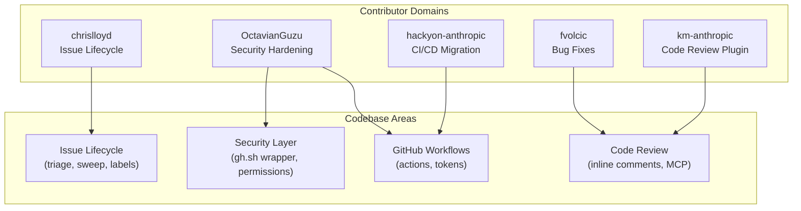
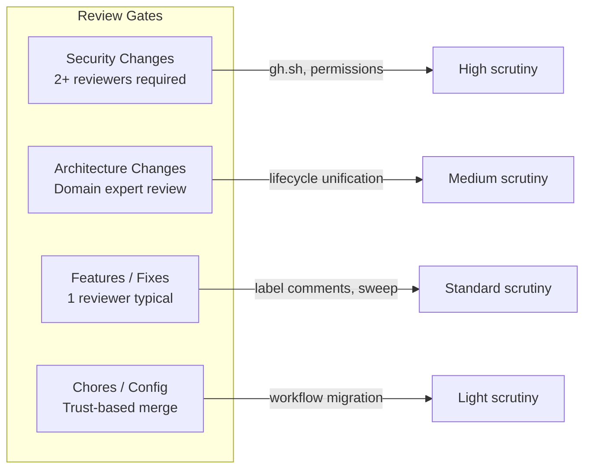
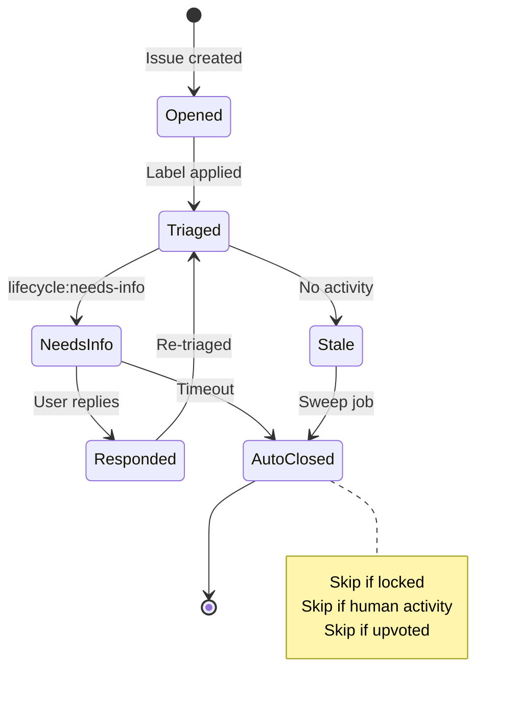
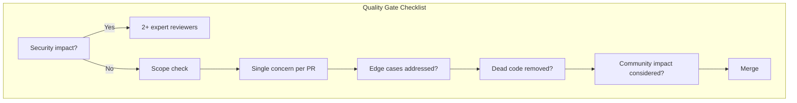

# Pull Request Review Patterns in Claude Code

This document analyzes 20 recently merged pull requests in the Claude Code repository to surface contribution patterns, review culture, quality standards, and architectural decisions. Understanding how a project reviews code reveals its true engineering values -- what the team cares about, what risks they guard against, and how they evolve their systems over time.

---

## Key Contributors and Their Domains

The Claude Code repository has a clear division of ownership across its contributors. Each contributor tends to focus on a specific area, which is a sign of a maturing codebase where individuals build deep expertise in particular subsystems.

### Contributor Breakdown

| Contributor | PRs | Primary Focus |
|---|---|---|
| Chris Lloyd (`chrislloyd`) | 5 | Issue lifecycle management system |
| Octavian Guzu (`OctavianGuzu`) | 5 | Security hardening and CI/CD wrappers |
| JB (`hackyon-anthropic`) | 4 | Workflow migration (claude-code-action) |
| Franklin Volcic (`fvolcic`) | 2 | Bug fixes and code review plugin |
| Kashyap Murali (`km-anthropic`) | 1 | Code review plugin behavior |
| `bogini` | 1 | Cleanup and removal of stale systems |
| `ant-kurt` | 1 | Documentation and settings examples |

### What This Tells Us

- **Domain specialization is strong.** Chris Lloyd owns the entire issue lifecycle system (triage, stale detection, auto-close, sweep). Octavian Guzu owns the security wrapper layer around the GitHub CLI. JB handled a concentrated burst of CI/CD migration work.
- **Single-PR contributors exist.** Some contributors land focused, one-off changes (km-anthropic fixing subagent comment behavior, ant-kurt adding docs). This suggests the codebase is accessible enough for targeted contributions.
- **Cleanup is valued.** The fact that `bogini` merged a PR purely to remove an obsolete system (oncall triage) shows the team actively reduces technical debt rather than letting dead code accumulate.

---

## Key Reviewers and Review Focus Areas

Reviewers in a project act as quality gatekeepers. Analyzing who reviews what -- and what they focus on -- reveals the project's implicit quality standards.

### Reviewer Profiles

| Reviewer | Role | Focus Area | Notable Reviews |
|---|---|---|---|
| `ddworken` | COLLABORATOR | Security | Approved gh.sh wrapper PRs (#30066, #28533) |
| `bogini` | COLLABORATOR | Lifecycle correctness | Approved auto-close fix (#26360) |
| `ashwin-ant` | COLLABORATOR | System design | Approved lifecycle unification refactor (#25352) |
| `sid374` | CONTRIBUTOR | Plugin behavior | Approved code-review comment fix (#33472) |
| `chrnorm` | -- | Security | Co-approved gh.sh validation (#30066) |
| `amorriscode` | CONTRIBUTOR | Feature completeness | Approved lifecycle label comments (#25665) |

### Review Patterns Observed

**Security PRs get multiple reviewers.** PR #30066 (gh.sh validation improvements) received approvals from both `chrnorm` and `ddworken`. This dual-review pattern for security-sensitive changes is a best practice -- it means no single person's blind spots can allow a security regression through.

**Domain experts review domain changes.** `bogini` reviewed the auto-close fix because they understand the triage system. `ashwin-ant` reviewed the lifecycle unification because architectural refactors need someone who understands the full system shape.

**Some PRs merge with minimal review.** Several of the workflow migration PRs by `hackyon-anthropic` and some of chrislloyd's earlier lifecycle PRs do not show explicit reviewer approvals in the data. This could indicate either trust-based merging for lower-risk changes, or that some reviews happened outside the formal GitHub review system (e.g., pair programming, Slack discussions).

---

## Recurring PR Themes

Analyzing the 20 PRs reveals five dominant themes that characterize what the Claude Code team is actively building and maintaining.

### Theme 1: Security Hardening (6 PRs)

This is the most prominent theme across the PR history. A full 30% of recent PRs focus on tightening security boundaries, particularly around the GitHub CLI (`gh`).

**The core problem:** GitHub Actions workflows that call `gh` directly are vulnerable to injection attacks. If an attacker can influence the arguments passed to `gh`, they could potentially read private repository data, modify issues, or escalate privileges.

**The solution pattern:**

1. **Wrapper script (`gh.sh`)** -- A shell script that acts as a controlled interface to `gh`. Instead of calling `gh` directly, workflows call `gh.sh`, which validates every subcommand and flag against an allowlist before executing.

2. **Allowlist-based validation** -- Only specific subcommands (like `issue view`, `issue edit`) and specific flags are permitted. Any unrecognized input is rejected.

3. **Zero-positional enforcement** -- The wrapper prevents passing unrecognized positional arguments, which could be used for injection.

4. **Environment pinning** -- Environment variables are explicitly set rather than inherited, preventing environment-based attacks.

5. **Permission minimization** -- Unnecessary permissions like `id-token: write` (OIDC) are removed when not needed (#28756).

6. **Non-write user monitoring** -- A dedicated workflow (#28243) detects when PRs modify the list of allowed non-write users, which is a sensitive configuration.

**Why this matters for beginners:** Security in CI/CD is often overlooked because workflows "just work." The Claude Code team's approach demonstrates defense-in-depth -- multiple layers of protection rather than trusting any single mechanism. This is a professional-grade pattern worth understanding early in your career.

### Theme 2: Issue Lifecycle Management (7 PRs)

Chris Lloyd drove a complete system for managing the lifecycle of GitHub issues, from initial triage through eventual closure.

**The lifecycle flow:**

**Evolution visible in PRs:**

1. **#25210** -- Initial sweep system to close timed-out issues
2. **#25352** -- Unified triage, stale detection, and lifecycle into one system (major refactor)
3. **#25649** -- Fixed crash on locked issues (edge case discovered in production)
4. **#25665** -- Added automated comments explaining lifecycle labels to users
5. **#26360** -- Fixed a bug where issues with human activity were being auto-closed anyway

**The bug in #26360 is particularly instructive.** It was a three-part fix:
- Issues with human comments were not being detected as "active"
- Upvote protection only worked for some content types, not all
- The fix required understanding the difference between bot activity and human activity

A community member (`aspiers`) even commented with 6 thumbs up arguing against auto-closing entirely, suggesting milestones as an alternative. This shows the team is making deliberate product decisions about automation vs. human control, and the community has strong opinions about it.

### Theme 3: CI/CD Workflow Migration (4 PRs)

JB (`hackyon-anthropic`) executed a focused migration from `claude-code-base-action` to `claude-code-action` across four rapid-fire PRs, all merged on 2026-01-14:

1. **#18198** -- Core migration of workflow references
2. **#18206** -- Added `id-token: write` permission (later removed in #28756 as unnecessary)
3. **#18209** -- Added `github_token` input
4. **#18238** -- Allowed non-write users to trigger workflows

**Pattern insight:** This burst of same-day PRs suggests an iterative deployment approach. Rather than one monolithic PR, the migration was broken into small, individually-mergeable steps. This is safer because each step can be independently reverted if something breaks. However, the `id-token` permission added in #18206 turned out to be unnecessary and was cleaned up a month later in #28756 -- showing that even small, focused PRs can introduce unnecessary changes that need later cleanup.

### Theme 4: Code Review Plugin (3 PRs)

The code review functionality is a distinct subsystem where Claude provides inline code review comments on PRs.

**The critical bug in #33472:** Subagents (automated Claude instances) were posting test or probe comments on real customer PRs. The fix was adding a `confirmed=true` parameter to the MCP (Model Context Protocol) tool call, ensuring that only intentional comments are posted. This reveals:

- The system uses MCP tools for GitHub interactions
- There is a subagent architecture where multiple Claude instances can operate
- The boundary between "testing" and "production" behavior needs explicit enforcement

### Theme 5: Cleanup and Debt Reduction (2 PRs)

- **#29462** removed the entire oncall triage system
- **#28967** increased timeouts before the removal (suggesting the system was struggling before being deprecated)

This two-PR arc tells a story: the oncall triage system was hitting timeout limits, got a temporary fix (more time), and was ultimately removed entirely. Recognizing when to stop fixing a system and instead remove it is an important engineering judgment.

---

## Code Review Quality Standards

Based on what gets approved, what gets flagged, and what patterns repeat, we can infer the team's implicit quality standards.

### Standard 1: Security Changes Require Expert Review

Every PR touching the `gh.sh` wrapper or workflow permissions received review from someone with security expertise (`ddworken`, `chrnorm`). This is not accidental -- it reflects a policy that security-sensitive code paths need specialized eyes.

### Standard 2: Prefer Removal Over Accumulation

The team actively removes code that is no longer needed (oncall triage removal, permission removal). This keeps the codebase lean and reduces the attack surface. In professional software development, the courage to delete code is often more valuable than the ability to write it.

### Standard 3: Edge Cases Discovered in Production Get Fixed Promptly

The locked-issue crash (#25649) and the human-activity auto-close bug (#26360) were both found in production and fixed quickly. The fixes were also thorough -- #26360 was a three-part fix addressing the root cause rather than just patching the symptom.

### Standard 4: Small, Focused PRs Are Preferred

Most PRs in this dataset change a single concern. Even the lifecycle unification (#25352), which was a major refactor, was preceded by smaller PRs that built up the individual components first. The workflow migration was split across four PRs rather than bundled into one.

### Standard 5: Community Feedback Is Acknowledged

The community comment on #26360 about auto-closing practices was not dismissed -- it received significant engagement (6 thumbs up). While the team proceeded with their approach, the feedback is visible and may influence future decisions.

---

## Architectural Decisions Surfaced in Reviews

### Decision 1: Wrapper Pattern for External Tool Access

Rather than calling `gh` directly from workflows, the team built an intermediary wrapper (`gh.sh`). This is an instance of the **Facade pattern** applied to CI/CD security. The wrapper:

- Provides a single point of control for all GitHub CLI access
- Makes it possible to audit every `gh` invocation
- Can be tested independently of the workflows that use it
- Allows security policy changes without modifying every workflow

For beginners, think of it like a bouncer at a club. Instead of letting everyone walk straight to the bar (calling `gh` directly), there is a single entry point that checks your ID and decides what you are allowed to do.

### Decision 2: Unified Lifecycle System Over Scattered Scripts

PR #25352 consolidated multiple separate scripts (triage, stale detection, sweep) into a single unified system. This architectural decision trades some complexity in one place for much less complexity overall. The benefits:

- Single source of truth for issue state transitions
- Fewer workflow files to maintain
- Consistent labeling and timeout behavior
- Easier to reason about the full lifecycle

### Decision 3: MCP Tool Protocol for Agent Actions

PR #33472 reveals that Claude's code review functionality uses MCP (Model Context Protocol) tools to interact with GitHub. This is significant architecture:

- Agent actions are mediated through a formal tool protocol
- Parameters like `confirmed` can gate destructive or visible actions
- The protocol provides a natural boundary between "what the agent wants to do" and "what actually happens"

This pattern of explicit confirmation gates is crucial for AI systems that interact with real-world resources. It prevents scenarios where testing, probing, or hallucinated actions have visible effects on production systems.

---

## Contribution Patterns and Velocity

### Temporal Distribution

| Period | PRs | Theme |
|---|---|---|
| Jan 14, 2026 | 4 | Workflow migration (burst) |
| Jan 16 - Feb 2 | 2 | Bug fixes, docs |
| Feb 11-14 | 5 | Issue lifecycle buildout |
| Feb 17-28 | 6 | Security hardening + lifecycle fixes |
| Mar 2-12 | 3 | Security + code review fix |

The pattern shows **thematic sprints** -- periods where the team focuses intensely on one area. The workflow migration was a single-day burst. The lifecycle system was built over about a week. Security hardening was spread over two weeks but clearly coordinated.

### PR Size and Risk Correlation

| Risk Level | Example PRs | Typical Review Depth |
|---|---|---|
| High (security) | #30066, #28533, #28243 | Multiple expert reviewers, detailed validation |
| Medium (new system) | #25352, #25210 | Domain expert review |
| Low (config/chore) | #28967, #18206 | Light or trust-based review |
| Fix (production bug) | #26360, #25649 | Fast turnaround, focused review |

---

## Lessons for New Contributors

Based on the patterns observed across these 20 PRs, here is practical guidance for anyone looking to contribute to or learn from this codebase:

1. **Keep PRs focused on a single concern.** The team clearly values small, reviewable changes over large bundles.

2. **Security-related changes will receive extra scrutiny.** If your PR touches workflow permissions, CLI wrappers, or authentication, expect (and welcome) detailed review.

3. **Fix edge cases thoroughly.** When a bug is found, address the root cause and related edge cases in the same fix (like the three-part fix in #26360).

4. **Do not be afraid to remove code.** If a system is no longer needed, removing it is a valuable contribution. The oncall triage removal (#29462) is a good example.

5. **Understand the wrapper pattern.** The `gh.sh` wrapper is a critical security boundary. Any new workflow that needs GitHub CLI access should use the wrapper, not call `gh` directly.

6. **Community feedback matters.** If your change affects user-facing behavior (like auto-closing issues), be prepared for community discussion and have clear reasoning for your approach.

---

## References

- [Claude Code GitHub Repository](https://github.com/anthropics/claude-code) (source of all analyzed PR data)
- [PR #33472: Code review confirmed parameter fix](https://github.com/anthropics/claude-code/pull/33472)
- [PR #30066: gh.sh wrapper validation improvements](https://github.com/anthropics/claude-code/pull/30066)
- [PR #26360: Auto-close human activity bug fix](https://github.com/anthropics/claude-code/pull/26360)
- [PR #25352: Issue lifecycle unification refactor](https://github.com/anthropics/claude-code/pull/25352)
- [PR #28533: gh.sh wrapper introduction](https://github.com/anthropics/claude-code/pull/28533)
