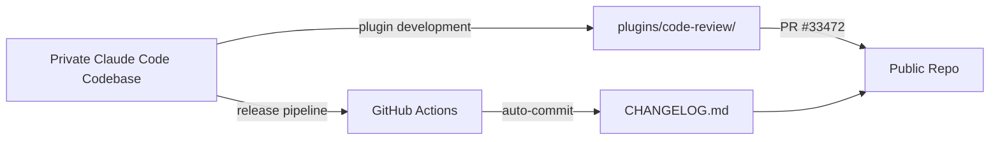
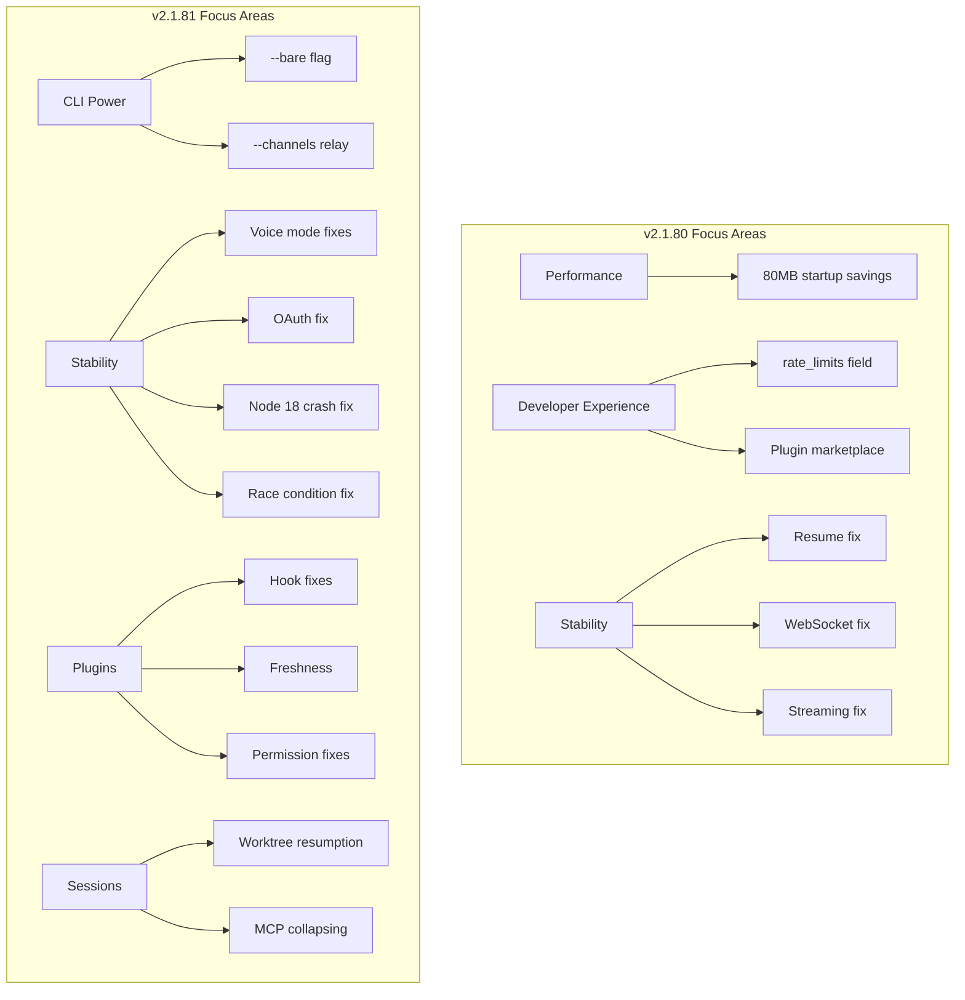
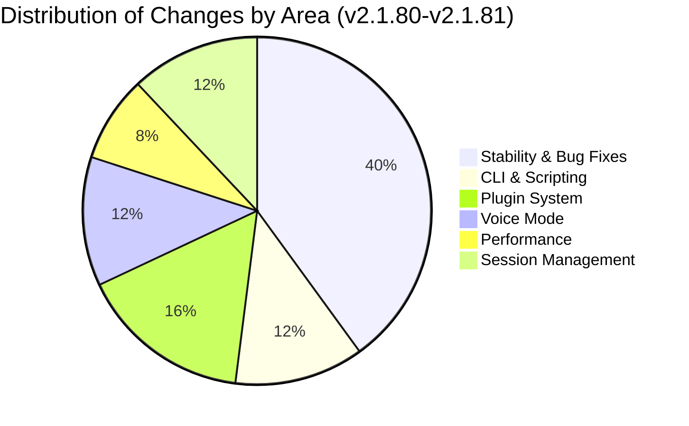

# Recent Changes in Claude Code (March 2026)

This document covers the last two weeks of development activity in the Claude Code repository (March 10--20, 2026). It is written for professionals who are new to the project and want to understand what the team is actively working on, what problems they are solving, and what patterns emerge from recent commits.

> **Note:** The Claude Code core product is closed-source. The public repository primarily contains documentation, plugins, and automated release artifacts. The changes described here reflect what is visible in that public layer, supplemented by detailed CHANGELOG entries that summarize the full product releases.

---

## Development Activity Overview

### What Happened in 14 Commits

Out of 14 commits in the last two weeks, the breakdown is:

| Category | Count | Description |
|----------|-------|-------------|
| Automated CHANGELOG updates | 12 | Generated by GitHub Actions on each release |
| Feature PR (merged) | 1 | Code-review plugin enhancement |
| Merge commit | 1 | PR #33472 merge |

This ratio tells an important story: **the public repository is primarily a release artifact surface**, not where day-to-day feature development happens. The real engineering work ships through the closed-source core, and the public repo reflects it via automated changelog updates and plugin changes.

### Most Changed Files

Only two files were modified across all 14 commits:

- **CHANGELOG.md** (12 changes) -- Updated automatically with every release.
- **plugins/code-review/commands/code-review.md** (1 change) -- Manual feature work on the code-review plugin.

This minimal footprint is typical of repositories that serve as a public interface to a larger private codebase.

---

## New Capabilities (Feature Commits)

### Code-Review Plugin: Confirmed Inline Comments

**Commit:** `db8834b` -- `feat(code-review): pass confirmed=true when posting inline comments`
**Author:** Kashyap Murali
**Merged via:** PR #33472 (March 12, 2026)

This is the only manual feature commit in the two-week window. Here is what it means and why it matters.

#### What Is the Code-Review Plugin?

Claude Code includes a plugin system that extends its capabilities. The **code-review** plugin allows Claude to review pull requests and post comments directly on specific lines of code (called "inline comments") in platforms like GitHub.

#### What Changed

Previously, when the code-review plugin posted inline comments on a PR, it did not explicitly mark them as "confirmed." This matters because many code review platforms distinguish between **pending** comments (drafts visible only to the author) and **confirmed** comments (published and visible to everyone).

By passing `confirmed=true`, the plugin now ensures that inline comments are immediately visible to all reviewers and the PR author, rather than sitting in a draft state that might never be submitted.

#### Why This Matters

In a real-world engineering workflow, a code review tool that leaves comments in draft state is almost useless -- the PR author never sees the feedback. This is a small change in code but a significant change in behavior. It is the difference between "Claude reviewed your PR" and "Claude reviewed your PR and you can actually see the results."

#### Lessons for Beginners

This commit illustrates several professional software engineering patterns:

1. **Conventional commit messages** -- The prefix `feat(code-review):` follows the Conventional Commits standard. `feat` means a new feature; `(code-review)` scopes it to a specific module. This convention makes changelogs, release notes, and git history searchable.

2. **Small, focused PRs** -- Only one file changed. The PR does exactly one thing: add a boolean flag. This makes it easy to review, easy to revert if something breaks, and easy to understand months later.

3. **Plugin architecture** -- The fact that this change lives in `plugins/code-review/` rather than the core codebase shows a separation of concerns. Plugins extend functionality without modifying the core product.

---

## Release Highlights (v2.1.80 -- v2.1.81)

Although the commits themselves are mostly automated, the CHANGELOG entries reveal a rich picture of what the engineering team shipped. These two releases span roughly one week and contain dozens of changes across multiple areas.

### v2.1.81 -- Major Themes

#### New CLI Capabilities

- **`--bare` flag for scripted `-p` calls** -- When you run Claude Code non-interactively (e.g., `claude -p "explain this code"`), the `--bare` flag strips away decorative output so the result is clean for piping into other tools. This is essential for integrating Claude Code into shell scripts, CI/CD pipelines, and automation workflows.

- **`--channels` permission relay** -- Channels are a way for Claude Code to communicate with external systems. This update allows permission grants to flow through channels, meaning an orchestrating system can approve tool use on behalf of the user.

- **`!` bash mode discoverability** -- In interactive mode, typing `!` lets you drop into a raw bash shell. This update improves how users discover that feature, likely through better prompts or help text.

#### Stability and Bug Fixes

- **Multiple voice mode fixes** -- Voice mode lets you talk to Claude Code instead of typing. Multiple fixes suggest this is an active area of development with rough edges being smoothed out.

- **OAuth concurrent session fix** -- When multiple Claude Code sessions share the same OAuth token, race conditions could cause authentication failures. This fix addresses that scenario, which is common in team environments or when running multiple terminal sessions.

- **Node.js 18 crash fix** -- Claude Code runs on Node.js. This fix prevents crashes on Node.js version 18 specifically, ensuring broader compatibility. Node.js 18 is an LTS (Long Term Support) release that many enterprises still run.

- **`CLAUDE_CODE_DISABLE_EXPERIMENTAL_BETAS` fix** -- Environment variables like this let administrators control which experimental features are active. A bug in how this variable was processed has been corrected.

- **Background agent race condition fix** -- Background agents run Claude Code tasks asynchronously. A race condition (where two processes compete and produce unpredictable results) was found and fixed.

#### Plugin and Permission System

- **Permission prompt fixes for dashed strings** -- When a tool name or path contains dashes (e.g., `my-custom-tool`), the permission prompt was not displaying or matching correctly. This is a subtle but important fix for usability.

- **Plugin hook fixes** -- Plugins can register "hooks" that run at specific points in Claude Code's lifecycle (e.g., before a command runs, after a file is edited). Bugs in hook execution were resolved.

- **Plugin freshness improvements** -- Ensures plugins are up-to-date by improving how Claude Code checks for and applies plugin updates.

#### Session Management

- **Worktree session resumption** -- Git worktrees let you check out multiple branches simultaneously in different directories. Claude Code now correctly resumes sessions when working inside a worktree, rather than losing context.

- **MCP tool call collapsing** -- MCP (Model Context Protocol) tool calls can generate verbose output. "Collapsing" means grouping or summarizing repeated calls so the UI stays readable.

### v2.1.80 -- Major Themes

#### Developer Experience

- **`rate_limits` field for statusline scripts** -- Statusline scripts display real-time information in the Claude Code UI. This new field exposes API rate limit data so developers can build dashboards or warnings when they are approaching their usage limits.

- **Plugin marketplace inline source** -- Plugins can now display their source code inline within the marketplace, improving transparency and trust.

- **`--channels` research preview** -- The initial launch of the channels feature (expanded in v2.1.81). Research preview means it is available for testing but not yet considered stable.

#### Performance

- **Startup memory reduction (~80MB saved on 250k-file repos)** -- When opening a large repository with 250,000+ files, Claude Code was consuming excessive memory at startup. This optimization saves approximately 80 megabytes, which is significant on resource-constrained machines or when running multiple sessions.

  To put this in perspective: 80MB may not sound like much, but if you run 5 Claude Code sessions simultaneously (common for polyrepo setups), that is 400MB saved. On a CI runner with 4GB of RAM, that could be the difference between success and an out-of-memory crash.

#### Bug Fixes

- **`--resume` parallel tool fix** -- When resuming a previous session that had multiple tools running in parallel, the state was not being restored correctly. This fix ensures seamless session recovery.

- **Voice mode WebSocket fix** -- Voice mode uses WebSockets for real-time audio streaming. A connection stability issue was resolved.

- **Fine-grained tool streaming fix** -- When tools stream their output incrementally (rather than returning all at once), the rendering was incorrect in some edge cases.

---

## Patterns and Lessons Learned

### 1. Automation-Heavy Release Process

Twelve out of fourteen commits are automated CHANGELOG updates. This tells us:

- **Releases are frequent** -- roughly daily, sometimes multiple times per day. This is a continuous deployment model.
- **The changelog is the source of truth** for what shipped. If you want to understand Claude Code's evolution, read the CHANGELOG, not the commit history.
- **GitHub Actions drives the release pipeline.** Every release triggers an automated commit to update the public-facing changelog.

### 2. Stability Is the Top Priority

Counting the changelog entries across both releases, bug fixes outnumber new features by roughly 3:1. This is characteristic of a **maturing product** -- the team is investing more in reliability, edge case handling, and cross-platform compatibility than in adding new capabilities.

### 3. Plugin System Is a First-Class Citizen

Multiple changes across both releases touch the plugin system: hook fixes, marketplace improvements, freshness checks, and the code-review plugin enhancement. This signals that Claude Code is designed to be extended through plugins, and the team is actively investing in making that extension surface robust.

### 4. Multi-Session and Multi-Environment Support

Fixes for OAuth concurrent sessions, worktree session resumption, and `--resume` parallel tools all point to the same user need: **running Claude Code in complex, real-world setups** -- multiple terminals, multiple branches, CI environments, and team-shared configurations. The product is evolving beyond single-user, single-terminal use.

### 5. Performance at Scale

The 80MB memory reduction for large repos is not just a nice optimization. It reflects a design philosophy: Claude Code must work on the largest repositories in the industry without degrading the developer's machine. Performance work like this typically requires careful profiling, identifying unnecessary data structures loaded at startup, and deferring or eliminating them.

---

## Development Focus Areas at a Glance

---

## Key Takeaways for New Contributors

1. **Read the CHANGELOG first.** The commit history is mostly automated noise. The CHANGELOG entries are curated and informative.

2. **Plugin development is the main entry point.** If you want to contribute to Claude Code, plugins are the public surface where changes happen. The `plugins/` directory is where your PRs will land.

3. **Follow Conventional Commits.** Every human-authored commit in this window uses the `feat(scope):` or `fix(scope):` format. Adopt this convention from day one.

4. **Small PRs win.** PR #33472 changed one file and added one boolean flag. It was reviewed, approved, and merged within a day. Large PRs take longer and carry more risk.

5. **Think about edge cases.** The majority of fixes in these releases address edge cases: dashed strings, concurrent sessions, Node.js version compatibility, race conditions. Professional software engineering is largely about handling the cases that "shouldn't happen but do."

---

## References

- Claude Code public repository: [https://github.com/anthropics/claude-code](https://github.com/anthropics/claude-code)
- PR #33472: [https://github.com/anthropics/claude-code/pull/33472](https://github.com/anthropics/claude-code/pull/33472)
