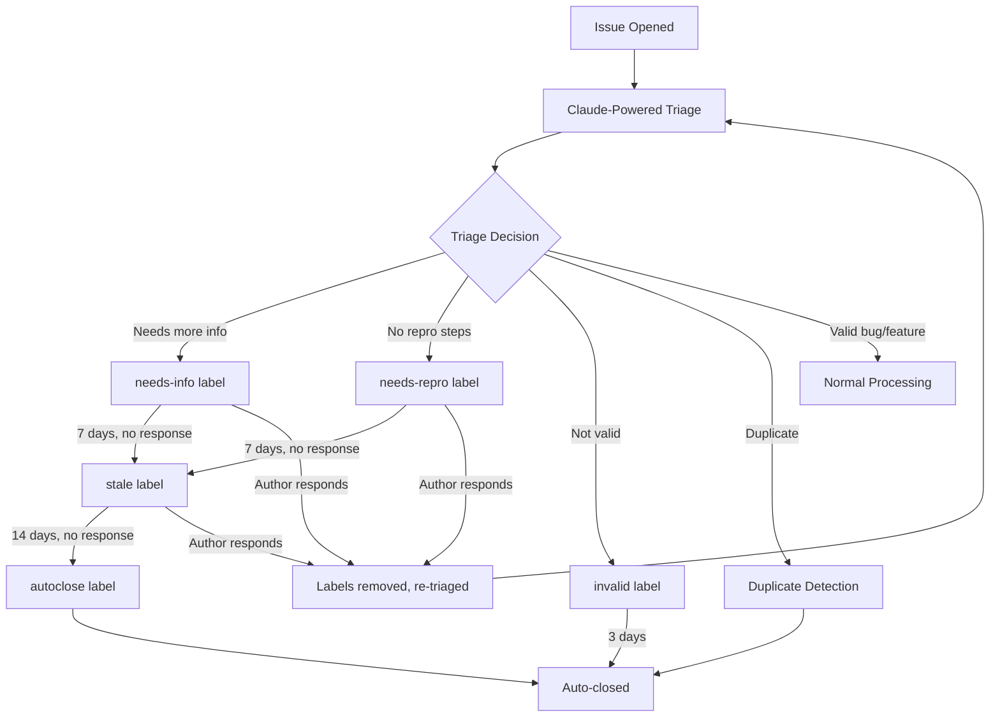
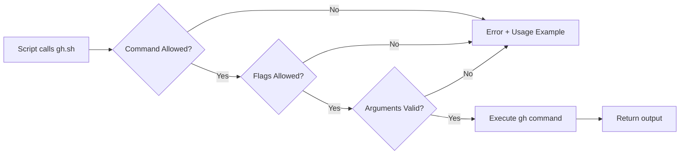
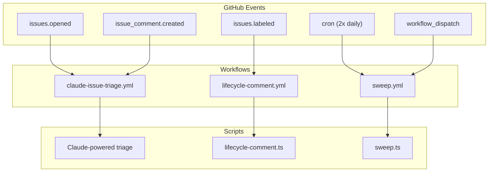
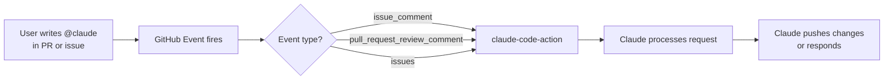

# Repository Automation and Scripts Deep Dive

This guide walks through the automation infrastructure that powers the claude-code repository. Every open-source project of significant size needs tooling to manage the flow of issues, enforce quality standards, and keep the backlog healthy. In claude-code, that tooling lives primarily in the `scripts/` directory and a set of GitHub Actions workflows that invoke those scripts. By the end of this guide, you will understand what each script does, why it exists, and how the pieces fit together.

---

## The scripts/ Directory — Purpose and Layout

The `scripts/` directory is the home for all automation logic that operates on the repository itself. These are not part of the product code — they are operational tools that keep the project running smoothly. Think of them as the maintenance crew for the issue tracker.

Here is what lives in the directory:

| Script | Language | Purpose |
|---|---|---|
| `sweep.ts` | TypeScript (Bun) | Daily sweep that closes stale/expired issues |
| `lifecycle-comment.ts` | TypeScript (Bun) | Posts templated comments when lifecycle labels are applied |
| `issue-lifecycle.ts` | TypeScript (Bun) | Shared configuration for labels, timeouts, and messages |
| `auto-close-duplicates.ts` | TypeScript (Bun) | Detects and closes duplicate issues |
| `backfill-duplicate-comments.ts` | TypeScript (Bun) | One-time backfill of comments on existing duplicates |
| `gh.sh` | Shell | Security wrapper around the `gh` CLI |
| `edit-issue-labels.sh` | Shell | Label add/remove operations with validation |
| `comment-on-duplicates.sh` | Shell | Shell-based duplicate commenting |

### Why TypeScript (Bun)?

The heavier logic — querying GitHub's API, evaluating timeouts, composing messages — is written in TypeScript and run with Bun. Bun is a fast JavaScript runtime that makes it easy to run `.ts` files directly without a separate compile step. This keeps the scripts expressive and type-safe while remaining quick to execute in CI.

### Why Shell Scripts?

The shell scripts serve as thin, constrained wrappers. They exist precisely because they are simple — there is less surface area for bugs or security issues. The `gh.sh` wrapper, for example, is deliberately minimal so that its security properties are easy to audit.

---

## The Issue Lifecycle System

The issue lifecycle system is the backbone of how claude-code manages its issue tracker at scale. Rather than relying on manual triage alone, the project uses a label-driven state machine that moves issues through defined stages, with automated timeouts that prevent the backlog from growing unbounded.

### How Issues Flow



### The Label State Machine

Each lifecycle label represents a state. When an issue enters a state, two things happen:

1. **A comment is posted** (via `lifecycle-comment.ts`) explaining what is needed and what will happen if there is no response.
2. **A timer starts** (enforced by `sweep.ts`) that will advance the issue to the next state if no action is taken.

The lifecycle labels and their timeouts are:

| Label | Timeout | Next State |
|---|---|---|
| `needs-info` | 7 days | `stale` |
| `needs-repro` | 7 days | `stale` |
| `needs-votes` | 30 days | `stale` |
| `invalid` | 3 days | Closed directly |
| `stale` | 14 days (standard), 30 days (for `needs-votes`) | `autoclose` |
| `autoclose` | — | Closed immediately |

### Preventing Infinite Loops

A critical design detail: the triage bot filters out its own comments. Without this filter, the bot would post a comment, detect the new comment as activity, re-triage the issue, post another comment, and loop forever. The concurrency group per issue with `cancel-in-progress` further ensures that only one triage run is active per issue at any time.

### Hardcoded Label Whitelist

To prevent label sprawl — where dozens of ad-hoc labels accumulate over time — the triage workflow uses a hardcoded whitelist of allowed labels. The bot can only apply labels from this list. This keeps the label taxonomy intentional and manageable.

### Safety Nets

Several safety mechanisms protect against incorrect auto-closes:

- **Human comment detection**: If a non-bot user comments on an issue after a `stale` or `autoclose` label is applied, those labels are automatically removed. This ensures that active conversations are not silenced by automation.
- **Upvote protection**: Issues with 10 or more upvotes are protected from auto-close across all issue types. Popular issues clearly have community interest, even if the original author has gone silent.
- **Locked issue handling**: The sweep skips locked issues entirely. An earlier bug caused the sweep to crash when it tried to comment on a locked issue — the fix was to check lock status before attempting any action.

---

## sweep.ts — The Daily Sweep

The sweep script is the engine that enforces lifecycle timeouts. It runs twice daily via a cron-triggered GitHub Actions workflow, scanning all open issues for lifecycle labels that have exceeded their timeout.

### What It Does

1. **Queries open issues** with lifecycle labels (`needs-info`, `needs-repro`, `needs-votes`, `stale`, `autoclose`, `invalid`).
2. **Checks how long** each label has been applied.
3. **Compares against the timeout** defined in `issue-lifecycle.ts`.
4. **Takes action**: either advances the label (e.g., `needs-info` to `stale`) or closes the issue.

### The closeExpired() Function

This is the core logic. For each issue with an expired lifecycle label:

1. It checks whether the issue is locked (skip if so).
2. It checks for non-bot comments posted after the label was applied (skip if found — the safety net).
3. It checks the upvote count (skip if 10 or more).
4. If all checks pass, it either advances the label or closes the issue with an appropriate message.

### Close Messages

Each close includes a message that:
- Explains why the issue was closed.
- Directs the user to open a new issue if they still experience the problem.
- Is respectful and constructive — auto-close should not feel punitive.

### Invocation

The sweep is designed to be run both in CI and locally for testing:

```bash
# CI invocation (environment variables set by GitHub Actions)
bun run scripts/sweep.ts

# Local testing with --dry-run
GITHUB_TOKEN=$(gh auth token) \
  GITHUB_REPOSITORY_OWNER=anthropics \
  GITHUB_REPOSITORY_NAME=claude-code \
  bun run scripts/sweep.ts --dry-run
```

In `--dry-run` mode, the script logs every action it would take without actually modifying any issues. This is essential for validating changes to timeout logic before deploying.

---

## lifecycle-comment.ts — Automated Comments on Label Application

When a lifecycle label is applied to an issue, this script posts a templated comment explaining what the label means and what the issue author should do next.

### Trigger

The script is invoked by the `lifecycle-comment.yml` GitHub Actions workflow, which triggers on the `issues.labeled` event. Every time any label is added to any issue, the workflow runs. The script then checks whether the label is a lifecycle label and, if so, posts the appropriate comment.

### Comment Templates by Label

Each label has a tailored message:

- **needs-info**: Asks the author for their Claude Code version, operating system, and full error messages. The goal is to gather enough information for the team to investigate.
- **needs-repro**: Asks for specific steps to reproduce the issue. Without reproduction steps, the team cannot diagnose or fix the problem.
- **invalid**: Explains why the issue does not belong in this repository and links to the correct Claude Code repository or Anthropic support channels.
- **stale**: Explains that the issue has been inactive and will be auto-closed if no activity occurs within the timeout window.
- **autoclose**: Explains that the issue is being closed due to prolonged inactivity.

### Why Automated Comments Matter

Without these comments, users would see a label appear on their issue with no explanation. Automated comments turn a mechanical process into a communicative one — the user understands what happened and what they can do about it.

---

## issue-lifecycle.ts — Shared Configuration

This module is the single source of truth for all lifecycle-related constants. Both `sweep.ts` and `lifecycle-comment.ts` import from it, ensuring consistency.

### What It Contains

- **Label names**: The exact string values for each lifecycle label.
- **Timeouts**: How long each label persists before the next action is taken.
- **Close reasons**: The GitHub API close reason (e.g., `not_planned`, `completed`) used when auto-closing.
- **Nudge messages**: The text posted in comments for each label transition.

### Why a Shared Config?

Having a single config file prevents drift. If the timeout for `needs-info` is 7 days, that fact is defined in one place. Without this, you could end up with the sweep enforcing a 7-day timeout while the comment promises the user 14 days — a confusing and unprofessional experience.

---

## Duplicate Detection — auto-close-duplicates.ts and comment-on-duplicates.sh

Duplicate issues are a common challenge in popular open-source projects. The same bug report might be filed dozens of times. The duplicate detection system identifies these and consolidates discussion.

### auto-close-duplicates.ts

This TypeScript script detects duplicate issues programmatically. When a duplicate is identified:

1. A comment is posted linking to the original issue.
2. The duplicate is closed with a reference to the canonical issue.

### comment-on-duplicates.sh

This shell script handles the simpler case of commenting on issues that have already been identified as duplicates (e.g., by a human applying a `duplicate` label). It is a lighter-weight tool compared to the TypeScript version.

### backfill-duplicate-comments.ts

This is a one-time migration script. When the duplicate commenting system was first introduced, there were existing duplicate issues that had been closed without a comment linking to the original. This script retroactively added those comments for consistency.

---

## gh.sh — The Security Wrapper for gh CLI

This is one of the most important scripts from a security perspective. It wraps the GitHub CLI (`gh`) to provide a controlled, auditable interface that prevents misuse.

### Why Does This Exist?

When automation scripts run in CI with a `GITHUB_TOKEN`, they have significant power — they can modify issues, labels, and potentially repository settings. If a script has a bug or is exploited, the blast radius could be large. The `gh.sh` wrapper constrains what operations are possible.

### How It Works



### Allowlisted Commands

Only a small set of `gh` subcommands are permitted:

- `gh issue view` — View a specific issue (requires exactly one numeric issue number)
- `gh issue list` — List issues (zero positional arguments enforced)
- `gh search issues` — Search across issues
- `gh label list` — List repository labels

### Allowlisted Flags

Only these flags are accepted:

- `--comments` — Include comments when viewing an issue
- `--state` — Filter by issue state (open, closed)
- `--limit` — Limit the number of results
- `--label` — Filter by label

Any other flags are rejected with a descriptive error message and usage examples.

### Environment Pinning

The wrapper explicitly sets:

- `GH_HOST=github.com` — Prevents redirection to other GitHub instances.
- `GH_REPO` — Derived from `GITHUB_REPOSITORY` and validated with format checking on the repository string.

This means even if an attacker could influence environment variables, the wrapper ensures operations target the correct repository.

### Validation Details

- **Repository format validation**: The `GITHUB_REPOSITORY` value is checked against an expected pattern (e.g., `owner/repo`). Malformed values are rejected.
- **Numeric issue number enforcement**: For `gh issue view`, the argument must be a single integer. This prevents injection of arbitrary strings into the command.
- **Descriptive errors**: When a command is rejected, the error message explains what went wrong and shows correct usage. This helps contributors debug their scripts rather than just failing silently.

---

## edit-issue-labels.sh — Label Operations with Validation

This script handles adding and removing labels from issues, with a critical safety check: it validates that labels actually exist in the repository before attempting to apply them.

### Why Validation Matters

Without validation, a typo in a label name (e.g., `needs-repro` vs `need-repro`) would silently create a new label in the repository. Over time, this leads to label sprawl and inconsistency. By checking against the repository's existing labels first, the script catches these mistakes early.

### How It Works

1. Fetches the list of valid labels from the repository using `gh label list`.
2. Compares the requested label against the valid list.
3. If the label exists, applies it. If not, returns an error.

This is a simple but effective pattern — validate inputs against a known-good list before taking action.

---

## GitHub Actions Integration

The scripts do not run on their own — they are triggered by GitHub Actions workflows. Understanding which workflow triggers which script is essential for contributors working on the automation.

### Workflow-to-Script Mapping



### claude-issue-triage.yml

- **Triggers**: `issues.opened`, `issue_comment.created`
- **Purpose**: Runs Claude-powered triage on new issues and new comments
- **Key features**:
  - Concurrency group per issue number with `cancel-in-progress: true`
  - Filters out bot comments to prevent re-triage loops
  - Uses a hardcoded label whitelist
  - Non-write-users check detects modifications to the `allowed_non_write_users` list

### lifecycle-comment.yml

- **Triggers**: `issues.labeled`
- **Purpose**: Posts appropriate comments when lifecycle labels are applied
- **Invokes**: `lifecycle-comment.ts`

### sweep.yml

- **Triggers**: Cron schedule (2x daily) and `workflow_dispatch` (manual trigger)
- **Purpose**: Enforces lifecycle label timeouts
- **Invokes**: `sweep.ts`
- **Manual trigger**: The `workflow_dispatch` trigger allows maintainers to run the sweep on demand, which is useful after making changes to timeout logic

---

## The --dry-run Pattern

Across the automation scripts, the `--dry-run` flag is a consistent pattern for safe local testing. This is worth understanding because it appears in multiple scripts and is the recommended way to validate changes before merging.

### How It Works

When `--dry-run` is passed:

1. The script runs all of its normal logic — querying issues, evaluating timeouts, deciding what actions to take.
2. Instead of executing those actions (closing issues, posting comments, modifying labels), it logs what it **would** do.
3. The script exits cleanly.

This means you can test the full decision-making pipeline without any side effects.

### Local Testing Recipe

```bash
# Step 1: Get a GitHub token (uses your existing gh CLI authentication)
export GITHUB_TOKEN=$(gh auth token)

# Step 2: Set the repository context
export GITHUB_REPOSITORY_OWNER=anthropics
export GITHUB_REPOSITORY_NAME=claude-code

# Step 3: Run the sweep in dry-run mode
bun run scripts/sweep.ts --dry-run
```

The output will show every issue that would be affected, what label transition or close action would occur, and what comment would be posted. This makes it easy to verify that a change to timeout logic produces the expected results across the full set of open issues.

### Why This Pattern Matters

In automation that modifies live data (issues, labels, comments), mistakes are visible and embarrassing. A bug that closes 200 valid issues is a very public failure. The `--dry-run` pattern provides a safety net that makes contributors comfortable making changes, because they can fully verify behavior before deployment.

---

## Security Considerations

Security in repository automation is not about protecting against nation-state attackers — it is about preventing accidental damage and reducing blast radius when things go wrong. The claude-code project takes several practical security measures.

### Why Wrappers Exist

The `gh.sh` wrapper exists because of the principle of least privilege. A script that needs to read issue data should not have the ability to delete branches. By constraining the available commands to a small allowlist, the wrapper ensures that even a bug in the calling script cannot perform destructive operations.

### Injection Prevention

Several layers protect against injection attacks:

1. **Numeric validation**: Issue numbers must be integers. This prevents injection of flags or commands through issue number parameters.
2. **Flag allowlisting**: Only known-safe flags are passed through. An attacker cannot add `--json` or other flags that might change output format in exploitable ways.
3. **Environment pinning**: `GH_HOST` and `GH_REPO` are set explicitly, preventing environment variable manipulation from redirecting commands to attacker-controlled repositories.
4. **Format validation**: The repository string is validated against an expected pattern before use.

### Bot Comment Filtering

The triage workflow filters out bot comments before processing. This is a security measure as much as a correctness measure. Without it, an attacker could potentially craft an issue comment that, when processed by the bot, causes the bot to post a comment that triggers itself in a specific way — an amplification attack. Filtering bot comments eliminates this vector.

### Label Whitelist

The hardcoded label whitelist prevents a compromised or buggy triage step from applying arbitrary labels. Since some workflows trigger on label events (like `lifecycle-comment.yml`), unrestricted label application could trigger unintended workflow cascades.

---

## Claude Code GitHub Actions (claude-code-action)

Beyond the issue lifecycle scripts, the claude-code repository uses a GitHub Actions integration called `claude-code-action` that brings Claude directly into the PR and issue workflow.

### What It Does

The `claude-code-action` (available at `anthropics/claude-code-action@v1`) allows anyone to mention `@claude` in a pull request comment, issue comment, or PR review comment to trigger Claude. Claude can then:

- Analyze code and provide feedback
- Implement requested changes and push commits
- Create pull requests for feature requests or bug fixes described in issues
- Follow repository guidelines defined in `CLAUDE.md`

### How It Is Triggered



### Configuration

The action supports several configuration options:

- **`prompt`**: Custom instructions for Claude beyond what is in `CLAUDE.md`.
- **`claude_args`**: CLI arguments passed to Claude Code, such as `--max-turns` (to limit conversation length) and `--model` (to specify which Claude model to use).
- **Provider support**: In addition to the default Anthropic API, the action supports **AWS Bedrock** and **Google Vertex AI** as model providers, allowing organizations to use their existing cloud provider relationships.

### Quick Setup

For new repositories, the fastest way to get started is the `/install-github-app` command, which automates the installation of the required GitHub App and workflow configuration.

### How It Respects CLAUDE.md

The `CLAUDE.md` file at the root of the repository acts as a system prompt for Claude when it operates within that repository. This means repository maintainers can define coding standards, testing requirements, and other guidelines that Claude will follow when making changes. This is the same file that Claude Code users interact with locally — the GitHub Actions integration simply reads it as part of its context.

---

## Putting It All Together

The automation system in claude-code is a layered architecture:

1. **Configuration layer** (`issue-lifecycle.ts`): Defines the rules — what labels exist, what their timeouts are, what messages to show.
2. **Action layer** (`sweep.ts`, `lifecycle-comment.ts`, `auto-close-duplicates.ts`): Implements the logic — querying issues, evaluating conditions, taking actions.
3. **Security layer** (`gh.sh`, `edit-issue-labels.sh`): Constrains what actions are possible — allowlisting commands, validating inputs.
4. **Trigger layer** (GitHub Actions workflows): Connects events to scripts — cron schedules, webhook events, manual dispatches.
5. **AI layer** (`claude-code-action`, Claude-powered triage): Brings intelligence to the process — understanding issue content, generating appropriate responses.

Each layer has a clear responsibility, and the boundaries between layers are enforced by the tools themselves (environment variables, flag validation, label whitelists). This separation makes the system maintainable — you can change a timeout without touching the sweep logic, or add a new lifecycle label without modifying the security wrapper.

---

## References

- [PR #25352 — Unified Claude-powered triage workflow](https://github.com/anthropics/claude-code/pull/25352)
- [PR #25210 — Daily sweep with lifecycle label timeouts](https://github.com/anthropics/claude-code/pull/25210)
- [PR #25665 — Lifecycle comments on label application](https://github.com/anthropics/claude-code/pull/25665)
- [PR #26360 — Auto-close bug fixes and safety nets](https://github.com/anthropics/claude-code/pull/26360)
- [PR #25649 — Sweep crash fix for locked issues](https://github.com/anthropics/claude-code/pull/25649)
- [PR #28533 — gh.sh security wrapper](https://github.com/anthropics/claude-code/pull/28533)
- [PR #30066 — gh.sh enhancements](https://github.com/anthropics/claude-code/pull/30066)
- [PR #27911 — edit-issue-labels.sh with validation](https://github.com/anthropics/claude-code/pull/27911)
- [Claude Code GitHub Action (claude-code-action)](https://github.com/anthropics/claude-code-action)
