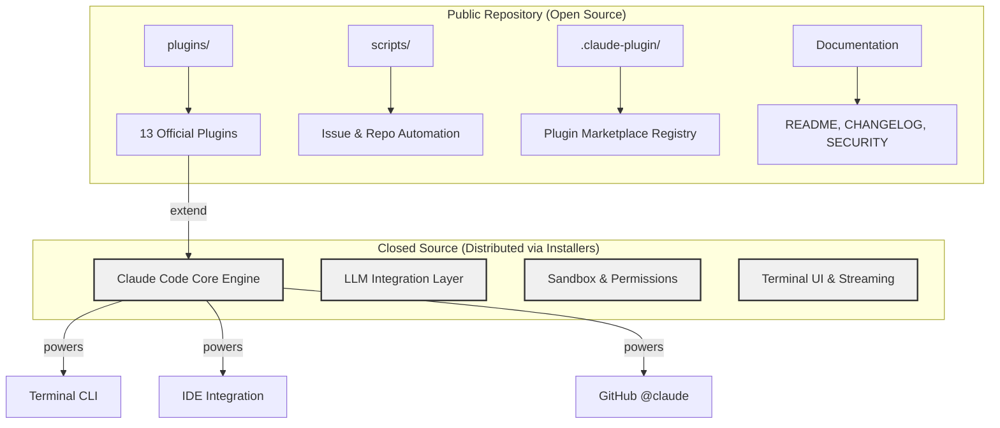
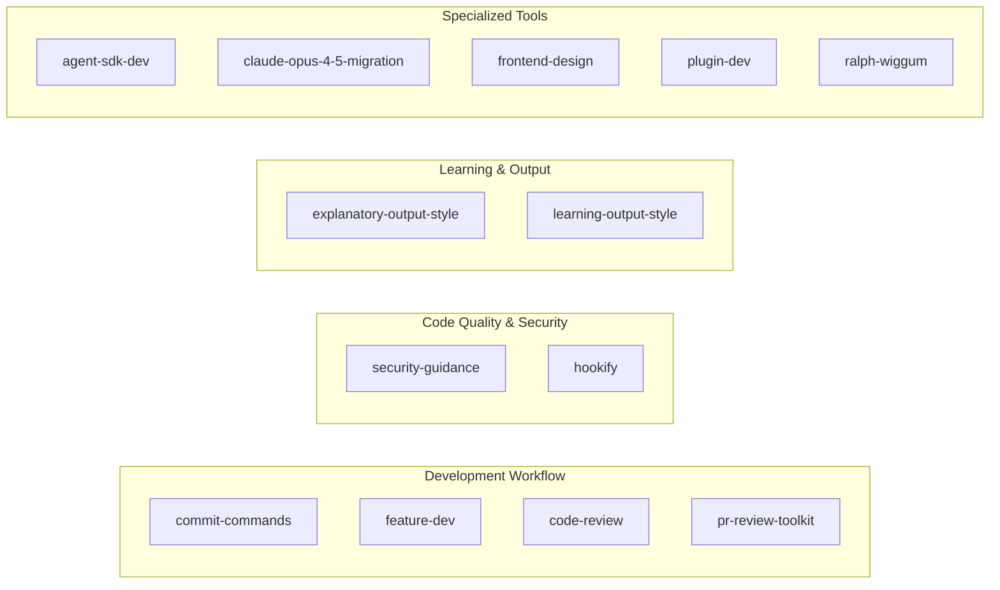

# Claude Code: Agentic Coding Tool for the Terminal

Claude Code is Anthropic's official CLI-based agentic coding assistant. It lives inside your terminal, understands your entire codebase, and helps you write, review, and ship code faster through natural language commands. Rather than switching between a chat window and your editor, Claude Code meets developers where they already work -- the command line -- and acts as an autonomous agent capable of reading files, running commands, managing git workflows, and coordinating multi-step development tasks.

This document provides a comprehensive overview of the Claude Code public repository: its purpose, architecture, plugin ecosystem, key technologies, and how to get involved as a contributor or user.

---

## Purpose and Mission

### What Problem Does Claude Code Solve?

Modern software development involves an enormous amount of routine work: writing boilerplate, reviewing pull requests, navigating unfamiliar codebases, committing and pushing changes, resolving merge conflicts, and explaining legacy code. These tasks are repetitive, context-heavy, and time-consuming.

Claude Code addresses this by embedding an AI agent directly into the developer's terminal workflow. Instead of copy-pasting code into a web chat, you interact with Claude Code in the same environment where you already write and run code. It can:

- **Execute routine tasks** -- scaffold files, run tests, manage dependencies
- **Explain complex code** -- break down unfamiliar functions, trace call chains, summarize modules
- **Handle git workflows** -- commit, push, create pull requests, review diffs
- **Reason about your codebase** -- read project structure, understand dependencies, suggest changes in context

### Where Can You Use It?

Claude Code is designed to work across multiple surfaces:

| Surface | How It Works |
|---------|-------------|
| **Terminal** | Direct CLI interaction via `claude` command |
| **IDE** | Integration with editors like VS Code |
| **GitHub** | Tag `@claude` on issues and pull requests for automated assistance |

This multi-surface approach means Claude Code is not just a terminal toy -- it is a professional-grade tool that fits into real engineering workflows, from local development to CI/CD pipelines and code review.

---

## Architecture Overview

### Public vs. Closed-Source Boundary

An important architectural detail for beginners: **the core Claude Code engine is closed-source**. The public GitHub repository you see does not contain the main application code (there is no `package.json`, `Cargo.toml`, `go.mod`, or `pyproject.toml` at the root level). Instead, the public repository serves as:

1. **The plugin ecosystem** -- official plugins that extend Claude Code's capabilities
2. **Documentation** -- README, changelog, security policy
3. **Community scripts** -- automation for issue management, duplicate detection, and repository maintenance
4. **The plugin marketplace** -- a registry (`.claude-plugin/marketplace.json`) for discovering and installing plugins

The actual Claude Code binary is distributed through package managers (Homebrew, NPM, WinGet) and direct installers, not built from this repository.



### Repository Directory Layout

Understanding the top-level structure helps you navigate the project:

| Directory / File | Purpose |
|-----------------|---------|
| `plugins/` | All 13 official plugins with their commands, agents, skills, and hooks |
| `scripts/` | GitHub automation scripts (TypeScript and shell) for issue lifecycle management |
| `.claude-plugin/` | Plugin marketplace metadata -- the registry that lists available plugins |
| `.devcontainer/` | Dev container configuration for reproducible development environments |
| `Script/` | PowerShell scripts for running Claude Code in dev containers |
| `.vscode/` | VS Code recommended extensions |
| `README.md` | Primary documentation and installation guide |
| `CHANGELOG.md` | Version history with feature and fix details |
| `SECURITY.md` | Vulnerability reporting instructions (via HackerOne) |
| `LICENSE.md` | License terms |

---

## Key Technologies and Dependencies

### Installation and Distribution

Claude Code supports multiple platforms and installation methods, reflecting its goal of being accessible to every developer regardless of their operating system or preferred package manager:

- **macOS / Linux:** `curl` one-liner installer (recommended), Homebrew (`brew install claude-code`)
- **Windows:** PowerShell installer script, WinGet (`winget install claude-code`)
- **NPM:** Available but deprecated -- the native installers are now preferred for better performance and update management

### Core Technology Stack (Inferred)

While the core engine is closed-source, the public repository and changelog reveal the technologies involved:

- **TypeScript** -- the `scripts/` directory contains `.ts` files for GitHub automation, and the plugin system uses JSON configuration, suggesting a Node.js/TypeScript foundation
- **Shell scripting** -- `.sh` scripts for repository maintenance and CI tasks
- **MCP (Model Context Protocol)** -- plugins can include `.mcp.json` configuration files, connecting Claude Code to external tool servers
- **Dev Containers** -- Docker-based development environments (`.devcontainer/`) for consistent contributor experience
- **GitHub Actions** -- the scripts directory includes issue lifecycle automation designed to run in CI

### Key Platform Capabilities (from Changelog)

The changelog reveals the engine's technical capabilities, which are important context even though the code is closed-source:

| Capability | Details | Version |
|-----------|---------|---------|
| **1M token context** | Opus 4.6 model support with massive context windows | v2.1.75 |
| **64k/128k output tokens** | Extended generation limits for large outputs | v2.1.77 |
| **Sandbox permissions** | `allowRead` sandbox for controlled file access | v2.1.77 |
| **MCP elicitation** | Dynamic tool discovery via Model Context Protocol | v2.1.76 |
| **Plugin persistent state** | Plugins can store data across sessions | v2.1.78 |
| **Line-by-line streaming** | Real-time output as the model generates | v2.1.78 |
| **Plugin marketplace** | Centralized discovery and installation of plugins | v2.1.80 |
| **OAuth authentication** | Enterprise-grade auth flows | v2.1.81 |
| **Channels (research preview)** | Multi-channel communication relay | v2.1.80-81 |
| **Hook lifecycle events** | `StopFailure`, `PostCompact` hooks for fine-grained control | v2.1.76-78 |

---

## The Plugin System

The plugin ecosystem is the heart of the public repository and the primary extensibility mechanism for Claude Code. Understanding it is essential for anyone who wants to customize or extend the tool.

### What Is a Plugin?

A plugin is a self-contained package that adds new capabilities to Claude Code. It can provide any combination of:

- **Commands** -- slash commands the user can invoke (e.g., `/commit`, `/commit-push-pr`)
- **Agents** -- autonomous sub-agents that Claude Code can dispatch for specific tasks (e.g., parallel code review agents)
- **Skills** -- specialized capabilities that can be loaded on demand
- **Hooks** -- lifecycle callbacks that run at specific points in Claude Code's execution (e.g., before a commit, after a compaction)
- **MCP servers** -- external tool servers connected via the Model Context Protocol

### Plugin Directory Structure

Every plugin follows a consistent layout:

```
plugin-name/
├── .claude-plugin/
│   └── plugin.json        # Plugin metadata: name, description, version
├── commands/               # Slash commands (markdown or code files)
├── agents/                 # Agent definitions for autonomous sub-tasks
├── skills/                 # Specialized skill definitions
├── hooks/                  # Lifecycle hook handlers
├── .mcp.json              # MCP server configuration (optional)
└── README.md              # Plugin documentation
```

This structure is important because Claude Code uses it to discover and load plugins. The `plugin.json` file is the entry point -- it tells Claude Code what the plugin provides and how to activate it.

### Official Plugins Overview

The repository ships with 13 official plugins, organized by category:



### Plugin Deep Dive by Category

**Development Workflow Plugins:**

- **commit-commands** -- Automates the entire git workflow with commands like `/commit` (stage, commit with AI-generated message), `/commit-push-pr` (commit, push, and create a PR in one command), and `/clean_gone` (prune merged branches). This is one of the most practical plugins for daily use.

- **feature-dev** -- Implements a structured 7-phase feature development workflow. Instead of ad-hoc coding, it guides you through planning, implementation, testing, and delivery in an organized sequence.

- **code-review** -- Runs automated PR reviews using 5 parallel Sonnet agents. Each agent focuses on a different aspect of code quality, and results are synthesized into a unified review. This demonstrates the multi-agent architecture that Claude Code supports.

- **pr-review-toolkit** -- A comprehensive suite of PR review agents for deeper analysis, complementing the automated code-review plugin with more specialized review capabilities.

**Code Quality and Security Plugins:**

- **security-guidance** -- Installs hooks that remind Claude Code to consider security implications during code generation. This is a good example of how hooks can enforce organizational policies.

- **hookify** -- A meta-plugin that helps you create custom hooks for behavior control. Rather than writing hook configurations manually, hookify provides a guided workflow for defining when and how hooks fire.

**Learning and Output Style Plugins:**

- **explanatory-output-style** -- Changes Claude Code's output to include educational insights about why certain implementation choices were made. Useful for junior developers or teams doing knowledge transfer.

- **learning-output-style** -- Enables an interactive learning mode where Claude Code teaches concepts as it works, turning every coding session into a learning opportunity.

**Specialized Tools:**

- **agent-sdk-dev** -- A development kit for building applications with the Claude Agent SDK. Provides templates, best practices, and tooling for agent development.

- **claude-opus-4-5-migration** -- Helps migrate existing code and prompts to work optimally with the Opus 4.5 model, handling API changes and prompt engineering differences.

- **frontend-design** -- Generates production-grade frontend interfaces, going beyond simple scaffolding to create polished, accessible UI components.

- **plugin-dev** -- A toolkit for building new plugins, featuring 7 expert skills that guide you through plugin creation, testing, and publishing.

- **ralph-wiggum** -- Creates self-referential AI loops for iterative development -- the agent reviews its own output and refines it in cycles.

### Plugin Marketplace

Starting with v2.1.80, Claude Code includes a plugin marketplace (`.claude-plugin/marketplace.json`) that provides centralized discovery and installation of plugins. This moves the ecosystem from manual plugin management toward a curated, searchable registry.

---

## Target Audience and Use Cases

### Who Is Claude Code For?

Claude Code is designed for **professional software developers** who spend significant time in the terminal. Its target audience includes:

- **Individual developers** who want to accelerate routine tasks (commits, reviews, boilerplate)
- **Team leads and senior engineers** who review PRs and need automated first-pass analysis
- **DevOps and platform engineers** who work heavily in the terminal and need AI assistance with scripts, configs, and infrastructure code
- **Organizations** looking to standardize coding practices through plugins and hooks (e.g., security policies, commit conventions)

### Real-World Use Cases

| Use Case | How Claude Code Helps |
|----------|----------------------|
| Onboarding to a new codebase | Ask Claude Code to explain modules, trace dependencies, summarize architecture |
| Daily git workflow | Use commit-commands plugin: `/commit` stages and commits, `/commit-push-pr` does the full cycle |
| Code review | code-review plugin dispatches 5 parallel agents to analyze a PR from different angles |
| Feature development | feature-dev plugin guides you through a 7-phase structured workflow |
| Security compliance | security-guidance hooks ensure security considerations are raised during code generation |
| Legacy code migration | claude-opus-4-5-migration helps update code for newer model versions |
| Learning while coding | learning-output-style turns every interaction into a teaching moment |

---

## Development Environment and Contribution Model

### Dev Container Setup

The repository includes a `.devcontainer/` directory with:

- `Dockerfile` -- defines the container image for development
- `devcontainer.json` -- VS Code Dev Container configuration
- `init-firewall.sh` -- initializes network firewall rules inside the container (likely for sandboxing during development)

This means contributors can spin up a consistent development environment using VS Code's Dev Containers feature or GitHub Codespaces, eliminating "works on my machine" issues.

### Repository Automation

The `scripts/` directory reveals a mature issue management workflow:

- **auto-close-duplicates.ts** -- Automatically detects and closes duplicate issues
- **sweep.ts** -- Performs cleanup sweeps across open issues
- **lifecycle-comment.ts** -- Posts lifecycle comments (e.g., stale warnings) on issues
- **issue-lifecycle.ts** -- Manages issue state transitions
- **backfill-duplicate-comments.ts** -- Retroactively adds duplicate markers to older issues
- **gh.sh / edit-issue-labels.sh / comment-on-duplicates.sh** -- Shell utilities for GitHub operations

These scripts indicate that Claude Code receives high issue volume and has invested in automation to keep the repository manageable.

### Security and Vulnerability Reporting

Security vulnerabilities are reported through **HackerOne**, Anthropic's bug bounty platform. This is standard practice for production-grade developer tools and indicates that security is treated as a first-class concern. The `/bug` command within Claude Code itself also provides a direct reporting mechanism.

### Community

Claude Code maintains an active community on Discord (`anthropic.com/discord`), which serves as the primary channel for user support, feature requests, and plugin development discussions.

---

## Data Collection and Privacy

Claude Code collects three categories of data:

1. **Usage data** -- how the tool is used (commands invoked, features accessed)
2. **Conversation data** -- the content of interactions with the AI
3. **User feedback** -- explicit feedback submitted by users

This is worth noting for enterprise users who may need to evaluate data handling policies before adoption. The README discloses this upfront, which is a positive transparency signal.

---

## Key Takeaways

For a beginner approaching Claude Code, here are the essential concepts to internalize:

1. **Claude Code is an agent, not a chatbot.** It does not just answer questions -- it reads your files, runs commands, and takes actions in your development environment.

2. **The public repository is the ecosystem, not the engine.** The core CLI is closed-source and distributed via installers. The open-source repository provides plugins, documentation, and community infrastructure.

3. **Plugins are the extension model.** Everything from git workflows to security policies to learning modes is implemented as a plugin. Understanding the plugin structure (`commands/`, `agents/`, `skills/`, `hooks/`) is the key to customizing Claude Code.

4. **Hooks enforce policies.** Unlike commands (which users invoke), hooks run automatically at lifecycle points. This makes them powerful for organizational standards.

5. **Multi-agent architecture is real.** Plugins like code-review dispatch multiple parallel agents, demonstrating that Claude Code supports sophisticated agentic patterns beyond simple request-response.

6. **The changelog is your roadmap.** With rapid iteration (versions 2.1.75 through 2.1.81 in the recent window alone), the changelog is the best way to track new capabilities, especially around context limits, permissions, and plugin features.

---

## References

- Repository: [https://github.com/anthropics/claude-code](https://github.com/anthropics/claude-code)
- Discord Community: [https://anthropic.com/discord](https://anthropic.com/discord)
- Security Reporting: [HackerOne Vulnerability Disclosure Program](https://hackerone.com/anthropic-vdp)
- Plugin Documentation: [plugins/README.md](https://github.com/anthropics/claude-code/blob/main/plugins/README.md)
