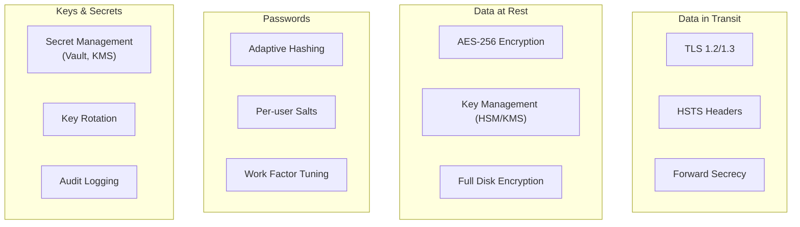
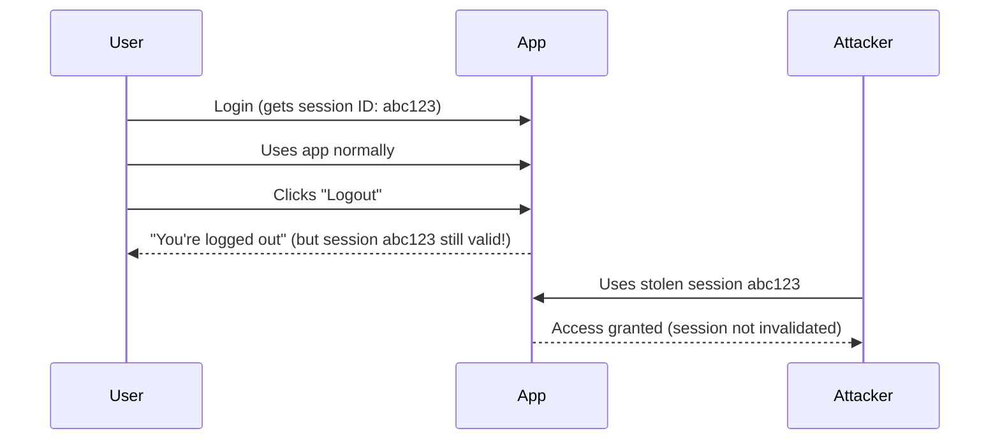
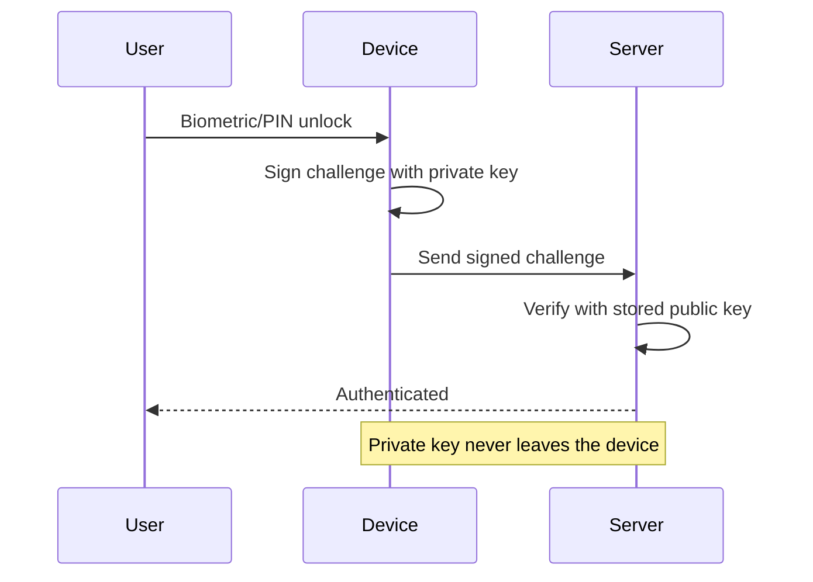

# Modern Authentication & Cryptography — A04 + A07:2025

This document combines two closely related OWASP Top 10 categories: **A04:2025 Cryptographic Failures** (32 CWEs, 1.6M occurrences) and **A07:2025 Authentication Failures** (36 CWEs, 1.1M occurrences). Together, they cover how applications protect data and verify identity — the foundation of application security.

---

## Part 1: Cryptographic Failures (A04:2025)

Cryptographic failures occur when applications fail to properly protect sensitive data through encryption. This isn't just about using the wrong algorithm — it covers missing encryption, poor key management, insufficient randomness, and misconfigured protocols.

### The Encryption Landscape



---

### Common Cryptographic Failures

#### 1. Missing or Weak Transport Encryption

**The Problem:** Data transmitted over HTTP or with weak TLS configuration can be intercepted.

**What to Do:**
- Enforce TLS 1.2+ for all connections (TLS 1.3 preferred)
- Enable Forward Secrecy (FS) ciphers
- Drop support for CBC mode ciphers
- Implement HSTS headers:
```http
Strict-Transport-Security: max-age=31536000; includeSubDomains; preload
```
- Never use unencrypted protocols (FTP, SMTP for sensitive data, STARTTLS)

#### 2. Weak Algorithms

Algorithms that are cryptographically broken and must NOT be used:

| Avoid | Use Instead | Why |
|-------|-------------|-----|
| MD5 | SHA-256/SHA-3 | Collision attacks are trivial |
| SHA-1 | SHA-256/SHA-3 | Practical collision attacks demonstrated |
| DES/3DES | AES-256 | Key space too small |
| RC4 | AES-GCM | Multiple biases discovered |
| RSA < 2048-bit | RSA 2048+ or ECC | Factoring attacks feasible |
| ECB mode | GCM mode | ECB leaks patterns in data |

#### 3. Poor Key Management

**Real-World Failures:**
- **Toyota (2022)**: Private keys and access tokens exposed on public GitHub
- **Facebook (2019)**: Hundreds of millions of passwords stored in plaintext logs

**Best Practices:**
```
DO:  Store keys in HSM or KMS (AWS KMS, Azure Key Vault, HashiCorp Vault)
DO:  Rotate keys on a defined schedule
DO:  Separate key storage from encrypted data
DO:  Audit all key access

DON'T: Hardcode keys in source code
DON'T: Store keys alongside encrypted data
DON'T: Share keys across environments
DON'T: Commit secrets to version control
```

#### 4. Weak Password Hashing

**Use these algorithms (in order of preference):**

| Algorithm | Notes |
|-----------|-------|
| **Argon2id** | Winner of the Password Hashing Competition. Best overall choice. |
| **yescrypt** | Memory-hard, good for Linux systems |
| **scrypt** | Memory-hard, well-established |
| **bcrypt** | Still acceptable for legacy systems (consult OWASP guidance) |
| **PBKDF2-HMAC-SHA-512** | When hardware constraints prevent memory-hard functions |

**Never use:** MD5, SHA-1, SHA-256 alone (too fast), unsalted hashes

#### 5. Missing Encryption at Rest

Every layer should encrypt sensitive data:
- **Database**: Column-level encryption for sensitive fields
- **Filesystem**: Encrypted volumes for data directories
- **Backups**: Encrypted backup files and transport
- **Application**: Encrypt before storing, decrypt on retrieval

**Real-World:** First American Financial (2019) — 885 million documents accessible because data at rest was unencrypted.

---

### Post-Quantum Cryptography (PQC)

Quantum computers threaten current public-key cryptography (RSA, ECC, Diffie-Hellman). NIST has published the first post-quantum encryption standards (2024). OWASP guidance: **high-risk systems must be quantum-safe by end of 2030**.

**What to do now:**
1. Inventory all cryptographic systems in your organization
2. Identify systems using vulnerable algorithms (RSA, ECC for key exchange)
3. Plan migration to quantum-resistant algorithms
4. Support quantum key exchange in TLS where possible
5. Follow NIST PQC standards as they finalize

---

### Real-World Cryptographic Breaches

| Year | Organization | Failure | Impact |
|------|-------------|---------|--------|
| 2013 | Target | Inadequate network encryption | 40M credit card numbers |
| 2017 | Equifax | Plaintext sensitive data | 147M records (SSNs) |
| 2019 | Facebook | Passwords in plaintext logs | Hundreds of millions of accounts |
| 2019 | First American | No encryption at rest | 885M documents |
| 2021 | RockYou2021 | Failed password hashing | 8.4B plaintext passwords compiled |
| 2022 | Toyota | Private keys on public GitHub | Exposed access credentials |

---

## Part 2: Authentication Failures (A07:2025)

Authentication failures occur when attackers can trick a system into recognizing an invalid or incorrect user as legitimate. This covers everything from credential stuffing to session management to MFA bypass.

### Modern Attack Patterns

#### Credential Stuffing & Password Spray

Traditional credential stuffing uses leaked username/password pairs. The 2025 evolution is **hybrid password spray attacks** — attackers increment known passwords:

```
Known leaked password: Winter2025
Attack attempts:      Winter2026, Winter2025!, W1nter2025, Winter2025#
```

This bypasses detection systems looking for repeated identical attempts.

#### Session Management Failures



#### SSO/Single Logout Failures

Logging into SSO gives you access to email, documents, and chat. But logging out may only close one application — the others remain authenticated. An attacker on the same machine can access the still-authenticated apps.

---

### Prevention Strategies

#### Multi-Factor Authentication (MFA)

MFA should be enforced on all important systems. It prevents automated credential stuffing, brute force, and stolen credential reuse attacks.

#### Password Policy (NIST 800-63b)

Modern password guidance has changed significantly:

| Old Guidance | New Guidance (NIST 800-63b) |
|-------------|---------------------------|
| Complex requirements (upper, lower, number, symbol) | Focus on length (minimum 8, encourage 15+) |
| Forced rotation every 90 days | Don't force rotation unless breach suspected |
| Security questions for recovery | Eliminate knowledge-based recovery |
| Block common passwords | Check against known-breached databases |

#### Breach Credential Checking

```python
# Check if a password has been exposed in a breach
import hashlib, requests

def is_password_pwned(password):
    sha1 = hashlib.sha1(password.encode()).hexdigest().upper()
    prefix, suffix = sha1[:5], sha1[5:]
    response = requests.get(f"https://api.pwnedpasswords.com/range/{prefix}")
    return suffix in response.text
```

#### Secure Session Management

- Generate high-entropy session IDs server-side after login
- Never expose session IDs in URLs
- Store in secure, HttpOnly cookies
- Invalidate on logout, idle timeout, and absolute timeout
- Generate a new session ID after successful login (prevent fixation)

#### JWT Security

When using JWTs (JSON Web Tokens):
- **Validate `aud` (audience) and `iss` (issuer) claims**
- Keep tokens short-lived (minutes, not hours)
- Use refresh tokens for longer sessions
- Follow OAuth standards for token revocation
- Never store secrets in JWT payloads (they're base64, not encrypted)

---

### Prevent Account Enumeration

Use identical error messages for all authentication outcomes:

```python
# BAD: Reveals whether the username exists
if not user_exists(username):
    return "Username not found"
elif not password_matches(username, password):
    return "Incorrect password"

# GOOD: Same message regardless of failure reason
if not authenticate(username, password):
    return "Invalid username or password"
```

---

## Emerging Trends

### Passkeys / FIDO2

Passkeys replace passwords entirely with public-key cryptography:



- No password to steal, stuff, or spray
- Phishing-resistant (bound to the specific origin)
- Supported by Apple, Google, Microsoft

### Zero-Trust Architecture

Encrypt **all** data flows and storage regardless of network location. No implicit trust based on network perimeter — verify every request.

### Confidential Computing

Hardware-based Trusted Execution Environments (TEEs) that enable processing encrypted data without ever decrypting it in main memory. Protects data even from privileged administrators.

---

## Compliance Matrix

| Requirement | GDPR | PCI-DSS | HIPAA |
|-------------|------|---------|-------|
| Encrypt data in transit | Required for high-risk | Required | Required where feasible |
| Encrypt data at rest | Required for high-risk | Required for cardholder data | Required where feasible |
| Strong password hashing | Required | Required | Required |
| MFA | Recommended | Required for admin | Required |
| Key management | Required | Required | Required |
| Breach notification | 72 hours | Immediately | 60 days |

---

## Quick Audit Checklist

- [ ] All sensitive data encrypted in transit (TLS 1.2+) and at rest (AES-256)?
- [ ] No deprecated algorithms (MD5, SHA-1, DES, RC4)?
- [ ] Secrets managed in vault/KMS, not hardcoded?
- [ ] Passwords hashed with Argon2id/bcrypt/scrypt + salt?
- [ ] HSTS headers enforced?
- [ ] MFA available and enforced for privileged accounts?
- [ ] Sessions invalidated on logout?
- [ ] JWT claims validated (aud, iss, exp)?
- [ ] Known-breached credentials blocked at registration?
- [ ] Post-quantum migration plan in place?

---

## References

- [A04:2025 Cryptographic Failures — OWASP](https://owasp.org/Top10/2025/A04_2025-Cryptographic_Failures/)
- [A07:2025 Authentication Failures — OWASP](https://owasp.org/Top10/2025/A07_2025-Authentication_Failures/)
- [Cryptographic Failures Guide — IntelligenceX](https://blog.intelligencex.org/owasp-a04-2025-cryptographic-failures-guide)
- [Cryptographic Failures — Invicti](https://www.invicti.com/blog/web-security/cryptographic-failures)
- [Comprehensive Guide to Cryptographic Failures — Authgear](https://www.authgear.com/post/cryptographic-failures-owasp)
- [OWASP Authentication Cheat Sheet](https://cheatsheetseries.owasp.org/cheatsheets/Authentication_Cheat_Sheet.html)
- [OWASP Password Storage Cheat Sheet](https://cheatsheetseries.owasp.org/cheatsheets/Password_Storage_Cheat_Sheet.html)
- [NIST SP 800-63b](https://pages.nist.gov/800-63-3/sp800-63b.html)
- [NIST Post-Quantum Cryptography Standards](https://www.nist.gov/news-events/news/2024/08/nist-releases-first-3-finalized-post-quantum-encryption-standards)
