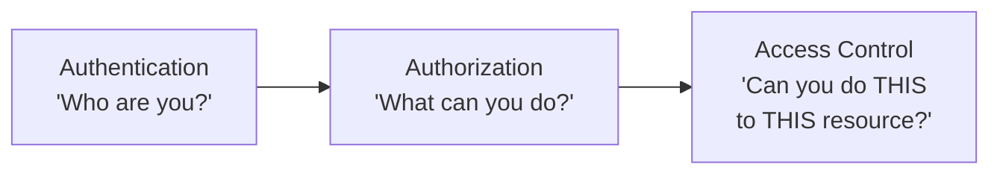
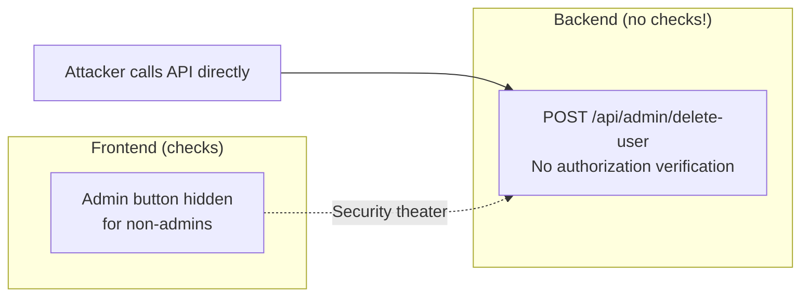
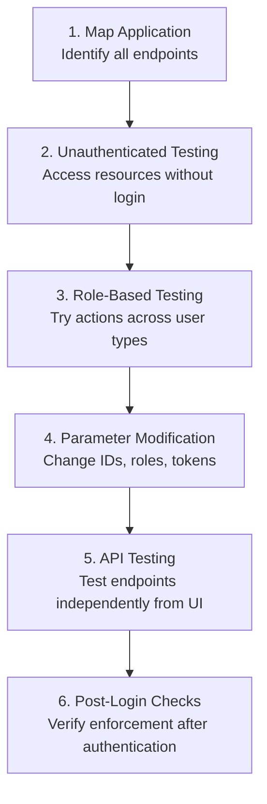

# Broken Access Control — A01:2025 Deep Dive

The #1 vulnerability in the OWASP Top 10 since 2021. **100% of applications tested** had some form of broken access control. With 40 mapped CWEs, 1.8 million occurrences, and 32,654 CVEs, this is the most widespread and impactful category of web application security risk.

---

## Understanding Access Control

Before diving into vulnerabilities, let's clarify three related but distinct concepts:



- **Authentication** verifies identity (login, password, MFA)
- **Authorization** determines what permissions a verified identity has
- **Access Control** enforces those permissions on specific resources and actions

Broken access control means the enforcement fails — users can act outside their intended permissions.

---

## Types of Access Control Vulnerabilities

### 1. Insecure Direct Object References (IDOR)

The most common form. Applications use user-controllable identifiers (IDs, filenames) to fetch objects without verifying ownership.

**Vulnerable Pattern:**
```python
# DANGEROUS: No ownership check
@app.route('/api/account/<account_id>')
def get_account(account_id):
    return db.query(f"SELECT * FROM accounts WHERE id = {account_id}")
```

**Safe Pattern:**
```python
# SAFE: Verify the requesting user owns this account
@app.route('/api/account/<account_id>')
def get_account(account_id):
    account = db.query("SELECT * FROM accounts WHERE id = ?", account_id)
    if account.owner_id != current_user.id:
        return jsonify({"error": "Forbidden"}), 403
    return jsonify(account)
```

**Real-World Breaches:**
- **Instagram (2019)**: IDOR let attackers view private posts by manipulating user IDs in API requests
- **Optus (2023)**: IDOR exposed nearly 10 million customer records including driver's licenses

### 2. Vertical Privilege Escalation

A regular user gains administrator-level access by bypassing authorization checks.

**Example:** Accessing admin endpoints directly:
```
GET /admin/users          → Should be blocked for non-admins
GET /admin/delete-user/42 → Should require admin role
```

**Real-World:** GitHub (2022) — Users escalated privileges within repositories without proper authorization controls.

### 3. Horizontal Privilege Escalation

A user accesses another user's resources at the same privilege level.

```
GET /profile/view?user_id=100  → Your profile (legitimate)
GET /profile/view?user_id=101  → Someone else's profile (unauthorized)
```

The difference from IDOR: horizontal escalation specifically refers to same-level access, while IDOR is the technical mechanism that enables it.

### 4. Parameter Tampering

Modifying URL parameters, form fields, or request bodies to bypass controls:

- **Price manipulation**: `total_price=50` changed to `total_price=1`
- **Role injection**: Adding `?role=admin` to a request
- **Hidden field manipulation**: Changing a hidden `user_role` field in a form

### 5. Path Traversal (CWE-22)

Using `../` sequences to access files outside the intended directory:

```
GET /api/files?name=report.pdf          → Legitimate
GET /api/files?name=../../../etc/passwd → Traversal attack
```

### 6. Cross-Site Request Forgery (CSRF) (CWE-352)

Tricking an authenticated user's browser into making unwanted requests:

```html
<!-- Attacker's page tricks victim's browser into transferring money -->

```

### 7. Server-Side Request Forgery (SSRF) (CWE-918)

Making the server request internal resources on the attacker's behalf. Rolled into A01 from its own category in 2021.

```
POST /api/fetch-url
{ "url": "http://169.254.169.254/latest/meta-data/" }
→ Fetches AWS instance metadata (credentials, tokens)
```

### 8. Missing Authorization on APIs

The UI enforces access control but the underlying API does not:



### 9. HTTP Method Confusion

Protecting GET but not POST/PUT/DELETE on the same endpoint:
```
GET  /api/users/42  → Protected (returns 403)
DELETE /api/users/42 → Unprotected (deletes the user!)
```

---

## Prevention Strategies

### Deny by Default

```python
# BAD: Grant access, then check for restrictions
if is_authenticated:
    grant_full_access()

# GOOD: Deny by default, grant specific permissions
if is_authenticated and has_permission(user, resource, action):
    grant_access()
else:
    deny_access()
```

### Server-Side Authorization

Never trust client-side controls. All authorization must happen server-side:

```python
# Middleware approach — centralized authorization
@require_permission('admin:read')
def admin_dashboard(request):
    return render('admin/dashboard.html')
```

### Access Control Models

**RBAC (Role-Based Access Control):**
```
Admin    → can create, read, update, delete all resources
Manager  → can create, read, update own team's resources
Employee → can read own resources only
```

**ABAC (Attribute-Based Access Control):**
```
Allow if:
  user.department == resource.department AND
  user.clearance >= resource.classification AND
  request.time is within business_hours
```

### Ownership Verification

Always verify the requesting user owns the resource:

```python
def update_profile(request, profile_id):
    profile = Profile.objects.get(id=profile_id)
    if profile.owner_id != request.user.id:
        return HttpResponseForbidden("Access denied")
    # ... proceed with update
```

### Monitoring and Rate Limiting

- Log all access control failures with user context
- Alert on patterns: multiple failed access attempts, attempts outside assigned roles
- Rate-limit API endpoints to slow automated attacks

---

## Testing Methodology



---

## Real-World Breaches Summary

| Year | Organization | Vulnerability | Impact |
|------|-------------|---------------|--------|
| 2013 | Facebook | Missing authorization | Could delete any user's photos |
| 2019 | Instagram | IDOR | Private posts/stories exposed via API |
| 2022 | GitHub | Privilege escalation | Unauthorized repository access |
| 2023 | Optus | IDOR | 10 million customer records exposed |

---

## Key Takeaways

1. Access control must be **designed in from the start**, not bolted on later
2. **Server-side enforcement** is non-negotiable — client-side controls are cosmetic
3. **Every API endpoint** needs its own authorization check, independent of the UI
4. **Test for access control** in every sprint — automated tools + manual verification
5. **Centralize authorization logic** in middleware to avoid scattered, inconsistent checks

---

## References

- [A01:2025 Official — OWASP](https://owasp.org/Top10/2025/A01_2025-Broken_Access_Control/)
- [Broken Access Control Complete Guide — IntelligenceX](https://blog.intelligencex.org/broken-access-control-owasp-a01-2025-complete-guide)
- [Broken Access Control — Invicti](https://www.invicti.com/blog/web-security/broken-access-control)
- [OWASP Authorization Cheat Sheet](https://cheatsheetseries.owasp.org/cheatsheets/Authorization_Cheat_Sheet.html)
- [CWE-1436: OWASP Top Ten 2025 Category A01](https://cwe.mitre.org/data/definitions/1436.html)
