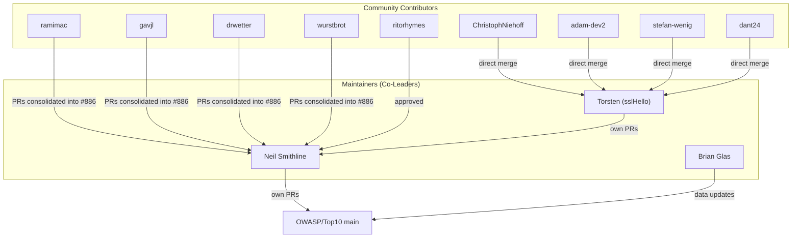
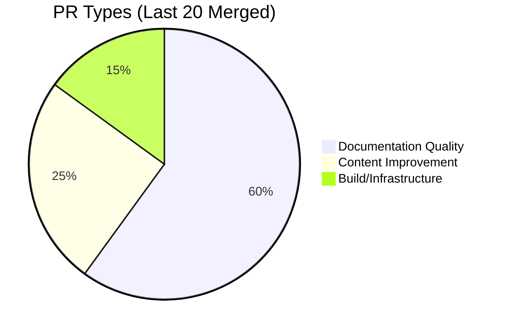

# OWASP Top 10 — PR Review Insights

## Overview

Analysis of the 20 most recently merged pull requests in the OWASP/Top10 repository reveals a **trusted maintainer model** with light formal review, active community contributions, and a strong focus on documentation quality. This document examines the review patterns, contributor dynamics, and quality themes.

---

## Contribution Model

### Key Observations

- **Most PRs have no formal code review** — the repository relies on a trusted maintainer model where co-leaders can merge without requiring approvals
- **Torsten (sslHello)** is the most prolific contributor in this window, handling many small editorial fixes
- **Neil Smithline** handles major consolidation PRs and orchestrates the release process
- **Brian Glas** focuses on data and statistics updates
- **Community contributions** focus on content improvements, not infrastructure

---

## Reviewer Dynamics

### Active Reviewers

| Reviewer | Style | Focus Areas |
|----------|-------|-------------|
| **Neil Smithline** | Pragmatic approvals with caveats | Release readiness, content accuracy |
| **Torsten (sslHello)** | Welcoming, catches post-merge issues | Editorial quality, link validity |

### Review Patterns

1. **Minimal formal review**: Of 20 PRs analyzed, only 1 had a formal GitHub review (PR #878, approved by Neil Smithline)
2. **Comment-based feedback**: Several PRs had discussion comments rather than formal reviews
3. **Post-merge catch**: PR #864 had a typo ("User" vs "Use") caught by Torsten after merge, showing that review sometimes continues post-merge
4. **Pragmatic approvals**: Neil approved PR #878 (CSS fix) with the comment "I'm not sure this matters for 2025 but we'll get the fix in place for the next release" — accepting good work even when timing is imperfect

---

## Recurring Feedback Themes

### 1. Documentation Quality (Most Common)

**12 of 20 PRs** focused on documentation quality:
- Typo corrections (A02, A03, A05, A08)
- Formatting fixes (list indentation, blank lines, scenario numbering)
- Link updates and validation
- Punctuation corrections

**Lesson**: Even high-profile security documents need thorough editorial review. The volume of post-release fixes suggests that a dedicated editorial pass before release would be valuable.

### 2. Content Accuracy and Modernization

**5 of 20 PRs** improved technical content:
- **A04**: Updated for post-quantum cryptography (PQC), modern TLS requirements, new password hashing algorithms (yescrypt)
- **A03**: Added modern attack examples (Shai-Hulud npm worm, Bybit), new tools (OWASP Dependency Track, OSV), SPDX standard
- **A05**: Reworded injection definition for technical precision
- **A07**: Added JWT claim validation guidance (`aud`, `iss`)
- **A06**: Emphasized developer awareness and security mindset

### 3. Architecture and Design Emphasis

**3 PRs from ChristophNiehoff** consistently pushed for:
- Emphasizing design's role in access control (A01)
- Developer awareness and security mindset (A06)
- Credential validation practices (A07)

This reflects a broader industry trend toward "shift-left" security thinking.

### 4. Build and Infrastructure

**3 PRs** addressed build system issues:
- `make publish` branch naming (main vs master)
- RC watermark CSS causing mobile layout breakage
- Root redirect updates for the new version

---

## PR Categories Breakdown

---

## Notable PRs

### PR #886 — The Consolidation PR

The most significant PR in this window consolidated **7 community PRs** that were targeting old file paths after the 2025 directory reorganization. This highlights:

- **Path migration challenges**: When files move, open PRs break
- **Maintainer burden**: Someone needs to rebase and consolidate scattered contributions
- **Communication gap**: Contributors weren't aware of the restructuring

### PR #882 — AI/Vibe Coding Risk

Added **X03:2025 "Inappropriate Trust in AI Generated Code ('Vibe Coding')"** — a forward-looking topic that signals OWASP's awareness of emerging AI-related security risks. This wasn't part of the official Top 10 but was added as supplementary content.

### PR #878 — CSS Layout Fix

A community contributor (ritorhymes) provided a thorough, well-documented PR with before/after screenshots across multiple breakpoints. Despite excellent quality, it was approved with the caveat that the RC watermark wouldn't matter for the final 2025 release. The fix was accepted anyway for future use — showing that good contributions are valued even with timing mismatches.

---

## Quality Patterns

### What Works Well
- **Open contribution model** — community members can submit improvements freely
- **Responsive maintainers** — PRs are typically reviewed and merged within days
- **Consolidation approach** — maintainers batch related changes for cleaner history
- **Forward-looking content** — supplementary topics (AI risks) prepare for future editions

### Areas for Improvement
- **Formal review process is light** — most PRs merge without formal approval
- **Post-merge issues** — typos and errors sometimes caught after merge
- **Path migration communication** — contributors need clearer guidance during restructurings
- **Consistent reference validation** — some reference links need periodic checking (e.g., ScienceDirect link discussion in PR #876)

---

## References

- [OWASP/Top10 Pull Requests](https://github.com/OWASP/Top10/pulls?q=is%3Apr+is%3Amerged)
- [PR #886 — Consolidation PR](https://github.com/OWASP/Top10/pull/886)
- [PR #882 — AI/Vibe Coding](https://github.com/OWASP/Top10/pull/882)
- [PR #878 — CSS Layout Fix](https://github.com/OWASP/Top10/pull/878)
