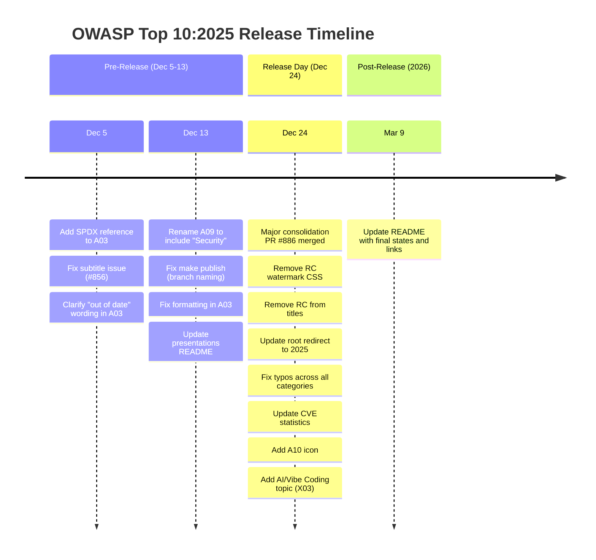

# OWASP Top 10 — Recent Changes

## Overview

The OWASP/Top10 repository saw a burst of activity centered on the **official release of the OWASP Top 10:2025** on December 24, 2025, followed by maintenance updates into early 2026. This document covers the recent commit history, key focus areas, and lessons from the release process.

---

## Release Timeline

The 2025 edition went through a Release Candidate (RC) phase before its official release. The commit history reveals a concentrated release effort:

---

## Focus Areas

### 1. A03: Software Supply Chain Failures — Most Actively Updated

A03 received **7 file changes** across the last 30 commits — more than any other category. Changes included:

- **Broadened scope**: Untrusted components criteria expanded beyond just "known vulnerabilities"
- **Modern examples added**: Shai-Hulud npm worm (2025), Bybit theft ($1.5B), Log4Shell CVE
- **New tool references**: OWASP Dependency Track, OSV (Open Source Vulnerabilities)
- **Staged rollout guidance**: New prevention advice for canary deployments
- **SPDX reference**: Added alongside CycloneDX for SBOM standards completeness

This heavy focus reflects the rapidly evolving supply chain threat landscape and community concern (voted #1 in the survey).

### 2. A10: Mishandling of Exceptional Conditions — New Category Polish

A10 received **4 file changes**, focused on:

- Formatting fixes for the background section
- Icon addition (added on Dec 25)
- Content structure improvements

As a brand-new category, A10 needed more polish than established categories.

### 3. Release Infrastructure

Several commits focused on the release mechanics:

- **RC removal**: Stripped Release Candidate notices from CSS, titles, and content
- **Redirect updates**: Root URL now points to 2025 version instead of 2021
- **Build fixes**: `make publish` branch naming corrected (main vs master)
- **Responsive CSS fix**: RC watermark was causing layout breakage on mobile

### 4. Cross-Category Content Improvements

| Category | Key Changes |
|----------|-------------|
| A01 | Streamlined content, improved JWT guidance (refresh tokens) |
| A02 | Updated reference links, added credential guidance |
| A04 | PQC (Post-Quantum Cryptography) updates, modern TLS guidance, yescrypt added |
| A05 | Injection definition reworded for clarity, typo fixed |
| A07 | Minor wording improvements |
| A08 | Typo fixes, example scenario numbering |
| A09 | Renamed to emphasize "Alerting" over "Monitoring" |

---

## Key Contributors

| Contributor | Role | Focus |
|-------------|------|-------|
| **Neil Smithline** | Co-leader | Release orchestration, major consolidation PRs, typo fixes |
| **Torsten Gigler** (sslHello) | Co-leader | Formatting, editorial, build fixes, link updates |
| **Brian Glas** | Co-leader | CVE statistics, mapping updates |
| **ramimac** | Community | A03 wording improvements, OSV addition |
| **gavjl** | Community | A01, A03, A05 clarity improvements |
| **drwetter** | Community | A04 PQC and crypto modernization |
| **wurstbrot** | Community | A03 tooling references |
| **ChristophNiehoff** | Community | A07 credential validation, A06 design mindset |

---

## Lessons Learned

### 1. Consolidation PRs Are Essential

PR #886 consolidated **7 separate PRs** (#818, #819, #821, #822, #844, #845, #850) that were targeting old file paths after the 2025 reorganization moved files from `2021/docs/en/2025/` to `2025/docs/en/`. This shows the importance of:

- Clear directory structure documentation
- Rebasing community PRs after reorganizations
- Having maintainers who can consolidate scattered contributions

### 2. Release Day Is a Documentation Sprint

December 24, 2025 saw **20+ commits** in a single day — the vast majority were documentation quality fixes (typos, formatting, links) rather than content changes. This pattern suggests:

- Content was finalized earlier in the RC phase
- Release day is about polish, not substance
- Having linting tools (markdownlint, textlint) helps but doesn't catch everything

### 3. New Categories Need Extra Attention

A10 (Mishandling of Exceptional Conditions) and A03 (expanded Supply Chain) required significantly more post-release fixes than established categories, highlighting the need for extra review cycles on new content.

### 4. Forward-Looking Content

The addition of **X03: Inappropriate Trust in AI Generated Code ('Vibe Coding')** signals that OWASP is already thinking about risks beyond the current Top 10, preparing for future editions that may address AI-specific security concerns.

---

## References

- [OWASP Top 10:2025 Release](https://owasp.org/Top10/2025/)
- [GitHub Repository — OWASP/Top10](https://github.com/OWASP/Top10)
- [PR #886 — Major Consolidation PR](https://github.com/OWASP/Top10/pull/886)
