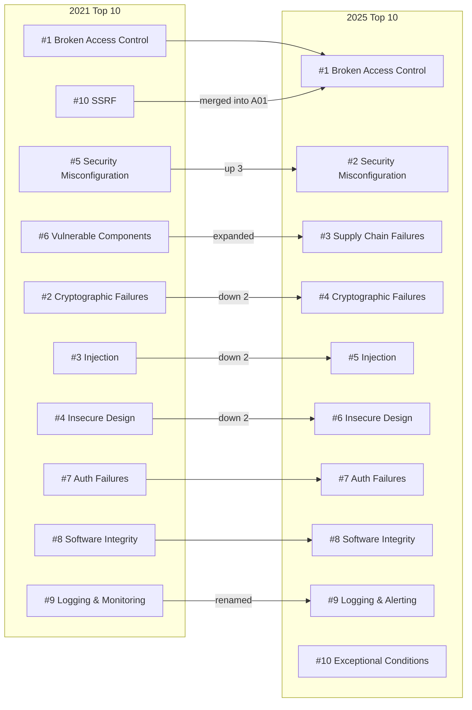
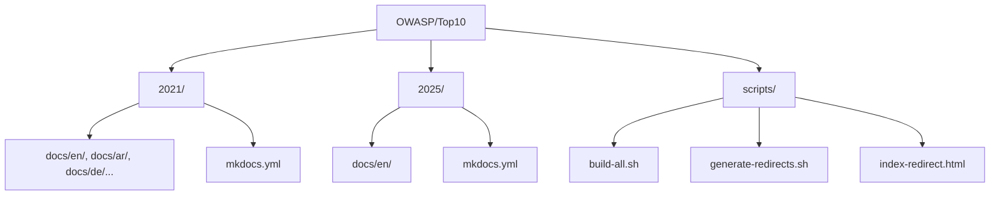

# OWASP Top 10 — Repo Goals & Architecture

## What is the OWASP Top 10?

The OWASP Top 10 is the most widely recognized awareness document for web application security, maintained by the [Open Worldwide Application Security Project (OWASP)](https://owasp.org). It represents a broad consensus about the most critical security risks to web applications, and serves as a baseline standard for developers, security professionals, and organizations worldwide.

The [OWASP/Top10](https://github.com/OWASP/Top10) repository is the official home for all versions of this document, from 2007 through the current 2025 edition. It is an open-source, community-driven project licensed under **CC-BY-SA-4.0**.

---

## Purpose and Target Audience

The OWASP Top 10 serves multiple purposes:

- **Awareness** — Educates developers about the most common and impactful security risks
- **Baseline Standard** — Used by organizations to set minimum security requirements
- **Training Foundation** — Forms the basis of many application security training programs
- **Compliance Reference** — Referenced by PCI DSS, NIST, and other regulatory frameworks
- **Risk Communication** — Helps security teams communicate risks to business stakeholders

### Who Uses It?

| Audience | How They Use It |
|----------|----------------|
| Developers | Understand what to defend against in code |
| Security Engineers | Prioritize testing and remediation efforts |
| Architects | Design systems that address top risks |
| Managers/CISOs | Set security policy and training requirements |
| Auditors | Evaluate application security posture |
| Educators | Teach application security fundamentals |

---

## The OWASP Top 10:2025 — Full Breakdown

The 2025 edition is the 8th installment. It was released on December 24, 2025, based on data from **2.8 million+ applications** tested by 13+ data contributors. It maps **248 CWEs** (Common Weakness Enumerations) across 10 categories.

### The List

```mermaid
graph LR
    A01["A01: Broken Access Control<br/>40 CWEs | 1.8M occurrences"]
    A02["A02: Security Misconfiguration<br/>16 CWEs | 719K occurrences"]
    A03["A03: Software Supply Chain Failures<br/>6 CWEs | NEW expansion"]
    A04["A04: Cryptographic Failures<br/>32 CWEs | 1.6M occurrences"]
    A05["A05: Injection<br/>37 CWEs | 1.4M occurrences"]
    A06["A06: Insecure Design<br/>39 CWEs | 729K occurrences"]
    A07["A07: Authentication Failures<br/>36 CWEs | 1.1M occurrences"]
    A08["A08: Software/Data Integrity Failures<br/>14 CWEs | 501K occurrences"]
    A09["A09: Security Logging & Alerting<br/>5 CWEs | 260K occurrences"]
    A10["A10: Mishandling Exceptional Conditions<br/>24 CWEs | NEW category"]

    A01 --> A02 --> A03 --> A04 --> A05
    A05 --> A06 --> A07 --> A08 --> A09 --> A10
```

### A01:2025 — Broken Access Control

Holds its #1 position from 2021. Found in 100% of applications tested. Covers 40 CWEs including path traversal, IDOR, CSRF, and SSRF (rolled in from its own 2021 category). 1.8 million occurrences in the data. Access control enforces policies so users cannot act outside their intended permissions — failures lead to unauthorized data access, modification, or privilege escalation.

**Key prevention:** Deny by default, implement access controls server-side, enforce record ownership, log failures, rate-limit APIs.

### A02:2025 — Security Misconfiguration

Moved up from #5 in 2021 to #2. Found in 100% of applications tested. As software becomes more configuration-driven, misconfigurations grow more prevalent. Covers default credentials, unnecessary features, overly informative error messages, missing security headers, and insecure cloud permissions.

**Key prevention:** Repeatable hardening processes, minimal platforms, automated configuration verification, security headers.

### A03:2025 — Software Supply Chain Failures (NEW expansion)

Expanded from 2021's "Vulnerable and Outdated Components" to cover the entire ecosystem: dependencies, build systems, CI/CD pipelines, and distribution infrastructure. Voted #1 concern in the community survey. Only 6 CWEs but has the **highest average exploit and impact scores** from CVEs. Real-world examples include SolarWinds (2019), Bybit theft ($1.5B, 2025), and the Shai-Hulud npm worm (2025).

**Key prevention:** SBOM management, transitive dependency tracking, signed packages, CI/CD hardening, staged rollouts.

### A04:2025 — Cryptographic Failures

Dropped from #2 to #4. Covers 32 CWEs related to weak algorithms, poor key management, insufficient entropy, and missing encryption. Includes everything from weak PRNGs to cleartext transmission to improper certificate validation.

**Key prevention:** Classify data sensitivity, encrypt at rest and in transit (TLS 1.2+), use authenticated encryption, prepare for post-quantum cryptography (PQC) by 2030.

### A05:2025 — Injection

Dropped from #3 to #5. Still one of the most tested categories with 100% of applications scanned. Covers 37 CWEs including SQL injection, XSS (30k+ CVEs), OS command injection, LDAP injection, and expression language injection. Now also references LLM prompt injection via the OWASP LLM Top 10.

**Key prevention:** Parameterized queries, safe APIs, positive input validation, context-aware output escaping.

### A06:2025 — Insecure Design

Dropped from #4 to #6. Introduced in 2021, the industry has shown improvements in threat modeling and secure design. Focuses on design and architectural flaws — missing security controls that were never created. Distinct from implementation bugs.

**Key prevention:** Threat modeling, secure design patterns, secure development lifecycle (SDLC), integrate security into user stories.

### A07:2025 — Authentication Failures

Holds at #7 with a name change (previously "Identification and Authentication Failures"). Covers 36 CWEs including credential stuffing, brute force, default passwords, weak MFA, and session management issues. Hybrid password spray attacks are a growing concern.

**Key prevention:** MFA everywhere, password managers, breach credential checking, NIST 800-63b compliance, secure session management.

### A08:2025 — Software or Data Integrity Failures

Continues at #8. Focuses on trust boundary violations at a lower level than supply chain — unsigned updates, insecure deserialization, unverified CDN resources, and CI/CD integrity gaps.

**Key prevention:** Digital signatures, trusted repositories, code review processes, CI/CD access controls.

### A09:2025 — Security Logging & Alerting Failures

Holds at #9 with a name change emphasizing alerting. Community-voted (hard to test for). Only 5 CWEs but critical for incident detection and response. Great logging without alerting provides minimal value during security incidents.

**Key prevention:** Log all security events, protect log integrity, set alerting thresholds, establish incident response plans, add honeytokens.

### A10:2025 — Mishandling of Exceptional Conditions (NEW)

Brand new category for 2025. Covers 24 CWEs focused on improper error handling, failing open, null pointer dereferences, unchecked return values, and missing default cases. When programs fail to prevent, detect, and respond to unusual situations, it leads to crashes, unexpected behavior, and vulnerabilities.

**Key prevention:** Catch errors at the source, fail closed (roll back transactions), centralized error handling, rate limiting, global exception handlers.

---

## What Changed from 2021 to 2025

### Key Changes Summary

1. **SSRF merged into Broken Access Control** — no longer its own category
2. **Security Misconfiguration surged to #2** — configuration-driven software is more prevalent
3. **Supply Chain Failures is the big new story** — expanded scope from just "vulnerable components" to the full supply chain
4. **Mishandling of Exceptional Conditions is new** — error handling gets its own category
5. **Injection continues to decline** — parameterized queries and frameworks are working
6. **Insecure Design improving** — threat modeling adoption is increasing

---

## Methodology

The OWASP Top 10 is data-informed, not blindly data-driven:

- **8 of 10 categories** come from contributed testing data (2.8M+ applications)
- **2 of 10 categories** come from a community survey of practitioners
- **589 CWEs** analyzed (up from 400 in 2021)
- **175k+ CVE records** mapped to CWEs from the National Vulnerability Database
- **CVSS exploit and impact scores** used for risk weighting
- Categories focus on **root causes** (e.g., "Cryptographic Failure") over **symptoms** (e.g., "Sensitive Data Exposure")

---

## Repository Architecture

### Key Technologies

| Technology | Purpose |
|-----------|---------|
| **MkDocs** | Static site generation from Markdown |
| **Python** | MkDocs plugins and build tooling |
| **Node.js** | markdownlint and textlint for quality |
| **Make** | Build orchestration (`make build-all`, `make serve`, `make publish`) |
| **GitHub Pages** | Hosting at owasp.org/Top10/ |
| **GitHub Actions** | CI/CD for linting and deployment |

Each version (2021, 2025) is an independent MkDocs site that can be built and served separately or together. Translations are added post-release as separate language directories.

---

## Project Leadership

Five co-leaders maintain the project:

- **Andrew van der Stock** (@vanderaj)
- **Brian Glas** (@infosecdad)
- **Neil Smithline** (@appsecneil)
- **Tanya Janca** (@shehackspurple)
- **Torsten Gigler** (@torsten_gigler)

---

## References

- [OWASP Top 10:2025 Official Site](https://owasp.org/Top10/2025/)
- [OWASP Top 10 Project Page](https://owasp.org/www-project-top-ten)
- [OWASP Top 10 GitHub Repository](https://github.com/OWASP/Top10)
- [MITRE CWE Dictionary](https://cwe.mitre.org)
- [National Vulnerability Database (NVD)](https://nvd.nist.gov)
