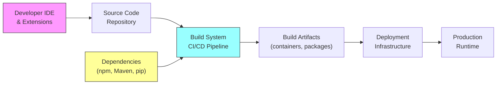
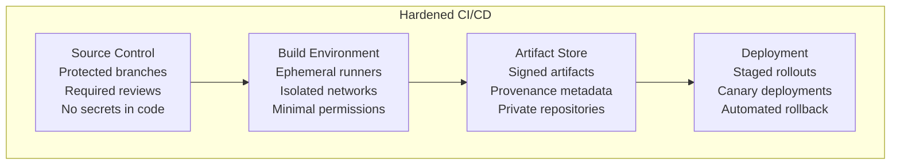
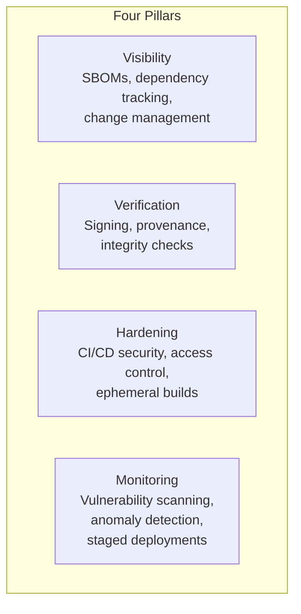

# Software Supply Chain Security — A03:2025 Deep Dive

A03:2025 Software Supply Chain Failures is one of the most significant additions to the OWASP Top 10. Voted the **#1 concern** by 50% of community survey respondents, this category expands the former "Vulnerable and Outdated Components" to cover the entire software supply chain — from your IDE to your production deployment.

While it has the **fewest occurrences** in testing data (6 CWEs, 215K occurrences), it has the **highest average exploit and impact scores** of any category. When supply chain attacks succeed, they tend to be catastrophic.

---

## What Is the Software Supply Chain?

The software supply chain encompasses every component, tool, process, and system involved in building, distributing, and running your software:

An attacker can compromise **any link** in this chain.

---

## Real-World Attack Case Studies

### SolarWinds (2019) — The Wake-Up Call

Russian state-sponsored attackers injected malware into SolarWinds Orion's build process. The malicious code was included in legitimate software updates, distributed to approximately **18,000 organizations** including US government agencies, Fortune 500 companies, and critical infrastructure.

**How it worked:**
1. Attackers gained access to SolarWinds' build environment
2. Injected malicious code into the Orion software build
3. Signed updates were distributed through normal channels
4. Organizations installed the "trusted" update, activating the backdoor

**Lesson:** Even signed, official updates can be compromised if the build environment is not secured.

### Bybit (2025) — $1.5 Billion Theft

North Korean attackers compromised the wallet software used by cryptocurrency exchange Bybit. The malicious code was designed to execute **only when the target wallet was being used**, making it extremely difficult to detect during testing.

**Lesson:** Supply chain attacks can be surgically targeted — malicious code may only activate under specific conditions.

### Shai-Hulud (2025) — The First Self-Propagating npm Worm

The first successful self-spreading npm worm. It:
1. Seeded malicious versions of popular packages
2. Used post-install scripts to harvest sensitive data
3. Detected npm tokens in victim environments
4. Automatically published malicious versions of any accessible package
5. Reached **500+ package versions** before being disrupted

**Lesson:** A single compromised developer machine can cascade across the entire npm ecosystem.

### Log4Shell (2021) — CVE-2021-44228

A zero-day remote code execution vulnerability in Apache Log4j, one of the most widely used Java logging libraries. The vulnerability allowed attackers to execute arbitrary code by simply logging a crafted string.

**Impact:** Virtually every Java application using Log4j was vulnerable. Exploitation was trivial, and the library was a transitive dependency in thousands of applications that didn't even know they used it.

**Lesson:** Transitive dependencies are invisible attack surface. You must track what your dependencies depend on.

---

## SBOM Management

A Software Bill of Materials (SBOM) is a complete inventory of all components in your software — the "ingredient list" for your application.

### SBOM Formats

| Format | Standard | Best For |
|--------|----------|----------|
| **SPDX** | ISO/IEC 5962:2021 | Compliance-focused, license tracking |
| **CycloneDX** | OWASP Standard | Security-focused, vulnerability correlation |

### Best Practices

1. **Generate during build** — not after deployment, when it's too late
2. **Track transitive dependencies** — your deps' deps' deps
3. **One machine-readable SBOM per release** — automate this in CI/CD
4. **Centrally manage** — use a platform like OWASP Dependency-Track

### Tooling

| Tool | Purpose |
|------|---------|
| **OWASP Dependency-Track** | SBOM analysis and vulnerability monitoring |
| **OWASP Dependency-Check** | Scan for known vulnerable dependencies |
| **retire.js** | Detect vulnerable JavaScript libraries |
| **OSV (Open Source Vulnerabilities)** | Google's open-source vulnerability database |
| **Snyk / Socket.dev** | Commercial SCA tools |

---

## CI/CD Pipeline Hardening

Your CI/CD pipeline is often the **weakest link** — it has access to source code, secrets, build tools, and deployment credentials.

### Key Hardening Measures

| Area | Action |
|------|--------|
| **Access Control** | MFA for all admins, least privilege, no shared accounts |
| **Branch Protection** | Required code reviews, no direct pushes to main |
| **Secrets** | Environment-scoped, rotated regularly, never in code |
| **Builds** | Ephemeral runners destroyed after each build |
| **Artifacts** | Digitally signed, provenance tracked (SLSA) |
| **Deployment** | Staged rollouts, canary deployments for updates |
| **Separation of Duty** | No single person can write AND deploy code to production |
| **Logging** | Tamper-evident logs for all pipeline actions |

---

## Dependency Management

### Selection
- Assess third-party components for maintenance status, security history, and community adoption
- Prefer well-maintained projects with active security teams
- Check test coverage and vulnerability disclosure processes

### Monitoring
- Continuously monitor NVD, OSV, and GitHub Advisory Database
- Subscribe to security advisories for all components you use
- Automate vulnerability scanning in CI/CD

### Updating
- Deliberately choose dependency versions (don't auto-upgrade blindly)
- Test compatibility before upgrading
- Use lockfiles (package-lock.json, Pipfile.lock, Cargo.lock) to pin versions
- If a library is unmaintained, plan migration to an alternative

### Deployment Safety
- **Never deploy updates to all systems simultaneously**
- Use staged rollouts or canary deployments
- Have automated rollback capabilities
- In case a trusted vendor is compromised, limit blast radius

---

## Build Integrity and SLSA

**SLSA (Supply-chain Levels for Software Artifacts)** is a framework for ensuring build integrity:

| Level | Requirements |
|-------|-------------|
| SLSA 1 | Build process documented |
| SLSA 2 | Hosted build, authenticated provenance |
| SLSA 3 | Isolated, ephemeral build environment |
| SLSA 4 | Hermetic, reproducible builds |

### Provenance
Generate metadata describing **where, when, and how** artifacts were produced. Use tools like SLSA Verifier to validate authenticity before deployment.

---

## Change Management

Track changes to ALL of these systems:

- CI/CD configurations and build pipelines
- Code repositories and branch policies
- Sandbox and staging environments
- Developer IDEs and extensions
- SBOM tooling and generated artifacts
- Logging systems and log configurations
- Third-party SaaS integrations
- Artifact and container registries

---

## Prevention Strategy Summary

---

## References

- [A03:2025 Official — OWASP](https://owasp.org/Top10/2025/A03_2025-Software_Supply_Chain_Failures/)
- [Software Supply Chain Security Cheat Sheet — OWASP](https://cheatsheetseries.owasp.org/cheatsheets/Software_Supply_Chain_Security_Cheat_Sheet.html)
- [Supply Chain Failures — Secure Code Warrior](https://www.securecodewarrior.com/article/owasp-top-10-2025-software-supply-chain-failures)
- [OWASP Dependency-Track](https://dependencytrack.org/)
- [OWASP CycloneDX](https://owasp.org/www-project-cyclonedx/)
- [SLSA Framework](https://slsa.dev/)
- [NIST SP 800-204D](https://csrc.nist.gov/publications/detail/sp/800-204d/final)
